 |  Extrapolating Section Strings Ore body interpretation by extrapolating existing vertical section strings.  
---|---  
  
# Overview

In this part of the tutorial you will extend the basic framework of an existing geological ore body string model using string translation and editing techniques.

## Prerequisites

  * Completed the [Creating a New Project page](<Creating_a_New_Project.md>) exercise.

  * Completed the [Defining Geological Modeling Settings](<Defining_Geological_Modeling_Settings.md#Exercise1>) exercise.

  * [Files](<Tutorial_Files_List.md>) required for the exercises on this page:

  *     * _vb_holesc.dm

    * _vb_min1st.dm

    * _vb_stopo.dm

    * _vb_viewdefs.dm

## Exercise: Extrapolating Section Strings

In this exercise you will extend the western and eastern ends of the ore body string model _vb_min1st.dm by 25m. The string model consists of sets of section strings which have been digitized in vertical N-S planes, spaced 25m apart. Both the upper (Green 5) and lower (Cyan 6) mineralization zones will be extended. .

This will be done by translating and then editing the additional strings. The extended string model will be saved to the file min2st.dm. The image below shows the extended string model (extensions are highlighted yellow), relative to the drillhole and topography surface contour data:

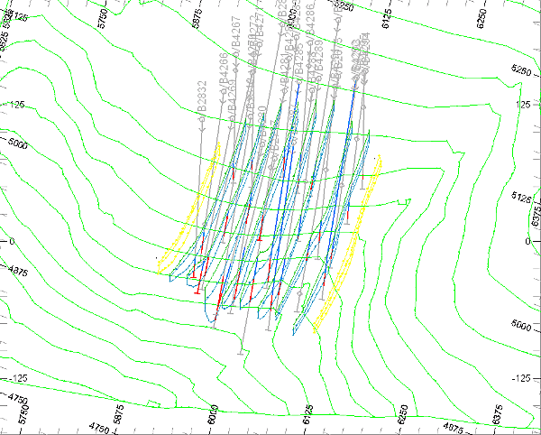

 |  Use string translation and editing techniques when:

  * extrapolating geological features beyond existing sample data;
  * inserting additional sections within a string model.

  
---|---  
  
## Loading and Formatting the Data

  1. Unload any previously loaded data.

  2. In the Project Files control bar, select the All Tables folder.

  3. Drag-and-drop the following files (if not already loaded) into the 3D window:~  

     * _vb_holesc

     * _vb_min1st

     * _vb_stopo

     * _vb_viewdefs

  4. In the Sheets control bar, expand the 3D folder.

  5. Select only the following check boxes (i.e. display these objects):  

     * Default Grid

     * _vb_min1st.dm (strings)

     * _vb_stopo.dm (strings)

     * _vb_holesc (drillholes)

  6. In the Sheets control bar, Double-click _vb_holesc (drillholes).
  7. In the Drillholes Properties dialog, Lines & Symbols tabIn the Color tab, select the Legend: [Datamine: ZONE (_vb_holesc)], Column: [_vb_holesc (drillholes).ZONE] .

  8. In the Labels tab, select Display Labels and ensure the Collar item is selected in the Position groupCollar.

  9. If not already split into two views, select theViewribbon andSplit Vertically
  10. Select the left-hand window, and, using the View ribbon, enable the Lock toggle
  11. If it exists, delete the Default Section item from the Sheets | 3D | Sections folder, then double-click the _vb_viewdefs item
  12. Disable the Use Dimensions check box and click the right arrow until the 'Inclined View' is shown in the left hand. Disable the Section Plane - Fill check box and click OK.
  13. Disable the view of the Default Grid, using the Sheets control bar.
  14. In the 3D window confirm that the 'Inclined View' of the composited static drillholes, topography contours and ore body strings is displayed as shown below:  
  
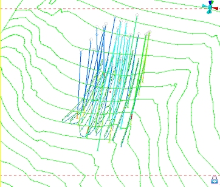  
  
 | 
     * The drillhole, topography and mineralization zones data are shown looking from above and the southeast.
     * The mineralization zone strings lie in vertical N-S orientated planes.  
---|---  

## Creating a Working Copy of _vb_min1st.dm (strings) 

  1. In the Sheets control bar, right-click _vb_min1st (strings) object and select Data | Save As.

  2. In the Save New 3D Object dialog, click Extended Precision Datamine (.dm) File.

  3. In the Save _vb_min1st (strings) dialog, select your project folder, define the File name: as 'min2st.dm', and click Save.
  4. In the Sheets control bar, confirm that the _vb_min1st.dm (strings) object has been replaced by the strings object min2st (strings).
  5. In the Sheets control bar, ensure min2st (strings)is selected.
  6. In the Loaded Data control bar, right-click double-click min2st (strings) to make it the current strings object.  
| The current object is highlighted in bold in the Sheets control bar and is also listed in the Current Objects toolbar.  
---|---  

**Extending the Mineralization Zone Strings on the Eastern Side**

  1. Using the View ribbon, select Zoom Area and define a zoom rectangle around the mineralization zone strings as shown below:  
  
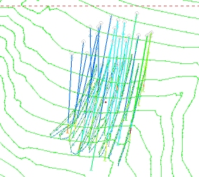

  2. Disable the overlays for the _vb_stopo and _vb_holesc overlays using the Sheets control bar.
  3. Select both the upper (Green 5) and lower (Cyan 6) mineralization zone strings of the far eastern (right) section - use the <CTRL> key and left-click to select both strings as shown:  
  
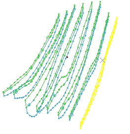  

  4. Select the Edit ribbon's Translate command

  5. In the Studio RM dialog, type in an X Translation Distance: of '25' , keep the original strings, and click OK:  
  
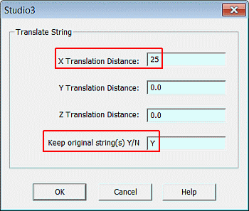  
  
 | Translation distances along a specific coordinate axis can be either positive or negative:
     * '+' translation in the direction of increasing coordinate values - for example, '25'
     * '-' translation in the direction of decreasing coordinate values - for example, '-25'  
---|---  
  6. Confirm that a new set of strings has been created 25m to the east (right) of the selected strings as shown below:  
  
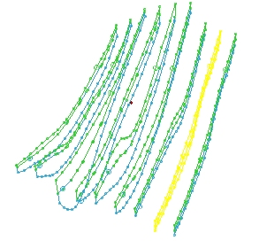
  7. Using the Home ribbon, click Deselect | All Strings

  8. Using the View ribbon, select Zoom Area and define a zoom rectangle around the northern (top right) end of the new zone strings.
  9. Using the Edit ribbon, select Delete Pointsand delete the two most northern columns of points shown below (see the above image for a unselected view of the points on the new string):  
  
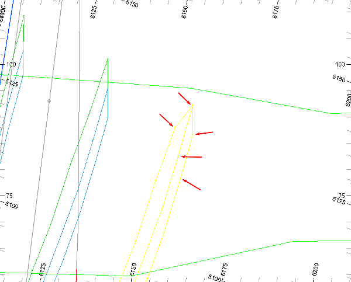  

  10. Click Done..
  11. Press <Up Arrow> and <Right Arrow> to move down to the southern (bottom) end of the new zone strings.
  12. Delete Pointsagain, but this time delete the most southern column of points shown below:  
  
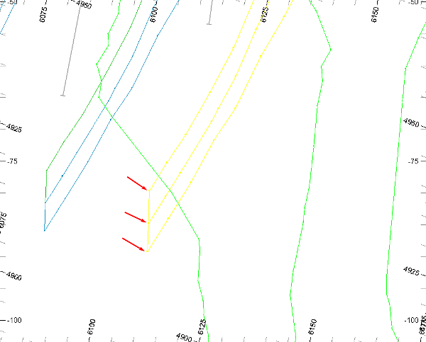  

  13. Click Cancel.
  14. ClickZoom Outand check that your edited zone strings for the extrapolated eastern end are the same as the highlighted strings shown below:  
  
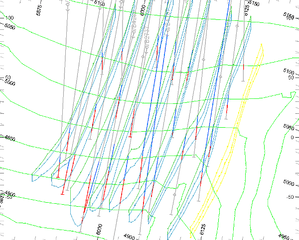
  15. Click away from the dataset to deselect any string data

  16. In the Sheets control bar, right-click min2st (strings), and select Save.

**Extending the Mineralization Zone Strings on the Western End**

  1. Repeat the above steps 1. to 6. for the far western section, using an X Translation Distance of '-25', keeping the original strings.
  2. In the 3D window, confirm that a new set of strings has been created 25m to the west (left) of the selected (yellow) strings shown below:  
  
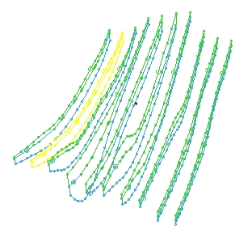
  3. Zoom in again, but define a zoom rectangle around the northern (top left) end of the new zone strings.
  4. Now delete the two columns of points shown below:  
  
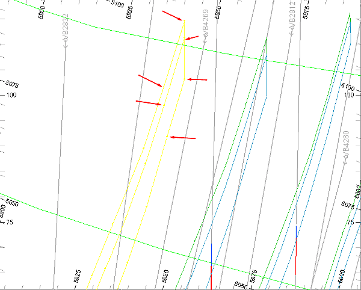  
  
| For increased control when deleting points, first select the required string, then run the point deletion command.  
---|---  
  

The eight points are deleted as follows:

     * four points in the upper string

     * four points in the lower string.

| Use Redraw View to refresh the Design window (rd) view between deleting one or more points.  
---|---  
  5. Click Done.
  6. Press <Up Arrow> and <Right Arrow> to move down to the southern (bottom left) end of the new zone strings.
  7. Delete the two column of points shown below:  
  
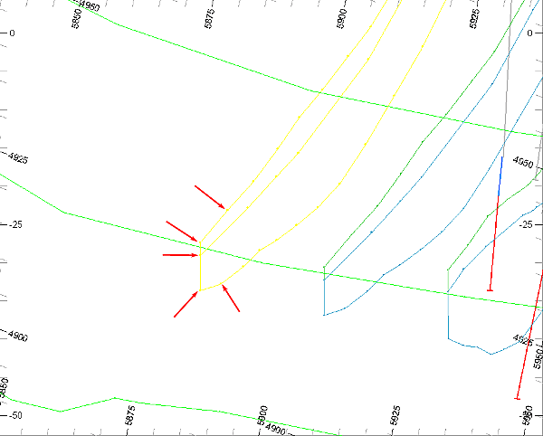  
  
 | The six points are deleted as follows:
     * three points in the upper string
     * three points in the lower string.
  
The two strings should still be closed after the points have been deleted - use Close String to close any open strings.  
---|---  
  8. Click Done.
  9. Use theViewribbon'sZoomfunction and confirm that your edited zone strings for the extrapolated western end are the same as the highlighted strings shown below:  
  
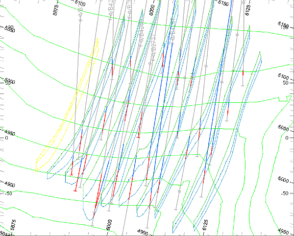
  10. Using the Home ribbon, choose Deselect | All Strings

  11. In the Sheets control bar, right-click on the min2st (strings) object, select Save.

| Your extrapolated ore zone strings can be checked against the example file _vb_min2st.dm  
---|---  
  
##  [Next Page](<Adding_Tag_Strings.md>)