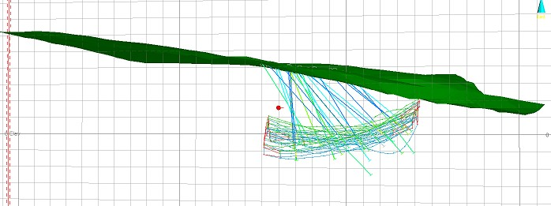
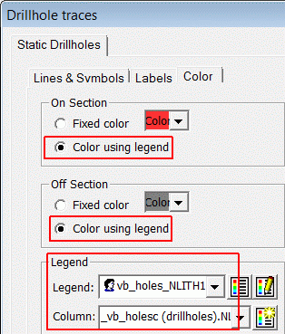
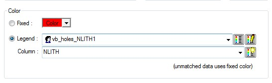
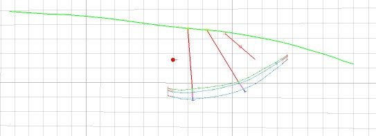
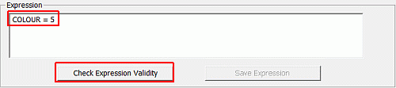
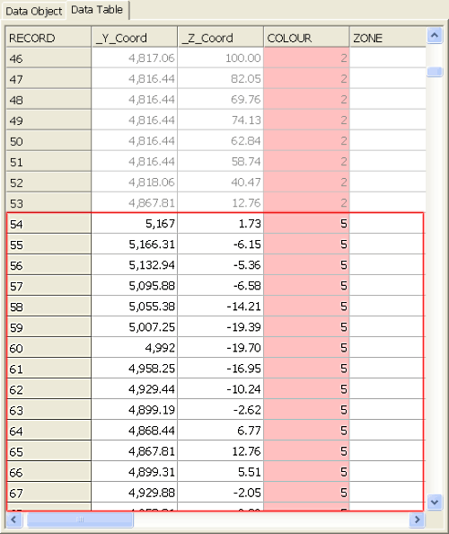
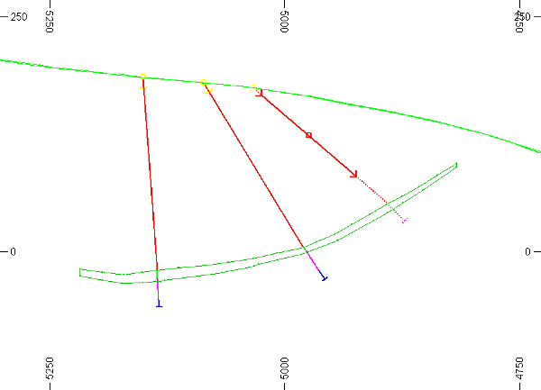

 |  Filtering Modeling Data How to filter modeling data.  
---|---  
  
# Overview

In this part of the tutorial you will be introduced to the procedures and tools used to filter geological modeling data.

## Prerequisites

  * Completed the [Creating a New Project](<Creating_a_New_Project.md>) exercise.

  * Completed the [Defining Geological Modeling Settings](<Defining_Geological_Modeling_Settings.md#Exercise1>) exercise.

  * [Files](<Tutorial_Files_List.md>) required for the exercises on this page:

  *     * _vb_holesc.dm

    * _vb_minst.dm

    * _vb_stopopt.dm

    * _vb_stopotr.dm

    * _vb_viewdefs.dm

## Exercise: Filtering Ore Body Strings using the Data Object Manager

In this exercise, you will use the Data Object Manager to filter the ore body strings object _vb_minst (strings) in the 3D window, based on the numeric attribute COLOUR, in order to view the different mineralization zones. This will be done as follows:

  * Defining and applying a Filter Expression to view only the **upper** mineralization zone strings.
  * Defining and applying a Filtering Expression to view only the **lower** mineralization zone strings.
  * Removing the previously defined filters for the ore body strings object.

 |  Use the Data Object Manager to filter data when:

  * filtering data within a single object and not by object type - for example, all string objects;
  * objects have already been loaded - it cannot be used to filter data during the loading of an object, but only after the object has been loaded;
  * applying the filter to an object across the **Design** , **Visualizer, Plots** or 3D windows.

  
---|---  
  
 |  Data can be filtered in two ways:

  1. Individual objects, using the Data Object Manager (this exercise).
  2. By object type, using the Format ribbon and the Filter command group

  
---|---  
  
## Loading Data

  1. Select the 3D window.

  2. Unload all data in memory.

  3. In the Project Files control bar, expand the All Tables folder.

  4. Drag-and-drop the following drillholes, ore body strings, topography wireframe triangles and section definition files (if not already loaded) into the 3D window:

     * _vb_holesc

     * _vb_minst

     * _vb_stopotr

     * _vb_viewdefs

  5. Select the Sheets control bar and expand the 3D folder.

  6. Select only the following check boxes (i.e. only display these objects) :

  1.      * Grid folder -Default Grid

     * Strings folder -_vb_minst (strings)

     * Drillholes folder -_vb_holesc (drillholes)

     * Wireframes folder -_vb_stopotr/_vb_stopopt (wireframe)

## Retrieving the View

  1. In theSheetscontrol bar, right-click theDefault Sectionitem in the3D | Sectionsfolder and selectDelete.
  2. Activate theViewribbon and enable theLocktoggle.
  3. In theSheetscontrol bar, double-click the_vb_viewdefsitem in the3D | Sectionsfolder.
  4. Disable the Use Dimensions check box, and in the Section Plane group, deselect theFilloption and selectLines.
  5. Click the right arrow until you see the 'N-S Secn 5935' description appear in the Status bar:  
  
  

  6. Note how the screen updates automatically each time a new section definition is selected. This is because, as you deleted the Default Section, the Viewdefs table is now the default (active) section, and will be locked to an orthogonal view each time. Click OK and zoom-all:  
  
  
  
 | 
     * The ore body strings object _vb_minst (strings) is currently coloured on the field COLOUR, using the legend Standard Datamine COLOUR Fields.
     * The ore body strings object contains three sets of strings, each having a different color:
     *        * green (5) - upper ore perimeters (closed strings)
       * cyan (6) - lower ore perimeters (closed strings)
       * red (9) - tag strings
     * The ore body strings object _vb_minst (strings) , in addition to the attribute field COLOUR, contains the attribute field ZONE (i.e. a mineralization zone flag field). These attributes correspond as follows:
     *        * upper mineralization zone: COLOUR=5, ZONE=1
       * lower mineralization zone: COLOUR=6, ZONE=2 
     * The composited static drillholes object _vb_holesc (drillholes) is currently colored on the field DENSITY, using the legend Datamine: DENSITY (_vb_holesc).  
---|---  

## Loading the NLITH1 Legend

  1. Using the Format ribbon, click Format Legends
  2. In the Legends Manager dialog, Available Legends group, right-click User Legends and select Load Legend.
  3. In the Open dialog, browse to C:\Database\MyTutorials\GeolMod, select _vb_holes_NLITH1.elg, and click Open.
  4. In the Legends Manager dialog, Available Legends group, confirm that vb_holes_NLITH1 is listed under the User Legends folder.
  5. In the **Legends Manager** dialog, click Close.

##    
Formatting Static Drillholes

  1. Select the Sheets control bar and expand the 3D folder.

  2. Double-click _vb_holesc (drillholes).

  3. In the Drillholes Properties dialog, select the Lines & Symbols tab

  4. Define the following settings and click OK:  
  
  

  5. Back in the 3D window, edit the _vb_viewdefs section so that Clipping is applied Outside to a distance of 2m in each direction.

  6. Edit the properties of the _vb_stopotr/_vb_stopopt overlay so that it is shown as an Intersection with the [_vb_viewdefs] table.

  7. In the 3D window, confirm that your drillholes are now colored by rock type as shown below:  
  
  

##  Filtering the Upper Mineralized Zone Strings

  1. Select the Data ribbon and click Manage Objects
  2. Ensure the _vb_minst object is selected on the left and, in the Data Object tab, Filter group, click Expression Builder....  

  3. In the Expression Builder dialog, Variable Selection pane, select the variable [COLOUR], and click Select Variable.  
| The variable  should now be displayed in the Expression pane.   
---|---  
  4. In the **Operators** group, click the '**=' button.**
  5. In the Data Selection group, click Column Data....
  6. In the Column Data dialog, select the value [5], and click OK.
  7. In the Expression Builder dialog, Expression pane, click **Check Expression Validity** :  
  
  

  8. In the Expression Wizard, click **OK**.  
 | The Expression Wizard message dialog can display two different messages:
     * 'Expression is valid' - the syntax of the expression is valid and so one can proceed with filtering.
     * 'The current expression is not valid...' - the syntax of the expression needs to be corrected before filtering can take place.  
---|---  
  9. In the Expression Builder dialog, click **OK**.
  10. Back in the Data Object Manager dialog, Data Object tab, Filter group, confirm that the **Filter** has been set to ' COLOUR = 5', and click Apply. 
  11. In the Data Object Manager dialog, Data Table tab, confirm that only records with 'COLOUR=5' are shown in black font as shown in the example below (other filtered records will be shown in grey):  
  
  

  12. Close the Data Object Manager dialog using the red cross in the top right corner.
  13. Confirm that only the upper zone strings (Green 5) are displayed, as shown below:  
  
  
  

****[Next Section](<Creating_and_Navigating_Log_Sheets.md>)