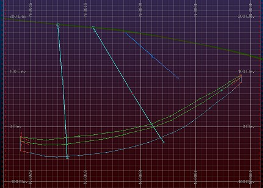
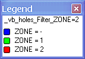
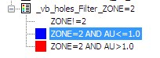
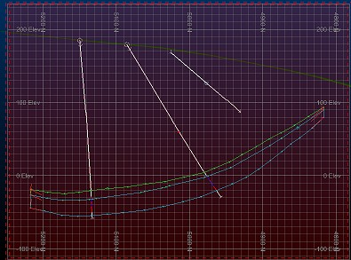

 |  Using Filter Legends Creating and applying filter legends.  
---|---  
  
# Overview

In this part of the tutorial you will create and use filter legends with geological modeling data.

## Prerequisites

  * Completed the [Creating a New Project](<Creating_a_New_Project.md>) exercise.

  * Completed the [Defining Geological Modeling Settings](<Defining_Geological_Modeling_Settings.md#Exercise1>) exercise.

  * [Files](<Tutorial_Files_List.md>) required for these exercises:

  *     * _vb_holes.dm

    * _vb_minst.dm

    * _vb_stopopt.dm

    * _vb_stopotr.dm

    * _vb_viewdefs.dm

## Exercise: Formatting Static Drillholes using Filter Legends

In this exercise, you will use the Legends Manager to create and apply a filter legend for the static drillholes object _vb_holesc (drillholes). The legend's filter expression uses the fields ZONE (the mineralized zone field) and AU (gold grade in g/t) in order to format drillhole segments within ZONE 2, with Au grades greater than 5 g/t.

You will complete the following tasks in this exercise:

  * Create a filter legend for static drillholes
  * Modify filter expressions for the legend
  * Apply the filter legend to static drillholes.

 |  Use the LegendsManager to filter data when:

  * needing to simultaneously filter and format data - for example, when identifying mineralized zones within drillholes;
  * filtering data within a single object, and not by object type;
  * objects have already been loaded - it cannot be used to filter data during the loading of an object, but only after the object has been loaded;
  * applying the filter to an object across the 3D window.

  
---|---  
  
## Loading the Data

  1. Select the 3D window.

  2. Unload all 3D data by opening the Sheets control bar, right-clicking the top level project icon and selecting Delete All - confirm this action

  3. In the Project Files control bar, expand the All Tables folder.

  4. Drag-and-drop the following drillholes, ore body strings, topography wireframe triangles and section definition files (if not already loaded) into the 3D window:

     * _vb_holes

     * _vb_minst

     * _vb_stopotr

     * _vb_viewdefs

 |  Use <CTRL> to select all the files you wish to load, then drag them into the data window in one go.  
---|---  
  
  5. Select the Sheets control bar and expand the 3D folder.

  6. Select only the following check boxes (i.e. display these objects) :

  1.      * Gridsfolder\- Default Grid

     * Stringsfolder\- _vb_minst (strings)

     * Drillholesfolder -_vb_holes (drillholes)

     * Wireframesfolder -_vb_stopotr/_vb_stopopt (wireframe)

## Retrieving the View

  1. If the View ribbon isn't displayed, activate it and select [_vb_viewdefs (table)] from the Sections drop-down list
  2. Enable the Lock option.
  3. Double-click the [_vb_viewdefs (table)] item to show the Section Properties dialog.
  4. Select the right arrow until 'N-S Secn 5935' appears in the Status bar.
  5. Make sure Clipping is set to Outside and click OK
  6. Your view should now look similar to the following:  
  
  
 | 
     * The ore body strings object _vb_minst (strings) is currently colored on the field COLOUR, using the legend Standard Datamine COLOUR Fields.
     * The ore body strings object contains three sets of strings, each having a different color:
     *        * green (5) - upper ore perimeters (closed strings)
       * cyan (6) - lower ore perimeters (closed strings)
       * red (9) - tag strings (used to control wireframe generation)  
---|---  

## Creating a Filter Legend for Static Drillholes

  1. Activate the Format ribbon and select Format Legends
  2. In the Legends Manager dialog, click New Legend....
  3. In the Legend Wizard: Data Table Column dialog, select Use Object Field.
  4. Select **the Object** [**_vb_holes(drillholes)].**
  5. Select the Field [ZONE], and click Next.
  6. In the Legend Wizard: Legend Storage dialog, select User Legends Storage, and click Next.
  7. In the Legend Wizard: General dialog, define **Name** as 'vb_holes_Filter_ZONE=2'.  
  
| The Type is automatically set to [Numeric] as the field ZONE is defined as a numeric field in the table_vb_holes(drillholes).  
---|---  
  8. In the Legend Wizard: General dialog, select Unique Values, and Convert to Filter Expressions, and click **Next**.
  9. In the Legend Wizard: Data Range dialog, click Next.
  10. In the Legend Wizard: Coloring dialog, select [Rainbow blue->red].
  11. Click Preview Legend....
  12. Compare your legend to that shown below, and close the Legend dialog:  
  

  13. In the Legend Wizard: Coloring dialog, click Finish.

## Modifying the Legend's Filter Expressions

  1. In the Legends Manager dialog, Available Legends group, expand the User Legends group and then expand vb_holes_Filter_ZONE=2.

  2. Select legend item ZONE = -.

  3. In the right-hand pane, Legend Item Interval group, define the Filter Expression as 'ZONE!=2'

  4. In the Legend Item Format group, select Fill Color [White].

  5. Select legend item ZONE = 1.

  6. In the pane on the right, Legend Item Interval group, define the Filter Expression as 'ZONE=2 AND AU<=1.0'
  7. In the Legend Item Format group, select Fill Color [(11) Bright Blue].
  8. Select legend item ZONE = 2.

  9. In the right-hand pane, Legend Item Interval group, define the Filter Expression as 'ZONE=2 AND AU>1.0'
  10. In the Legends Manager dialog, confirm that legend vb_holes_Filter_ZONE=2 now contains the legend items shown below:  
  
  

  11. In the Legends Manager dialog, click Close.  

## Applying the Filter Legend to the Static Drillholes

  1. Select the Sheets control bar and fully expand the 3D-Overlays folder.

  2. Select only the following objects:  
  

     * Gridsfolder\- Default Grid

     * Drillholes folder -_vb_holes (drillholes)

     * Strings folder -_vb_minst (strings)

     * Wireframes folder -_vb_stopotr/_vb_stopopt (wireframe)

     * Sections folder -_vb_viewdefs (table)

  3. Double click _vb_holes (drillholes)to display theDrillholes Propertiesdialog
  4. In the Drillholes Properties dialog, select the Lines & Symbols tab

  5. In the Drillholes tab, click Format....

  6. In the Drillhole Traces dialog, Static Drillholes tab, select the Color tab.

  7. In the Color grouptab, select the user Legend [vb_holes_Filter_ZONE=2] (note how the system recognizes that a filter legend - containing the definition of both columns and values for each bin - has been loaded, and disabling the Column field as it is no longer relevant).

  8. Click OK

  9. In the 3D window, confirm that your drillholes are now colored and filtered as shown below:  
  
  

 |  Only the drillhole segments with ZONE = 2 are colored, i.e. either red or blue; the other drillhole segments are colored white.   
---|---  

## Applying the Standard NLITH Legend to the Static Drillholes 

  1. Select the Sheets control bar and fully expand the 3D-Overlays folder.
  2. Right-click _vb_holes (drillholes) , and select Legend Column | NLITH .

****[Next Section](<Displaying_Wireframes_as_Intersections.md>)