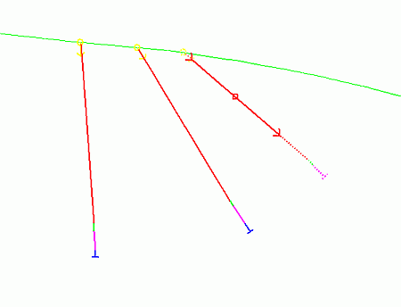
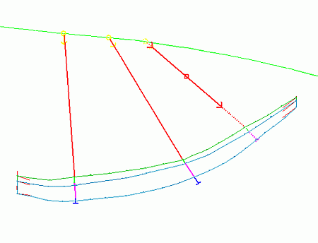
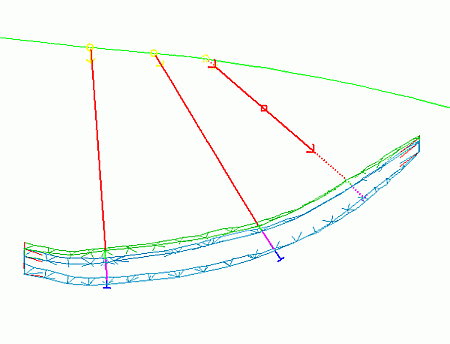
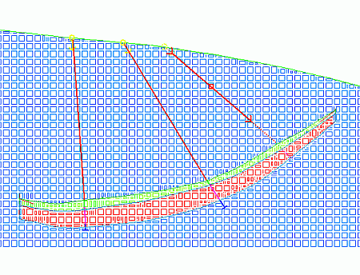

 |  Geological Modeling Methodology Outlining the geological modeling process  
---|---  
  
# The General Approach to Geological Modeling

The process of creating a 3D geological ore body model in Studio RM typically makes use of the following:

  * topography contours
  * drillholes
  * structural data e.g. fault surface
  * ore body string model (section strings, top or bottom contact contours)
  * ore body wireframe model
  * waste and ore block models

The addition of user-defined alpha or numeric attributes (e.g. ZONE - mineralization zone number; DENSITY - rock density) and the use of data filters, views and formatting, e.g. color, symbols and linestyles, facilitates the geological modeling process and enables the generation of professional outputs; for example, summary reports, plots and 3-d animations.

The general geological modeling process is summarized in the following flow diagram:

Geological Modeling Element |  Example |  Comments  
---|---|---  
Drillholes |   | 

  * drillhole data tables are desurveyed to generate static drillholes
  * drillholes are validated:
  *     * visually
    * statistically
  * drillholes are composited by rock type or mineralization zone for use in string modeling

  
|   |   
Section Strings Model* |   | 

  * closed perimeter strings are digitized in vertical sections defining the limits of each mineralization zone
  * Tag Strings are digitized
  * custom attributes are added to strings:
  *     * colors
    * zone codes
  * strings are conditioned

  
|   |   
Wireframe Model* |   | 

  * surface topography wireframe
  * ore body closed volume wireframes
  * custom attributes are automatically transferred from strings to wireframes
  * wireframes are verified
  * volumes are calculated

  
|   |   
Block Model** |   | 

  * different block models are created:
  *     * ore body
    * waste
    * combined
    * optimized
  * block models contain:
  *     * rock codes
    * densities
    * custom attributes e.g. mineralization zone codes

  
  
 |  * 3D ore bodies can also be modelled using top and bottom contact contour strings (and subsequent wireframe surfaces). ** The optimized waste+ore block model is then typically passed on to the next step which is Grade Estimation.  
---|---  
  
****[Next Page](<Working_with_Drillholes.md>)

 |  Related Topics  
---|---  
| [Working with Drillholes](<Working_with_Drillholes.md>)