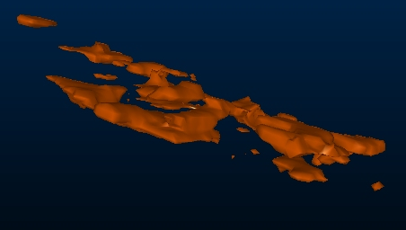
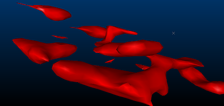
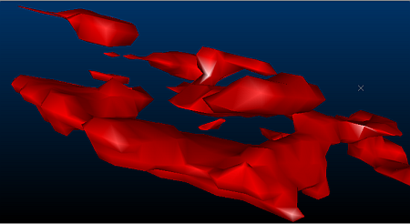
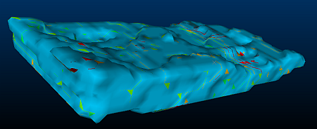
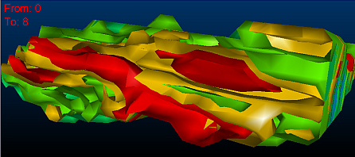
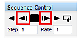

# Isoshell Output Settings

 |  Specifying Isoshell Output Settings Configuring triangle spacing and smoothing, and creating isoshells as a single object  
---|---  
  
# Overview

In this part of the tutorial, you will create isoshells using different triangle spacing and smoothing settings, and observe the effects of these changes in the 3D window. You will also create isoshells as a single object, and use Studio's sequencing functionality to view isolevels individually, as an animated sequence.

## Prerequisites

  * Completed the following exercises:

  *     * [Tutorial Preparation](<CreateIsoshells_AddData.md#Exercise1>)

    * [Creating Categorical Isoshells](<CreateIsoshells_CatValues.md#Exercise1>)

    * [Viewing Categorical Isoshells](<ConfigCatIsoshells.md#Exercise1>)

    * [Creating Continuous Isoshells](<CreateIsoshells_ContValues.md>)

    * [Viewing Continuous Isoshells](<ConfigContIsoshells.md>)

## Exercise: Specifying Isoshell Output Settings

## Triangle Spacing

Triangle spacing (size) can either be set automatically, for the size of bounding box specified in the Volume tab, by selecting Calculate from bounding boxin theOutputtab. It can also be defined by specifying a value for the size of triangles used in generating the output.

Larger triangles are processed faster, but produce coarser wireframes which may not show smaller structures.

 |  As reducing the triangle size increases the detail in the isoshells produced, it is recommended that this is done prior to increasing the smoothing using the Smooth Isosurfaces setting.  Larger triangle sizes should be used initially to quickly produce coarse isoshells, with smaller wireframes being subsequently specified to improve their detail.  
---|---  
  
  1. Unload any data that may already be loaded.
  2. Use the Structure ribbon to select Create Isoshells.
  3. In the Create Isoshellsdialog, clickRestore.
  4. **I** n the Output tab, Object Base Name box, type "ISO_AU_TRIANGLE15".
  5. **I** n the Output tab, deselect Calculate from bounding box.
  6. **I** n the Output tab, Triangle Spacing box, type '15', and click OK.  
| In this case, reducing triangle size by 25% is likely to produce an acceptable compromise between processing time, and the detail of the isoshells produced.  
---|---  
  7. In the Isoshell Report dialog, click Finish.
  8. In the Sheets control bar, expand the 3D and Wireframes folders, and deselect all objects except ISO_AU_TRIANGLE15: (AU=8).
  9. Double-click ISO_AU_TRIANGLE15: (AU=8).
  10. In the Wireframe Properties dialog,General tab, Colorgroup,Legend:drop-down list, select [AU Range].
  11. In theColorgroup,Columndrop-down list, select [AU].
  12. In theShadinggroup,select theSmoothoption, and clickOK.
  13. Using theViewribbon selectZoom Area | Zoom West.
  14. In the 3D window, zoom into the displayed isoshells, and note the effect of reducing the triangle size:  
  

## Smoothing Isosurfaces

When using larger triangle sizes, noticeable ramping steps may be visible in the output wireframe. These can be smoothed during generation using the Smooth Isosurfaces option. This process ‘averages out’ regional differences between existing vertices, rather than adding additional vertices. Wireframes can also be smoothed after generation by using thewireframe-smoothcommand. Excessive smoothing should be avoided, however, as this can reduce volumes.

  1. Use the Structure ribbon to select Create Isoshells.
  2. In the Create Isoshellsdialog, clickRestore.
  3. **I** n the Create Isoshellsdialog,Output tab, Object Base Name box, type "ISO_AU_LOW_SMOOTHING".
  4. **I** n the Output tab, select Calculate from bounding box.
  5. **I** n the Output tab, select Smooth Isosurfaces, and select the Low option.
  6. **I** n the Create Isoshellsdialog, clickOK.
  7. In the Isoshell Report dialog, click Export to Excel.
  8. In row 3 of the Excel worksheet, confirm that 47,287,079 m3 of material contains more than 2 g/t of AU.
  9. In row 7 of the Excel worksheet, confirm that 1,297,018 m3of material contains more than 10 g/t of AU.
  10. Compare these volumes with the volumes reported in the [Creating Continuous Isoshells](<CreateIsoshells_ContValues.md#Exercise1>) exercise (steps 14-15), and note that the smoothing process has reduced them.
  11. In Excel, select File | Exit.
  12. In the Microsoft Excel dialog, click Don't Save.
  13. In the Isoshell Report dialog, click Finish.
  14. In the Sheets control bar, expand the Wireframes folder, and deselect all objects except ISO_AU_LOW_SMOOTHING: (AU=8).
  15. Double-click ISO_AU_LOW_SMOOTHING: (AU=8).
  16. In the Wireframe Properties dialog,General tab, Colorgroup,select aFixed Colorof [Red]Legend:drop-down list, select [AU Range].
  17. In theColorgroup,Columndrop-down list, select [AU].
  18. In theShadinggroup,select theSmoothoption, and clickOK.
  19. Using theViewribbon selectZoom Area | Zoom West.
  20. In the 3D window, zoom into the isoshells and note the visual effect of the smoothing setting that you specified:  
  

  21. Compare ISO_AU_LOW_SMOOTHING: (AU=8) \- created with low smoothing - with ISO_AU: (AU=8), displayed below, which was created without selecting theSmooth Isosurfacesoption:  
  

  22. In the Sheets control bar, right-click the Wireframes folder and select Hide All.

## Isolevel Objects

Creating a different object for each isolevel allows you to easily switch between isoshells in the 3D window by selecting individual isoshells in the Sheets control bar. This method of creating isoshells also enables you to change the transparency of individual isoshells using the Opacity control in the Wireframe Properties dialog, General tab. This enhances the visual characteristics of the isoshells, enabling you to display them more effectively in the 3D window.

Creating isoshells as a single object, however, enables you to sequence them in the 3D window, allowing you to view each isolevel individually as part of an animated sequence. This is demonstrated below.

## Creating Isoshells as a Single Object

  1. Use the Structure ribbon to select Create Isoshells.
  2. In the Create Isoshellsdialog, clickRestore.
  3. **I** n the Output tab, Object Base Name box, type "ISO_AU_SINGLEOBJECT ".
  4. **I** n the Output tab, deselect Different object for each isolevel.
  5. **I** n theOutputtab, deselectSmooth Isosurfaces, and clickOK.
  6. In the Isoshell Report dialog, click Finish.
  7. In the Sheets control bar, expand the Wireframes folder and double-click ISO_AU_SINGLEOBJECT.
  8. In the Wireframe Properties dialog,General tab, Colorgroup,Legend:drop-down list, select [AU Range].
  9. In theColorgroup,Columndrop-down list, select [AU].
  10. In theShadinggroup,select theSmoothoption, and clickOK.
  11. In the 3D window, confirm that the isoshells are displayed:  
  

## Sequencing Isoshells

  1. In the Sheets control bar, expand the Sections folder, and select Isoshell Section.
  2. In the Sheets control bar, expand the Wireframes folder, and double-click ISO_AU_SINGLEOBJECT.
  3. In the Wireframe Properties dialog,General tab, Sequence Columndrop-down list, select [AU].
  4. In theSequence Optionsgroup, select theForwardsoption.
  5. In theSequence Optionsgroup, deselectLoop.
  6. In theSequence Optionsgroup, type '1' in theAnim Stepbox.
  7. In theSequence Optionsgroup,Annotatedrop-down list, select [AU].
  8. In theSequence Optionsgroup, selectShow Annotation, and clickOK.
  9. In the Sheets control bar, right-click ISO_AU_SINGLEOBJECT, and selectSequence Controls.
  10. In the3Dwindow, confirm that an annotated view of the isoshells section is displayed:   
  

  11. In theSequence Controlbar, use theStep the animation forwardsandStep the animation backwardsbuttons to step through the sequence:   
  

  12. In the3Dwindow, confirm that AU values associated with each group of isoshells are displayed.

****Top of page