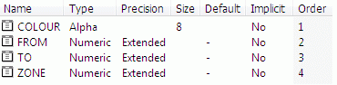

 |  Importing Drillhole Data Tables Importing a Drillhole Data Table from an Excel Worksheet.  
---|---  
  
# Overview

In this part of the tutorial you will import a drillhole data table from a text file, and import another drillhole data table from an Excel worksheet. You will then confirm that a new Machine Data Source for importing Microsoft Excel worksheets is listed in the ODBC Data Source Administrator dialog.

## Prerequisites

  * Completed the [Creating a New Project](<Creating_a_New_Project.md>) exercise.

  * Have access to an installed copy of Microsoft® Excel

  * Read the Principles page [Working with Drillholes](<Working_with_Drillholes.md>).

  * [Files](<Tutorial_Files_List.md>) required for the exercises on this page:

  *     * _vb_collars_space.txt

    * _vb_drillhole_data.xls

## Links to exercises

The following exercises are available on this page:

  * Importing a Drillhole Data Table from a Text File

  * Importing a Drillhole Data Table from an Excel Worksheet

## Exercise: Importing a Drillhole Data Table from a Text File

In this exercise, you will import the drillhole collars file _vb_collars_space.txt (ASCII space-delimited format), and generate the Datamine format (.dm) collars file dhcollar.dm. The imported file will then be checked in the Datamine Table Editor.  
The collars file contains the following fields:

  * BHID* \- drillhole identifier
  * XCOLLAR* \- collar x-coordinate
  * YCOLLAR* \- collar y-coordinate

  * ZCOLLAR* \- collar z-coordinate (elevation)

  * ENDDEPTH \- drillhole final depth (m)

  * REFSYS \- coordinate system (in this case a Local grid)

  * REFMETH \- coordination method (obtained using differential GPS methods)

  * HOLETYPE \- method used to drill the hole (DD - diamond drill cored, RC - reverse circulation percussion)

  * ENDDATE \- date on which drilling was completed (date format dd/mm/yy)

* Standard Datamine Mining drillhole Collars file fields.

## Importing the Drillhole Collars File

  1. Display the Project Files control bar and select the Import External Data into the Project toolbar icon

  2. In theData Import dialog, Driver Categorybox, select [Text].

  3. In theData Import dialog, Data Type box, select [Tables] and click OK.

  4. In the Open Source File (Text) dialog, browse to the folder C:\Database\MyTutorials\GeolMod, and select the file _vb_collars_space.txt , click Open.

  5. In the Text Wizard (1 of 3) dialog, define the settings shown below, and click Next  
  
Data Type: Delimited  
Start at Line: 1  
Header Row: Selected and a value of "1"

  6. In the Text Wizard (2 of 3) dialog, make sure the Space option is set (the default is Comma) and confirm that the data shown in the Preview group is now separated by vertical lines.

  7. In the Text Wizard (2 of 3) dialog, click Next.

  8. In the Text Wizard (3 of 3) dialog, select each data column in turn in the Preview group (use the horizontal slider bar to view the fields hidden to the right), define the column format settings as shown in the table below, and click Finish.

Column Formats: |  |   
---|---|---  
Name |  Type |  Property  
BHID |  Attribute |  Alpha  
XCOLLAR |  Attribute |  Numeric  
YCOLLAR |  Attribute |  Numeric  
ZCOLLAR |  Attribute |  Numeric  
ENDDEPTH |  Attribute |  Numeric  
REFSYS |  Attribute |  Alpha  
REFMETH |  Attribute |  Alpha  
HOLETYPE |  Attribute |  Alpha  
ENDDATE |  Attribute |  Alpha  
Special Values: |  |   
Absent Data |  - |  Leave blank/unselected  
Trace Data |  - |  Leave blank/unselected  
  
  9. In the Import Files dialog, Files tab define Table file as 'dhcollar'.
  10. In the Import Fields tab, select all nine check boxes, and click OK.
  11. In the Project Files control bar, All Tables (*.dm) folder, check that the new Datamine file dhcollar is listed. 
  12. Display the Files window.
  13. In the Project Files control bar, All Tables (*.dm) folder, left-click the file dhcollar.
  14. Click the Project button and SaveSelect File | Save.

 |  Your imported and saved drillhole collar table dhcollar can be checked against the example file _vb_collars.  
---|---  
  
## Exercise: Importing a Drillhole Data Table from an Excel Worksheet

In this exercise you will import the mineralization zones drillhole table Zones, from the _vb_zones sheet in the Excel format file _vb_drillhole_data.xls. It will be saved to the Datamine format (*.dm) file dhzones.dm, using the default Machine Data Source. The drillhole mineralized zones sheet contains the following fields:

  * BHID*: drillhole identifier.
  * FROM*: depth at which the sample interval starts.
  * TO*: depth at which the sample interval ends.
  * ZONE: numeric mineralized zone identifier.

* Standard Datamine Mining field names for a drillhole interval table.  

 |  A default Machine Data Source for importing Microsoft Excel worksheets in *.xls format is generally created as part of the Microsoft Excel installation. You will need to have access to an installed copy of Microsoft Excel to complete this exercise.  
---|---  
  
## Importing the Zones Worksheet

  1. Display the Project Files control bar and select the Import External Data into the Project toolbar icon

  2. In the Data Import dialog, select the Driver Category [ODBC v2] and the Data Type [Tables v2] , and click OK.

  3. In the Select Data Source dialog, Machine Data Source tab, click New....

  4. In the Create New Data Source dialog, select User Data Source (Applies to this machine only), and clickNext.

  5. In the Create New Data Source dialog, driver list, select Microsoft Excel Driver (*.xls)and clickNext.

  6. In the Create New Data Source dialog, click Finish.

  7. In the ODBC Microsoft Excel Setup dialog, click Select Workbook....

  8. In the Select Workbook dialog, browse to the folder C:\Database\MyTutorials\GeolMod, select the Database Name [_vb_drillhole_data.xls], and click OK.

  9. In the ODBC Microsoft Excel Setup dialog, Data Source Name: box, enter "Zones$", and click OK.

  10. In the Select Data Source dialog, click OK.

  11. In the Table Selection dialog, select the sheet [Zones$], and click OK.

  12. In the ODBC Table Import dialog, Data Fields group, select [BHID], [FROM], [TO] and [ZONE] by clicking All, and click OK.

  13. In the StudioRM warning dialog, click OK. 

 |  The data conversion error can be ignored as it is detecting empty records in the numeric ZONE column which are there by design.  
---|---  
  14. In the Import Files dialog, Files tab, define the Table filename as dhzones.

  15. In the Import Files dialog, Import Fields tab, select [BHID], [FROM], [TO] and [ZONE], and click OK.

  16. In the Project Files control bar, All Tables (*.dm) folder, confirm that the newly imported file dhzones is listed.  

 |  Imported Datamine files have a different icon from existing Datamine files that were added to the project when it was created.  
---|---  
  17. Display the Files window.

  18. In the Project Files control bar, All Tables (*.dm) folder, select dhzones.

  19. In the Files window, confirm that the Name, Type, Precision and Size parameters are as shown below:  
  
  

  20. Save the project file using the Project button and Saveusing File | Save

 |  Your imported and saved drillhole mineralization zones table dhzones can be checked against the example file _vb_zones.  
---|---  
 |  The above exercise shows the general method for importing a single drillhole data table. When importing drillhole data tables in order to create static drillholes for modeling purposes, a set of drillhole tables needs to be imported. A typical minimum set of drillhole data consists of the following tables: Collars - drillhole collar coordinates Surveys - downhole survey readings Assays - interval table containing assay data Additional tables typically include: a lithology or rock type table (interval table) geological structures table  
---|---  
  
##   [Next Page](<Creating_Static_Drillholes.md>)