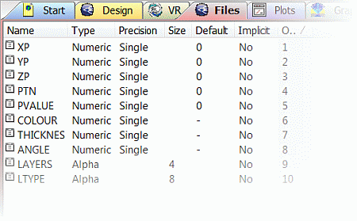
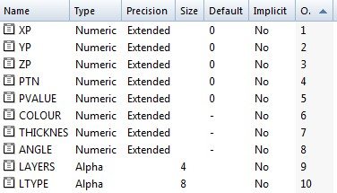
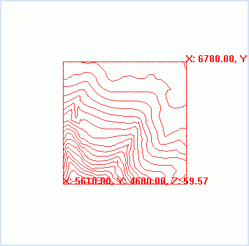

 |  Importing Topography Contours Importing topography contours from a CAD file  
---|---  
  
# Overview

In this part of the tutorial you will import CAD-format (.dwg) topography contour data, preview the 3D object and then re-import the file.

## Prerequisites

  * Completed the [Creating a New Project](<Creating_a_New_Project.md>) exercise.

  * [Files](<Tutorial_Files_List.md>) required for the exercises on this page:

  *     * _vb_stopo.dwg

## Links to exercises

The following exercises are available on this page:

  * Importing Topography Contours from a CAD File

  * Re-importing the Topography Contours

## Exercise: Importing Topography Contours from a CAD File

In this exercise you will import topography contours data from the file _vb_stopo.dwg (AutoCAD DWG 2000 format), and generate the Datamine format (.dm) strings filestopoi.dm.

The CAD drawing file has the following data characteristics:

Polylines: represent topography contours and a bounding perimeter

  * Contour interval: 10m
  * Elevation range: 60 - 250m
  * X-coordinate range: 5,610 - 6,780m
  * Y-coordinate range: 4,600 - 5,779m 

## Importing the CAD Topography Contours file

  * Display the Project Files control bar and select the Import External Data into the Project toolbar iconSelect File | Add to Project | Imported from Data Source....

  * In the Data Import dialog, select the Driver Category [CAD], and select the Data Type [AutoCAD(strings)].

  * In the Data Import dialog, click OK.

  * In the Open Source File (CAD AutoCAD) dialog, browse to C:\Database\MyTutorials\GeolMod, and select _vb_stopo.dwg.

  * In the Open Source File (CAD AutoCAD) dialog, click Open.

  * In the Read Drawing File dialog, Selection Control group, select Load All Layers, and click OK.

  * In the Import Files dialog, Files tab, clear the Points File and Table File check boxes.

  * Define the Strings File name as "stopoi".

  * In the Import Fields tab, define the Datamine COLOUR Field as [COLOUR] (which should be set by default anyway)

  * Select Use legends to resolve Datamine color values, and click OK.

  * In the Project Files control bar, Strings folder, confirm that the file stopoi is listed.

  * Display the Files window using the Home ribbon's Show menu.

  * In the Project Files control bar, left-click the file stopoi.

  * In the Files window, confirm that the file's field Name, Type, Precision and Size parameters are as shown below:  
  
  
  
Note that Studio RM will create an extended file, not single precision  

  * Save the project file using the Project button and Saveusing File | Save.

 |  Your imported and saved topography contour strings table stopoi can be checked against the example file _ostopoi.  
---|---  
  
## 

 |  The number of records in the string table can be checked using the following steps:

  1. In the Project Files control bar, selecting the Strings folder
  2. In the Files window, selecting stopoi and checking the value listed under Rows (the value should be 1828).

  
---|---  
  
## Previewing the Topography Contours File

  1. In the Project Files control bar, select the Strings folder.

  2. Right-click the stopoi file, select Preview.

  3. In the Preview dialog, check that your contours are as shown below.  
  

  4. Rotate the 3D preview using the left mouse button.

  5. Close the dialog when you have finished previewing the topography contour data.

 |  The Preview option can be used to preview any Datamine-format files (only 3D objects). It provides a quick view of the 3D object before it is loaded in the viewing window for modeling purposes, or used for data processing. In addition Datamine files can also be previewed (right-click, and select Preview) in the Explorer Widow before adding files to the project.  
---|---  
  
## Exercise: Re-importing CAD Data

In this lesson, you will re-import the topography contours data from the file _vb_stopo.dwg (AutoCAD DWG 2000 format) to regenerate the Datamine-format (.dm) String file stopoi.dm.

 | 

  * The file is re-imported using the import parameters that are stored in the project file as defaults. These parameters were generated and saved to the project file when the file was first imported.
  * This feature can be used to simply and quickly re-import a data file that has been updated with new information, e.g. a CAD topography drawing which is updated on a monthly basis with the latest survey measurements.
  * As an alternative, the CAD file could also be loaded directly into Studio without generating a *.dm file. This is done via the Data ribbon's External | Other menu option, which also makes use of the Data Source Drivers. One advantage of loading (rather than importing) the CAD file is that every time the project is opened, the loaded CAD reference data is refreshed; new records that have been added to the CAD file will then automatically be displayed. The loaded CAD data can be refreshed at any time using the Refresh context menu option in the Loaded Data control bar.

  
---|---  
  
 | Import or Load a CAD File?

  * Importa CAD file when you wish to process or manipulate the data.
  * Loada CAD file when you only wish to use it as unmodified reference data for modeling or visualization purposes.

  
---|---  
  
## Re-importing the CAD Topography Contours file

  1. In the Project Files control bar, select the Strings folder.

  2. Right-click the stopoi file, and select Re-Import.

  3. Check the progress of the re-import process, using the progress bar.

##   [Next Page](<Conditioning_the_Imported_Contours_Strings.md>)