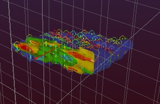

# Introduction

 |  Geological Modeling Tutorial Welcome to the Geological Modeling Tutorial  
---|---  
  
 | 

# The Studio RM Geological Modeling Tutorial

Duration: approximately 3-4 hours Aimed at: New users/staff, or anyone needing a refresher course This tutorial introduces you to key software features and procedures used in the geological modeling process when creating an ore body model. In this tutorial, you will find principles and exercises associated with the following topics:

  * Getting Started
  * Importing Topography Contours
  * Generating Drillholes
  * Loading 3D Reference Data
  * Visual Modeling Aids
  * Geological String Modeling
  * Geological Wireframe Modeling
  * Geological Block Modeling
  * Creating Isoshells

  
---|---  
  
## Sample and User-created Tutorial Data Files

There are two categories of data file used in the exercises in this tutorial; sample files (those that are added to your computer during installation of Studio RM) and user-created files (created by you and added to your PC as each exercise is completed). For each user-created file there is an existing equivalent sample data file, e.g. the user-created file modopt has an equivalent file _vb_modopt which is part of the installed data set. They can be used to check you user-created files after an exercise has been completed. Your user-created file should be the same as the sample file, providing the exercise instructions have been followed correctly. 

Most sample files supplied with the tutorial data set use the prefix "_vb_" to denote that they belong to the Viking Bounty data set. It is suggested that all files, created by you during the exercises, should be named using the user file names as shown in the exercises. This will make it easier for you to follow the exercise instructions and for you to find your files in later exercises. The sample data files are located in the folders under C:\Database\DMTutorials\Data\VBOP, whereas your own user-created files will be stored under C:\Database\MyTutorials\GeolMod.

 |  Related Topics  
---|---  
| [The Geological Modeling Data Set](<The_Geological_Modeling_Data_Set.md>)[  
Tutorial Files List](<Tutorial_Files_List.md>)[  
Geological Modeling Methodology](<Geological_Modeling_Methodology.md>)  
  
Copyright © Datamine Corporate Limited  
JMN_MF_016