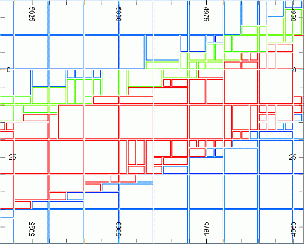
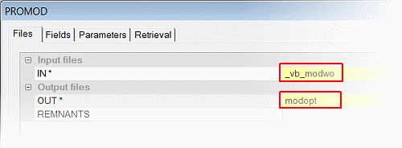
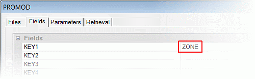
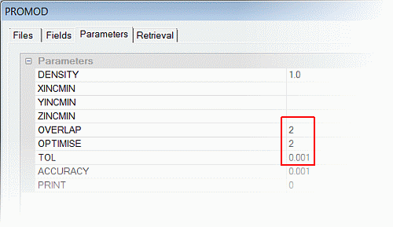
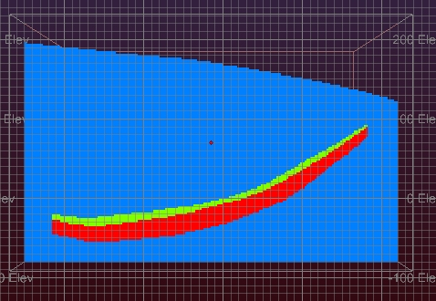
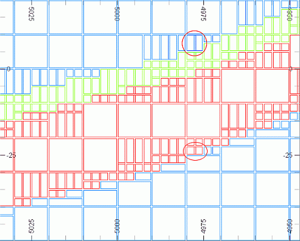

 |  Optimizing a Block Model How to optimize a block model.  
---|---  
  
# Overview

In this portion of the tutorial you are going to optimize a combined waste-and-ore block model using Studio processes.

## Prerequisites

  * Created a new project and added all the required tutorial files i.e. the exercise on the [Creating a New Project page](<Creating_a_New_Project.md>).

  * Defined project settings i.e. completed the [Defining Geological Modeling Settings](<Defining_Geological_Modeling_Settings.md#Exercise1>) exercise.

  * Read through the relevant heading on the Principles page [Working with Block Models](<Working_with_Block_Models.md>).

  * [Files](<Tutorial_Files_List.md>) required for the exercises on this page:

  *     * _vb_modwo.dm

    * _vb_viewdefs.dm

## Exercise: Optimizing the Combined Waste+Ore Block Model

In this exercise, you are going to use the process PROMOD to optimize the "waste + ore" block model _vb_modwo in order to reduce the number of subcells in the block model. The optimization process will be controlled by the key field ZONE and the results output to the file modopt.dm .

A slice through the optimized "waste+ore" block model, with the waste colored blue and the upper and lower ore zones colored green and red respectively, is shown below:

****

| 

  * Optimize a block model after:
  *     * combining two block models.
    * placing a block model into a new prototype.

  
---|---  
| 

  * The optimization of a block model allows for the following:
  *     * combination of subcells within the limits of parent cells by one or more key fields.
    * checking and resolution of model cell overlaps.
  * The optimization of a block model typically results in a smaller file size.

  
---|---  
  
| 

  * The optimization process averages out numeric field values (but not the key field values) when adjacent subcells are combined. This averaging may not be suitable for numeric flag fields e.g. rock type codes, which contain discrete values. If required, these averaged numeric flag fields in the optimized block model can be processed after optimization, using the process EXTRA, to correct this.

  
---|---  
  
Optimizing the "Waste + Ore" Block Model

  1. Activate the Model ribbon and select Manipulate | Optimize
  2. In the PROMOD dialog, Files tab, browse for and define the file names, as shown below:**  
  
**
  3. In the PROMOD dialog, Fields tab, select the fields as shown below:**  
  
**  
  
| 
     * The key field (Field KEY1) is set to ZONE.
     * Adjacent subcells within the same Parent Cell and with the same ZONE value will be combined.  
---|---  
  4. In the PROMOD dialog, Parameter tab, define the settings, as shown below, and then click OK:**  
  
**  
  
| 
     * The OPTIMISE parameter value is set to "2". This parameter has the following options:
       * 0 - No combination of subcells.
       * 1 - Combination of subcells only if they form a complete parent cell and if the values of the key field(s) in each are consistent.
       * 2 - Combine subcells to form a minimum number of subcells.
     * The TOL value (0.001) gives a tolerance on the comparison of the key field values.
     * Setting the PRINT parameter to a value other than "0" will generate a summary list of the optimization process. See the "Full Description" in the PROMOD Help document for further details.  
---|---  
  5. In the Command control bar, view the messages to follow the status of the PROMOD process.

  6. Check that the output model file modopt contains 67,278 records.

## Loading and Formatting the Data

  1. Unload any data that may be already loaded.

  2. Select the Project Files control bar, All Tables folder.

  3. Drag-and-drop the following files (if not already loaded) into the 3D window (agree to load a read-only model if the prompt is shown):  

     * _vb_modwo

     * _vb_viewdefs

     * modopt

  4. Select the Sheets control bar and expand the 3D-Overlays folder.

  5. Select only the following check boxes (i.e. display these objects):  

     * Default Grid

     * modopt (block model)

     * _vb_modwo (block model)

  6. In the Sheets control bar, 3D-Overlays folder, double-click modopt(block model).

  7. In the Block Model Properties dialog, ensure the Legend is set to [Datamine:ZONE], the Column is set to [ZONE], the Display Type is set to Intersection, then click OK

  8. In the Color tab, Color group, select the Legend : [Datamine: ZONE (modopt (block model))] and Column [ZONE].

  9. In the Sheets control bar, 3D folder, double-click _vb_modwo(block model).
  10. In theBlock Model Propertiesdialog, ensure theLegendis set to [Datamine:ZONE], theColumnis set to [ZONE] and theDisplay Typeis set toIntersection,thenclickOK
  11. Double-click the Default Section item and click North-South and set the Section Ref Point for X to '5935'. Click OK.
  12. In theViewribbon, select theLockcommand.
  13. In the 3D window, check that the model is colored as shown below, which indicates that the model consists of both "waste" and "ore" cells according to the three zones (ZONE = 1, 2 or 3):**  
  
**
  14. Using the View ribbon, Zoom Area
  15. Change the Display type for each model so that an 80% exaggeration is used, Show Fill is disabled and Show Edges is enabled.
  16. Disable the display of the grid and section, and change the background color of the3Dwindow to White.
  17. In the 3D window, check for adjacent subcells that have been combined, as shown by the highlighted examples below:**  
  
**  
You can highlight the effect of optimization more clearly by alternately enabling and disabling the display of _vb_modwo (non-optimized) to see where cells have been combined in the modopt item.
  18. Disable the display of the _vb_modwo overlay (leaving only the optimized model section on screen).  
  
| 
     * Turning on the display of both the combined (_vb_modwo) and the optimized (modopt) block models allows you to see where subcells have been combined to create new cells. These new cells fall within the limits defined by the Parent Cells.
     * Those adjacent subcells within the same Parent Cell and with the same ZONE value have been combined and have cell dimensions which are a multiple of 2.5m.  
---|---  
  19. Activate the Edit ribbon and select Query | Point and select (left-click) points within model subcells which lie in the upper (green) mineralization zone, lower (red) mineralization zone and in the (blue) waste, both above and below the ore.
  20. Click Done.
  21. In the Output control bar, check that the values for the queried points have values for the ZONE field as follows:  
  

     * "waste" above: ZONE = 0
     * upper mineralized zone: ZONE = 1
     * lower mineralized zone: ZONE = 2
     * "waste" below: ZONE = 0
  22. Repeat steps 10. to 17. for other views.

| Your optimized block model can be checked against the example file _vb_modopt.dm.  
---|---