# RM_Geological Interpretation Using a Background Image

 |  Interpretation using a Background Image Using background images to create geological string model interpretations  
---|---  
  
# Overview

In this part of the tutorial you will model geological features by drawing strings onto a background image.

## Prerequisites

  * Completed the [Creating a New Project](<Creating_a_New_Project.md>) exercise.

  * Completed the [Defining Geological Modeling Settings](<Defining_Geological_Modeling_Settings.md#Exercise1>) exercise.

  * [Files](<Tutorial_Files_List.md>) required for the exercises on this page:

  *     * _vb_Seismic_Section_NS_5985.bmp

    * _vb_stopopt.dm

    * _vb_stopotr.dm

    * _vb_viewdefs.dm

## Exercise: Geological Interpretation Using Background Images

In this exercise you will interpret the geological features displayed on a seismic section. This will be done by loading the seismic section image file _vb_Seismic_Section_NS_5985.bmp as a background image, and then digitizing strings in the view plane, using different colors to represent the various geological features displayed in the seismic section.

The strings are then saved to a new Datamine file seisinterp.dm . The image below shows the completed interpretation consisting of two vertically dipping faults in orange (3), and untrimmed upper, middle and lower ore body contacts shown in green (5), cyan (6) and magenta (7) respectively:

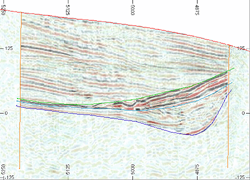

 |  Use background images:

  * as a reference for creating geological string models in plan or section;
  * as a visual enhancement for existing drillhole data and geological string or wireframe models.

  
---|---  
| The following formats can be used for background images: *.bmp, *.ecw, *.jpg or *.tif .  
---|---  
  
## Loading and Formatting the Data

  1. With your [new project](<Creating_a_New_Project.md>) loaded, activate the 3D window.

  2. In the Project Files control bar, expand the All Tables folder.

  3. Drag-and-drop the following wireframe triangles and section definitions files (if not already loaded) into the Design window:

     * _vb_stopotr

     * _vb_viewdefs

  4. Select the Sheets control bar

  5. Expand the Sections folder and right-click the [_vb_viewdefs (table)] item to select Make Active Section \- you can only have 1 active section at any one time.  
  
When a section is active, it will be used as a reference for the various view and 3D digitizing commands.
  6. then the [_vb_viewdefs (table)] item to see a list of all previously-defined section definitions in the loaded file.  
  
Note how your application has automatically detected that the file is a view definition file, and splits each definition out into a selectable item in the Sheets control bar.
  7. Right click the [N-S Secn 5985] item and choose Select:  
  
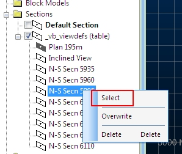
  8. Now you've created the active section in the 3D window, you are going to show an intersection of it and the loaded wireframe data, so back in the Sheets control bar, expand the Wireframes folder.
  9. Double-click the _vb_stopotr/_vb_stopopt (wireframe) overlay.
  10. In the Wireframe Properties dialog, select the Intersection Shading option.

  11. Expand the Intersection Definition drop-down list and select Click OK:  
  
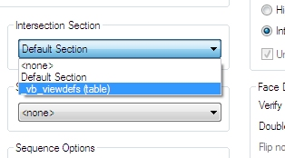  
  
With the section defined and activated, plus an instruction issued to show the wireframe intersection, you can now lock the view so it is perpendicular to the section. This is a really easy way of ensuring you are looking at data from a precise viewpoint.

  12. Next, activate theViewribbon (if not already active) and chooseView | Align. This forces the view to be orthogonal to the active section (Lock, by the way, is similar in that it also forces an orthogonal viewpoint but locks it into position, preventing further freeform rotation.
  13. Finally, using theViewribbon, selectZoom Fit:  
  
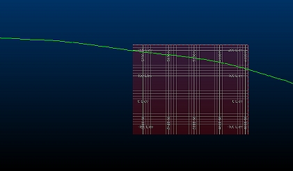

## Loading the Background Image

This section takes you through the process of loading an image file as a flat wireframe rectangle, which can subsequently be used as a basis for digitizing. As the effect of perspective will affect the view of this image, this setting will be disabled. Your current section is already aligned with the image, so you will then position the wireframe image in the correct location to start digitizing.

  1. Using the View ribbon, ensure the Perspective toggle is disabled:  
  
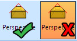

  2. Continuing from the previous exercise, access the Sheets control bar and right-click the Wireframes folder.

  3. Select Load Image Wireframe, and in the file browser that is displayed, navigate to:  
  
C:\Database\DMTutorials\Data\VBOP\Pics

  4. Select the file _vb_Seismic_Section_NS_5985.jpg

  5. In the Image Registration dialog (this is the dialog used to position your flat image object) you need to define three points to absolutely reference the image in 3D space.  
  
You are going to set an XYZ reference position for the top left, top right and bottom left of the image/wireframe.  
  
First, make sure your dialog looks like this:  
  
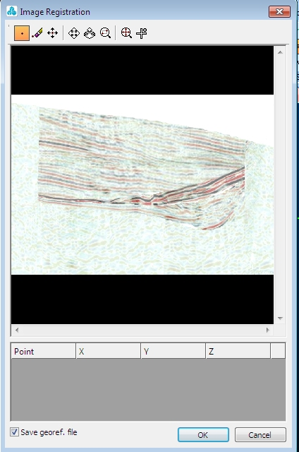

  6. The bottom section of the image contains the reference points that you select interactively using the top toolbar.  
  
First, you're going to define the top left image position in 3D space: click the New Point icon:  
  
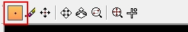

  7. Next click on the image preview in the top left corner:  
  
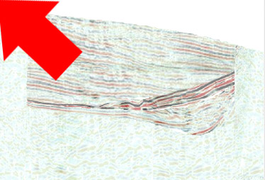

  8. See the new line appear in the table below? At the moment, the XYZ values for your point are set to 0, 0, 0 which is incorrect. Edit the table below so that Point 1 values are as follows (just over-type the existing values):  
  
X = 5985  
Y = 5270  
Z = 220  
  
Don't press <ENTER> after the last value has been entered, just click outside of the cell to enter it. Pressing <ENTER> instructs the application to attempt to position your image based on the values entered, as only 1 set of points has been entered, you will be issued a warning stating not enough points have been specified, and you'll have to start over again from Step 3.

  9. Select the New Point icon again and this time click in the top right of the image preview. As before, edit the values in the table below, but this time to the following:  
  
X = 5985  
Y = 4760  
Z = 220  
  
Again - don't press <ENTER> after the last value

  10. Final point, this time select New Point again and click the bottom left of the image preview, then set the table row values to:  
  
X = 5985  
Y = 5270  
Z = -130  
  
Here's the completed reference point table:  
  
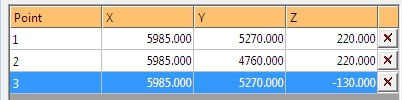  

  11. Click OK and your wireframe image will appear - conveniently aligned with the topography intersection:  
  
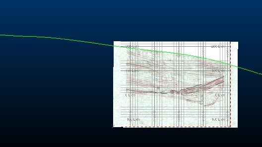

  12. Using the View ribbon, select View | Zoom Area and drag a rectangle around the outside of the loaded image wireframe.

  13. Whilst normally useful, the section grid is obstructing the view of the data a bit, so go to the Sheets control bar, expand the Grids folder and disable the check box next to [Default Grid].

  14. You should now see a full screen image of the loaded seismic data:  
  
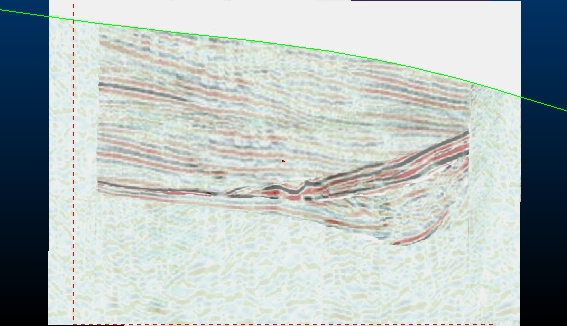  
You can load as many image wireframes as you wish, and if the images are already georeferenced, you can miss out the image registration step completely - just drag and drop from Windows if you wish. If your file contains multiple images, they can all be loaded at once and positioned automatically!

## Creating a Section String from a Topography Wireframe

Here, you're going to create a string that represents the intersection currently displayed as a green line on screen.

  1. Using the Structure ribbon, select Operations | Plane | Section.

  2. In the Section dialog, confirm that [_vb_stopotr/_vb_stopopt] is selected in the Object drop-down list.

  3. Click Use View Planeand click OK.

  4. In the Sheets control bar, expand the 3D folder.

  5. Expand the Wireframes folder and disable the view of [_vb_stopotr/_vb_stopopt (wireframe)]

  6. Still in the Sheets control bar, expand the Strings folder to see your newly-created section string (Section 1: _vb_stopotr/vb_stopopt) - double click it to open the String Properties dialog.

  7. Select the Lines tab, and in the Color group, set a Fixed Color of Red. 

  8. In the 3D window, confirm that the red topography section string appears as shown below:  
  
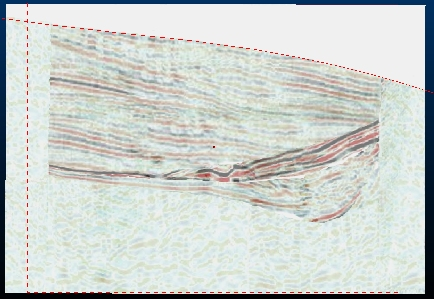  

| The new section strings object Section 0:_vb_stopotr/_vb_stoppt is colored on the column COLOUR, by default. This was transferred from the wireframe when the slice was generated.   
---|---  

## Creating a New Strings Object

  1. In theCurrent Objectstoolbar, select theObject Type [Strings] and then click Create New Object Applying Default Template.  
  
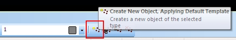  

  2. In theLoaded Datacontrol bar, confirm that theNew Stringsobject is listed, and is highlighted in bold - identifying it as the current strings object:  
  
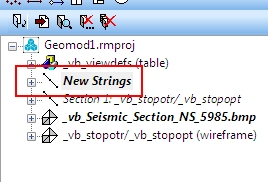  

## Digitizing the Fault Strings

  1. Type 'ns' to start digitizing a new string

  2. In the Current Objects toolbar, select the attribute [COLOUR], set the value to [3] (Orange).

  3. Move the cursor to the top of the northern (left side of view) fault line where it intersects the topography and left click

  4. Move the cursor down approximately 300m, to a point defining the bottom of the fault, left click again:  
  
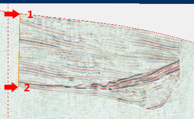

  5. Type 'ns' to start another new string (no need to click Done on the previous one)

  6. Move the cursor to the top of the southern (right side of view) fault line where it intersects the topography. This time digitize a 2-point line defining the southermost fault intersection line.  
  
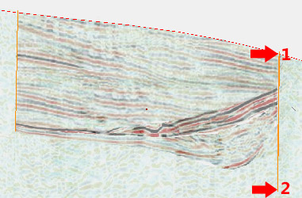

  7. Click Done. Click away from your data to deselect it.

  8. Confirm that two new orange (3) fault strings have been digitized as shown above.

## Digitizing the First Ore Body String

  1. Start to digitize another new string, and use the Current Objects toolbar, to set the attribute [COLOUR], to [5] (Green).

  2. Digitize a new line starting at the left (Northern) end of end of the set of thick, dark red and black reflectors. Moving along the top contact of this horizon, digitize in further points (x10) using left-click.  
  
You're aiming for something like this (arrows shown for suggested digitizing points):  
  
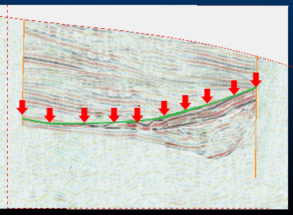

## Digitizing the Second Ore Body String

  1. Digitize another new string, but this time color it Cyan (color 6 in the Current Objects toolbar list)

  2. Move the cursor to the bottom of the northern (left) end of the set of thick, dark red and black reflectors, then digitize 10 points to create a line similar to that shown below (again, arrows show suggested digitizing points:  
  
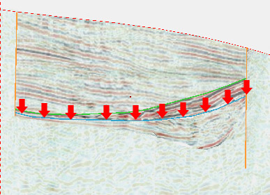

## Digitizing the Third Ore Body String

  1. Using the same process as above, digitize another new string, this time a magenta (Color = 7) along the bottom of the end of the set of thick, continuous red and black reflectors.  
  
Use as many digitizing points as you need (between 10 and 20 will be fine)  
  
Here's what you're aiming for:  
  
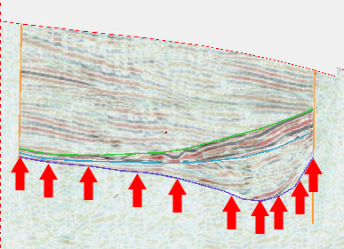

  2. Click Done and deselect any selected data.

## Hiding the Background Image

  1. To hide the background image, expand the Wireframes folder in the Sheets control bar, and disable the [_vb_seismic_Section_NS_5985.bmp] item

  2. You should now see the digitized strings in isolation (plus a section indicator and topography intersection string:  
  
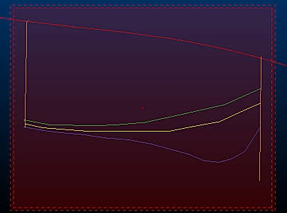

## Saving the New Strings to a Datamine File

  1. In the Loaded Data control bar, right-click the New Strings object and select Data | Save As.

  2. In the Save New 3D Object dialog, click Single Precision Datamine (.dm) File.

  3. In the Save New Strings dialog, select your project folder, define the File name as 'seisinterp_NS5985', and click Save.

  4. In the Loaded Data control bar, confirm that the New Strings object has been replaced by the object seisinterp_NS5985 (strings). 

| The geological interpretation strings seisiinterp_ns5985 can be checked against the example file _vb_seisiinterp_ns5985.dm  
---|---  
  
****[Next Section](<Digitizing_Vertical_Section_Strings.md>)