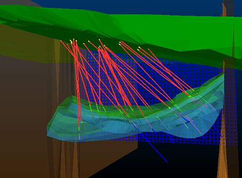
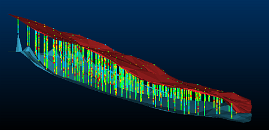

 |  The Geological Modeling Data Set The geological modeling data set.  
---|---  
  
# The Main Geological Modeling Data Set

The Viking Bounty data set used in this tutorial represents a shallow, hydrothermal Cu-Au deposit and consists of the following:

  * 28 drillholes (containing rock type, density, mineralization zone flag, gold and copper grade information)
  * topography contours and surfaces
  * fault surfaces
  * ore body model strings and surfaces
  * waste and ore block models

These data are shown below, viewed from below the topography surface, and from the west.  

# The Creating Isoshells Data Set

The data set used in the Creating Isoshells tutorial contains drillholes that are constrained by upper and lower wireframes. The wireframes are created by running a macro, and are used to define the extents of the isoshells that you create. These data are displayed in the image below, viewed from the west.

Assuming a default installation, these data files are located here: C:\Database\DMTutorials\Data\VBOP.

 |  Related Topics  
---|---  
| [Tutorial Files List](<Tutorial_Files_List.md>)