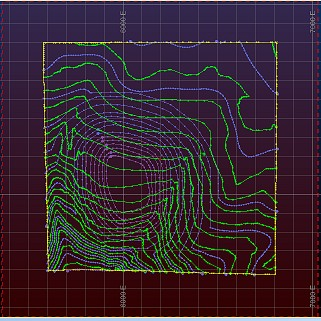

 |  Using CAD Drawings Loading and viewing CAD drawings  
---|---  
  
# Overview

In this part of the tutorial you will load and view a CAD drawing file.

## Prerequisites

  * Completed the [Creating a New Project](<Creating_a_New_Project.md>) exercise.

  * Completed the [Defining Geological Modeling Settings](<Defining_Geological_Modeling_Settings.md#Exercise1>) exercise.

  * [Files](<Tutorial_Files_List.md>) required for the exercises on this page:

  *     * _vb_toecons.dxf

    * _vb_stopo.dm

## Links to exercises

The following exercise is available on this page:

  * Loading and Viewing CAD Topography Contours

## Exercise: Loading and Viewing CAD Topography Contours

In this exercise you will load and view the CAD topography contours file _vb_toecons.dxf (CAD file format), in conjunction with other modeling data.

 |  Load CAD files:

  * when using the CAD data for visual reference purposes
  * when needing to regularly refresh a loaded file which contains updated information in the source CAD file
  * as an alternative to importing and creating a *.dm format file.

  
---|---  
  
 |  Loading a CAD file will add file location and associated loading settings to the project file; importing a file results in a *.dm output file.  
---|---  
  
## Loading the CAD File

  1. Select the 3D window.
  2. Activate the Data ribbon and select External | Other
  3. In the Data Import dialog, select the Driver Category [CAD],Data Type [AutoCAD (strings)], and click OK.
  4. In the Open Source File (CAD AUTOCAD) dialog, browse to C:\Database\MyTutorials\GeolMod, select the file _vb_toecons.dxfand click Open.
  5. In the **Read drawing file** dialog, check that the Load All Layers check box is selected, and click OK.
  6. In the **Loaded Data** control bar, check that_vb_toecons.dxf (Strings)is listed.
  7. Check that the drawing has been loaded into the3D window.
  8. Save the project file using the Project button and Save

## Loading Other Data

  1. Select the Project Files control bar, All Tables folder.

  2. Drag and drop the following strings file (if not already loaded) into the 3D window:

     1.         * _vb_stopo

## Viewing the Data

  1. Select the Sheets control bar and expand the 3D folder.

  2. Select only the following check boxes (i.e. display these objects only - switch all others off) :

     1.         * Gridsfolder - [Default Grid]

        * Strings folder - [_vb_stopo.dm]

        * Strings folder - [vb_toeconsdxf]

        * Sections - [Default Section]

  3. Click inside the 3D window and type 'za' to zoom-all-graphics

  4. In the View Control toolbar, click View Settings.

  5. Double click the [Default Section] overlay to show the Section Properties dialog.

  6. Make sure the Apply clipping check box is disabled and both Azi and Dip fields show '0' (i.e. a horizontal orientation).

  7. Using the View ribbon, click Lock

  8. In the 3D window, confirm that the following data are displayed:  
  

 |  This loaded drawing file can be formatted, colored and annotated using the same techniques used for similar loaded objects e.g. strings.  
---|---  
  
****[Next Section](<Applying_Legends_to_Geological_Modeling.md>)