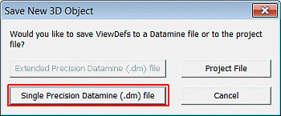
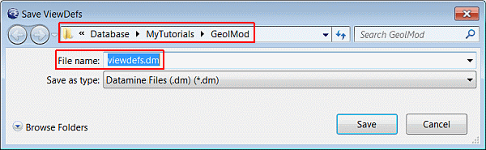
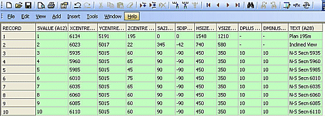

 |  Using Section Definition Files Creating and editing section definition files.  
---|---  
  
# Overview

In this part of the tutorial you will save views to a section definition file, edit this file and use it to retrieve views in the Design window.

## Prerequisites

  * Completed the [Creating a New Project](<Creating_a_New_Project.md>) exercise.

  * Completed the [Defining Geological Modeling Settings](<Defining_Geological_Modeling_Settings.md#Exercise1>) exercise.

  * Objects (Loaded Data) required for these exercises:

  *     * ViewDefs

  * [Files](<Tutorial_Files_List.md>) required for the exercises on this page:

  *     * _vb_collars.dm

    * _vb_holes.dm

    * _vb_viewdefs.dm

## Links to exercises

The following exercises are available on this page:

  * Saving Viewplanes to a Section Defintion File

  * Editing a Section Definition File

  * Retrieving Views from a Section Definition File

## Exercise: Saving Viewplanes to a Section Definition File

In this exercise, you will save to a section definition file, the three views (a plan, an inclined and a vertical section view) which were defined, saved to the ViewDefs table, and then saved to the project file in a previous exercise.

 |  Save views to a section definition file:

  * when needing to share a set of defined viewplanes amongst modeling projects;
  * as input into the plotting processes PLOTMX and PLOTWS.

  
---|---  
  
## Saving the Views to a Section Definition File

  1. In the Loaded Data control bar, right-click ViewDefs , select Data | Save As.
  2. In the Save New 3D Object dialog, click Single Precision Datamine (.dm) File.  
  

  3. In the Save ViewDefs dialog, select your tutorial folder, define File name as 'viewdefs.dm' , and click Save:  
  

  4. In the Loaded Data control bar, confirm that the ViewDefs table has been replaced by the loaded file viewdefs.dm (sections).

## Exercise: Editing a Section Definition File

In this exercise, you will add additional section definitions to the section definition file viewdefs.dm , which was saved in a previous exercise. Editing will be done using the Table Editor, and will include the addition of the following 7 vertical section definitions to the existing plan, inclined and vertical section definitions:

**Borehole** * |  **Secn.** |  **Descrip.** |  **X** **Centre** |  **Y** **Centre** |  **Z** **Centre** |  **Azi.** |  **Dip** |  **Horz.** **Dim.** |  **Vert.** **Dim.** |  **Front** **Clip** |  **Back** **Clip**  
---|---|---|---|---|---|---|---|---|---|---|---  
VB4271  
VB4269 |  4 |  N-S Secn 5960 |  5960 |  5015 |  65 |  90 |  -90 |  450 |  350 |  10 |  10  
VB2813 VB2812 |  5 |  N-S Secn 5985 |  5985 |  5015 |  45 |  90 |  -90 |  450 |  350 |  10 |  10  
VB4283 VB4282 |  6 |  N-S Secn 6010 |  6010 |  5015 |  75 |  90 |  -90 |  450 |  350 |  10 |  10  
VB4286 VB2737 |  7 |  N-S Secn 6035 |  6035 |  5015 |  65 |  90 |  -90 |  450 |  350 |  10 |  10  
VB4290 VB4289 |  8 |  N-S Secn 6060 |  6060 |  5015 |  60 |  90 |  -90 |  450 |  350 |  10 |  10  
VB2675 VB2675 |  9 |  N-S Secn 6085 |  6085 |  5015 |  60 |  90 |  -90 |  450 |  350 |  10 |  10  
VB4293  
VB4293 |  10 |  N-S Secn 6110 |  6110 |  5015 |  60 |  90 |  -90 |  450 |  350 |  10 |  10  
  
## Adding Section Definitions using the Table Editor

  1. In the Project Files control bar, expand the Section Definitions folder.
  2. Right-click viewdefs , and select _O_ pen.
  3. In the Table Editor, click Add Record and type in the parameters for **Secn.** number 4 as shown in the above table.4
  4. Repeat step 3. for each of the remaining sections 5 to 10.
  5. Check that your viewdefs table contains the 10 viewplanes shown below:  
  
  
  

  6. In the Table Editor, select _F_ ile | _S_ ave to save the modified table.
  7. In the Table Editor, select _F_ ile | _E_ xit.  
| Your edited file can be checked against the example file _vb_viewdefs.  
---|---  

## Updating the List of Views available in the Design Window

  1. In the Loaded Data control bar, right-click **viewdefs (sections),** and select Data | Refresh....  
  
| A refresh is required so that the additional views in the modified section definitions file (**viewdefs.dm**) are loaded into memory; only then are they available to the Get View command.  
---|---  

## Exercise: Retrieving Views from a Section Definition File

In this exercise, you will retrieve views which are saved in the_vb_viewdefs.dmsection definition file.

 |  Retrieve saved viewplanes from a section definition file when using views saved in a section definition file, which is shared by different modeling projects.  
---|---  
  
 |  Only one Section Defintions (View Definition) table can be loaded at a time.  
---|---  
  
## Unloading Previous Section or View Definitions Tables

  1. In the Loaded Data control bar, unload any existing view definitions tables or section definition files (right-click on the table and select Data | Unload):  

     * ViewDefs
     * viewdefs (sections)

## Loading the Section Definition File and Other Data

  1. In the Project Files control bar, expand the All Tables folder.

  2. Drag-and-drop the following section definitions, topography contour strings and drillholes files (if not already loaded) into the Design window:

     * _vb_viewdefs

     * _vb_stopo

     * _vb_holes

  3. In the Loaded Data control bar, check that the _vb_viewdefs (table) is listed.