 |  Validating Dynamic Drillholes Introducing different methods of validating dynamic drillholes and data  
---|---  
  
# Overview

In this part of the tutorial you will use the Desurvey Report, visual 3D window methods, and the linked Plots and Tables window methods for validating drillhole data tables and static drillholes.

## Prerequisites

  * Completed the [Creating a New Project](<Creating_a_New_Project.md>) exercise.

  * Read the Principles page: [Working with Drillholes](<Working_with_Drillholes.md>).

  * Completed the [Defining Geological Modeling Settings](<Defining_Geological_Modeling_Settings.md#Exercise1>) exercise.

  * Completed the [Creating Dynamic Drillholes](<Creating_Dynamic_Drillholes.md#TOP>) exercise.

  * Objects (Loaded Data) required for the exercises on this page:

  *     * Holes

    * Intersections

## Links to exercises

The following exercises are available on this page:

  * Validating Drillholes Using the Desurvey Report

  * Visually Validating Dynamic Drillholes

  * Visually Validating Dynamic Drillholes with the Linked Plots and Tables Windows

## Exercise: Validating Drillholes using the Desurvey Report

In this exercise you will use the table and desurvey validation results in the Desurvey Report control bar to validate the dynamic drillholes in the Holes object which was created in the exercise [Creating Dynamic Drillholes](<Creating_Dynamic_Drillholes.md#Exercise1>).

 |  Use the Desurvey Reportto check for the following:

  * absent or incomplete data e.g. missing collars
  * sample gaps
  * sample overlaps
  * duplicate sample intervals.

  
---|---  
  
## Checking the Desurvey Report

  1. Select the Desurvey Report control bar. If this is not visible, you will need to activate it using the Home ribbon's Show menu.

  2. Scroll to the top of the text listing.

  3. Note that the assays table has 31 'gap' warnings, the lithology table has overlap warnings.

  4. The other drillhole data tables have no errors or warnings:  
  
  
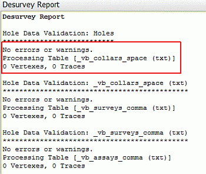  

  5. The 2 Desurveying errors indicate that drillholes VB4277 and VB4278 have missing collar coordinates:  
  
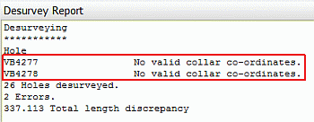  

 |  Additional table validation, hole summary and desurvey reports can be viewed in the Reports window as follows:
     1. Using the Home ribbon to select Show | Reports
     2. In the main menu, select Insert |Sheet |Report....
     3. Select the required Report Type.  
---|---  

## Exercise: Visually Validating Dynamic Drillholes in the Design Window

In this exercise you will visually validate the dynamic drillholes of the Holes object created in the exercise [Creating Dynamic Drillholes](<Creating_Dynamic_Drillholes.md#Exercise1>). This will be done by selecting drillholes in the 3D window and viewing the corresponding results in the Compositor control bar.

 |  Use 3D visual validation methods tocheck the following:

  * relative location of drillholes and topography
  * drillhole traces (lengths, orientations)
  * stratigraphic sequence
  * positions of mineralized zones.

  
---|---  
  
## Viewing the Data

  1. Drag the following files into the 3D window from the Project Files control bar:

     * _vb_stopo

  2. Select the Sheets control bar and expand the 3D folder.

  3. Ensure the following overlays are selected (only these ones - disable all the others):  

     * Grids - Default Grid

     * Drillholes - Holes

     * Strings - _vb_stopo (strings)

  4. Double click the [Default Section] item in the Sections folder and ensure Clipping is set to None.

  5. Whilst you're in the Section Properties dialog, make sure the Azimuth and Inclination are both set to '0' (tip: click the Horizontal button to do this automatically).

  6. Click inside the 3D window and type 'za' to execute the zoom-all-graphics command.

  7. Double-click the [Holes] item and select the Lines & Symbols tab.

  8. Select the Legend option and then select [_vb_lithology_comma (txt).NLITH] from the Column drop down list - note how all of the tables comprising the dynamic drillholes are displayed in this list (it hasn't been desurveyed to a static drillhole file).

  9. Click the auto-create-legend button, i.e.:  
  
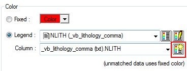  
  
Click OK

  10. Activate the View ribbon and click the Lock button to show an orthogonal plan view of your data.

  11. In the 3D window, confirm that a horizontal view of the topography contours and dynamic drillholes (at 77.56m elevation) is displayed:  
  
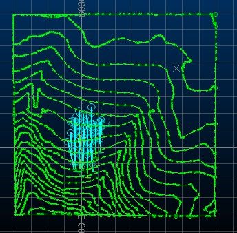

## Formatting Drillholes Traces

  1. In the Sheets control bar, 3D-Overlay folder, expand the Drillholes folder and double-click [Holes]double-click Dynamic Drillholes.

  2. In the Drillholes Properties dialog, select the Labels tab and enable the Display Labels check box

  3. In the Drillhole Traces dialog, Dynamic Drillholes tab, select the Labels tab.

  4. Select New and, using the Column drop-down list, make sure [_vb_collars_space (txt).BHID] is selected. Click Insert, then Apply.  
  

## Coloring the Drillhole Traces by Rock Type

  1. Select the Lines & Symbols tab

  2. Make sure that the Legend option is selected and the [NLITH (_vb_lithology_comma)] legend is selected

  3. Make sure the Column drop-down list shows [_vb_lithology_comma (.txt).NLITH]

  4. Click OK to dismiss the Drillholes Properties dialog

  5. In the 3D window, enable the View ribbon and select View | Zoom Area and check that they are labelled with a hole identifier and colored as shown below (your colors may be different, depending on the default legend used to color the other fields):  
  
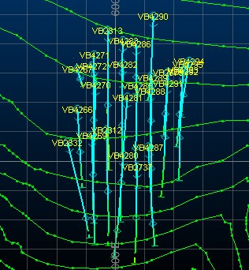

## Saving Format Settings

  1. Save the project file using the Project button and Save

  2. In the Save Data/Set Auto Reload dialog, clear all the Save check boxes, select all the Auto Reload check boxes, and click OK.

## Querying Drillhole Data

  1. Select the 3D window.

  2. In the Command toolbar, run the command composite-drillholes (quick key 'cmdh').

  3. In the 3D window, click-drag-release on a portion of the drillhole VB2832's trace (the hole is located on the far left of the drillhole set).

  4. Select the Compositor control bar and note the values for the different fields as shown below:  
  
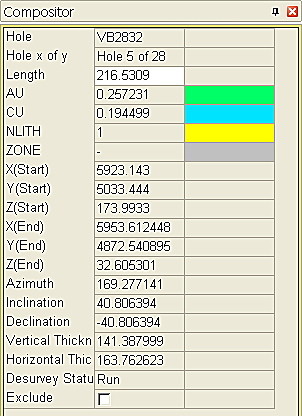  

  5. Repeat the above for other drillhole segments on the same or different holes.

  6. In the 3D window, click Done.

## Exercise: Visually Validating Dynamic Drillholes with the Linked Plots and Tables Windows

In this exercise you will use the Plots and Tables windows, in conjunction with the Linked View option to validate the dynamic drillholes of the Holes object, which was created in the exercise [Creating Dynamic Drillholes](<Creating_Dynamic_Drillholes.md#Exercise1>).

 |  Use the linked 3D visual validation methods to check the following:

  * all of the checks mentioned in the previous exercise
  * locatiing drillholes
  * locating specific table records after selecting drillhole segments in the plot view
  * locating drillhole segment(s) in the plot view after selecting table records.

  
---|---  
  
## Viewing Holes in Section

  1. Select the Plots window.

  2. Select the Sheets control bar and expand the Plots, Section 6012.50 E, Set of 2 Projections, South North Projection Section 6012.50 E, Overlays folder.

  3. Select only the following check boxes (i.e. display these objects) :

     1.         * Dynamic Drillholes

        * Grid (1)

        * _vb_stopo.dm (strings)

  4. Using the Plot View ribbon, select Scale | Fit

  5. Using the Scale command group's drop-down list, select [1:2500]In the Scale View toolbar, select a Plot Scale of [1:2500].

  6. Click Set

  7. In the View Settings dialog, Section Definition tab, define the settings shown below, click OK.  
  
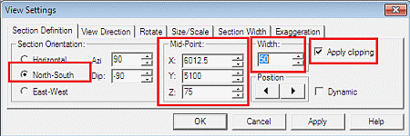

  8. In the Plots window, confirm that a clipped plan and north-south section projection are displayed, which contain topography contours and dynamic drillholes (at 6012.5m easting):  
  
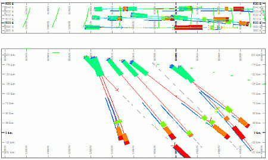

## Formatting Drillholes Traces

  1. In the Sheets control bar, Plots, Section 6012.50 E, Set of 2 Projections, North South Projection Section 6012.50 E branch, Overlay folder, double-click Dynamic Drillholes.

  2. In the Format Display dialog, Overlays tab, Overlay Format group, Drillholes tab, click Format....:

  3. In the Drillhole Traces dialog, Dynamic Drillholes tab, select the Labels tab.

  4. In the Labels tab, select the settings shown below, and click OK:  
  
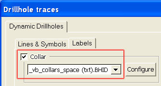  

  5. In the Format Display dialog, Overlay Format group, Drillholes tab, Display downhole columns group, select ZONE (it will be highlighted in blue) and click Format....

  6. In the Format for ZONE dialog, Border/Color tab, deselect Fill and click OK.

  7. In the Format Display dialog, Drillholes tab, select NLITH and click Format...:

  8. In the Format for NLITH dialog, Style Templates tab, select the [Trace] style and click Apply:  

## Coloring Drillhole Traces by Rock Type

  1. In the Format for NLITH dialog, select the Trace tab.

  2. In the Color group, define the settings shown below, and click Apply and then click OK:  
  
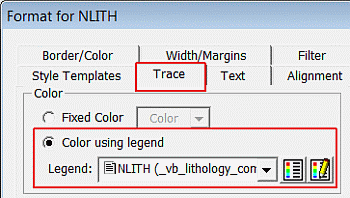  

  3. In the Format Display dialog, Overlays tab, select the Apply to all overlays displaying Holes check box, and then click OK.

  4. In the Plots window, confirm that your dynamic drillhole traces are formatted as shown below:  
  
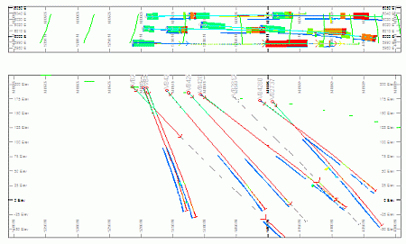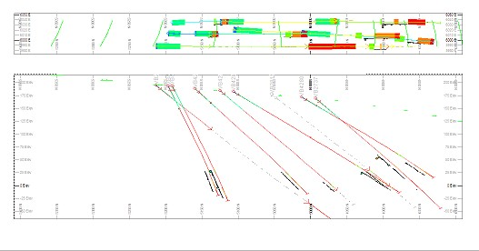

## Saving Format Settings

  1. Save the project file using the Project button and Save
  2. In the Save Data/Set Auto Reload dialog, clear all the Save check boxes, select all the Auto Reload check boxes, and click OK.

## Viewing Tables

  1. Activate the Home ribbon and select Show | Tables

  2. In the Tables window select the _vb_collars_space(txt) tab (should be the default selection)

 |  All the dynamic drillhole tables and the intersections table are displayed in separate tabs in the Tables window.  
---|---  
  
## Linking Viewed Data

  1. In the Tables window, _vb_collars (txt) tab, select the record for BHID VB2675 by double-clicking the row label on the left (when selected, the row will be highlighted)

  2. Select the _vb_surveys_comma (txt) tab and note that all survey records for drillhole VB2675 are highlighted.

  3. Select the Plots window and note that drillhole VB2675 is highlighted in red:  
  
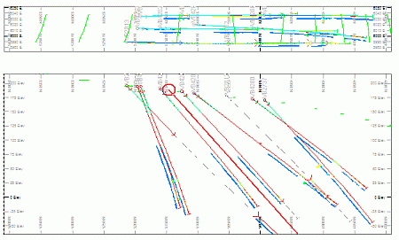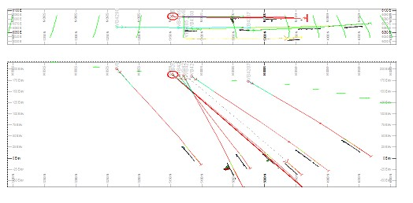  

  4. In the Plots window click and drag to select a portion of drillhole VB4295.

  5. In the Tables window, select various tabs and note that VB4295 records are highlighted.

 |  Selection and linking can be done between various data views, as follows:
     * table to table
     * table to plots
     * plot to table
     * plot to plot.  
---|---  
  6. In one of the tabs in the Tables window, select records for drillhole VB4295 by dragging the mouse - for example, the two highest gold grade values in the assays table.

  7. In the Plots window, identify the selected drillhole segments.

****[Next Section](<Using_CAD_Drawings.md>)