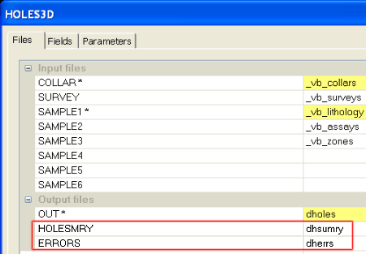
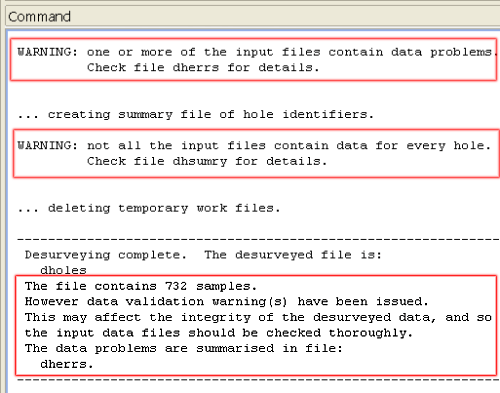
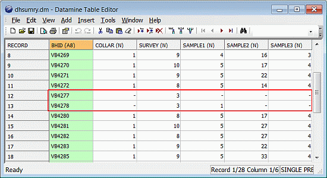
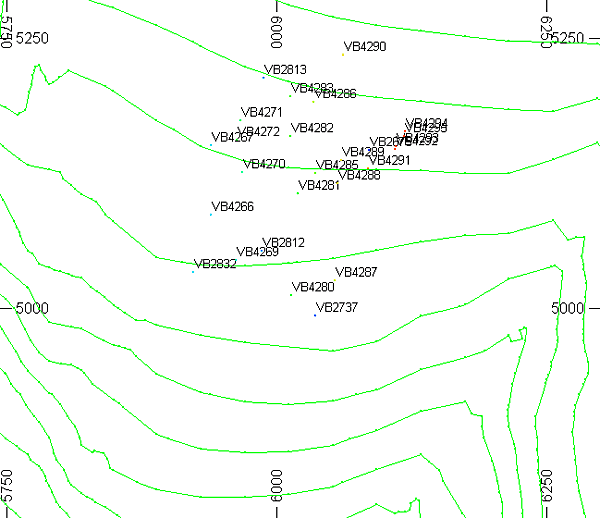
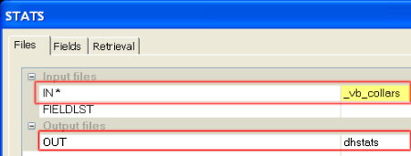
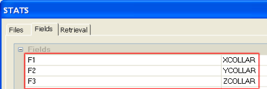
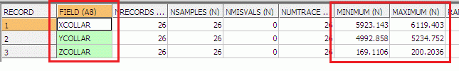

 |  Validating Static Drillholes Introducing non-visual methods of validating static drillholes and data.  
---|---  
  
# Overview

In this part of the tutorial you will use summary desurvey tables and statistical methods for validating drillhole data tables and static drillholes.

## Prerequisites

  * Completed the [Creating a New Project](<Creating_a_New_Project.md>) exercise.

  * Read the Principles page: [Working with Drillholes](<Working_with_Drillholes.md>).

  * Completed the [Defining Geological Modeling Settings](<Defining_Geological_Modeling_Settings.md#Exercise1>) exercise.

  * [Files](<Tutorial_Files_List.md>) required for the exercises on this page:

  *     * _vb_assays.dm

    * _vb_collars.dm

    * _vb_lithology.dm

    * _vb_surveys.dm

    * _vb_zones.dm

## Links to exercises

The following exercises are available on this page:

  * Validating Drillholes using HOLES3D Output

  * Using Summary Statistics to Check Drillhole Collar Coordinates

## Exercise: Validating Drillholes using HOLES3D Output

In this exercise you are going to use the output summary and errors tables from the desurvey process HOLES3D to check the input drillhole data tables and the desurveying process.

 |  Use the optionalHOLES3Doutput holes summary and desurvey errors tables to check for the following:

  * absent or incomplete data e.g. missing collars
  * sample overlaps
  * duplicate sample intervals.

  
---|---  
  
## Creating the Summary and Errors Tables

  1. Repeat steps 1. to 5. in the exercise [Creating Static Drillholes](<Creating_Static_Drillholes.md#Exercise1>) , but this time include the two additional output files highlighted below:  
| Use the HOLES3D dialog's Restore button to load the previously defined settings.  
---|---  

  2. When prompted to replace the existing dholes, click Yes.

  3. In the Command control bar, note that two warnings have been issued and that a hole summary table dhsumry and an errors table dherrs have been created:  
  

## Checking the Hole Summary Table

  1. Select the Project Files control bar, All Tables folder.

  2. Double-click on the table dhsumry.

  3. In the Datamine Table Editor dialog, note that drillholes VB4277 and VB4278 have missing collar and sample data:  
  
  

 |  The fields SAMPLE1, SAMPLE2 and SAMPLE3 correspond to the lithology, assays and zones tables which were specified in the Files tab when HOLES3D was run in the first section of this exercise.  
---|---  
  4. Select File | Exit.

## Checking the Errors Table

  1. Select the Project Files control bar, All Tables folder.

  2. Double-click on the table dherrs.

  3. In the Datamine Table Editor dialog, note that drillhole VB2675 has an overlapping sample and that VB2737 has duplicate FROMs in the SAMPLE1 file - you can see this information in the automatically-created PROBLEM column.

 | 
     * The fields SAMPLE1, SAMPLE2 and SAMPLE3 correspond to the lithology, assays and zones tables which were specified in the Files tab when HOLES3D was run in the first section of this exercise.
     * The standard procedure for checking and correcting these errors would be to:
     *        * compare the listed errors against the relevant records in the source files e.g. database, text files or spreadheet
       * correct data entries where required
       * re-import the data tables to the *.dm files
       * rerun HOLES3D  
---|---  
  4. Select File | Exit.

## Exercise: Using Summary Statistics to Check Drillhole Collar Coordinates

In this exercise you will use the STATS process to determine the minimum and maximum values for the X, Y and Z coordinates in the drillhole collars file _vb_collars. The positions of the drillhole collars are shown in the image below.

## 

 |  UseSTATSto check the following:

  * minimum and maximum X, Y and Z collar coordinate values
  * minimum, mean and maximum mineral grade values - for example, to investigate the parametric summary statistics and to check for outliers.

  
---|---  
  
## 

## Calculating Summary Statistics

  1. Select the 3D window.

  2. Activate the Sample Analysis ribbon and click the top-level Statistics Processes button

  3. In the STATS dialog, Files tab, select and define the input and output files as shown below:  
  
  

  4. In the Fields tab, select the three collar coordinate fields shown below, and click OK:  
  
  

  5. In the Command toolbar, press <Enter> three times - once for each of the selected input fields.

  6. In the Command control bar, confirm the following:

     * The STATS process has completed.

     * Summary statistics have been calculated.

     * Three records have been saved to the dhstats file

## Viewing the Summary Statistics in the Table Editor

  1. Select the Project Files control bar, All Tables folder.

  2. Double-click dhstats.

  3. In the Table Editor dialog, confirm that your minimum and maximum collar coordinates are as shown below:  
  
  

  4. In the Datamine Table Editor dialog, select File | Exit.

 |  See the Command Table in your online Help documentation for a comprehensive list of Processes and their uses.  
---|---  
  
##   [Next Page](<Visually_Validating_Static_Drillholes.md>)