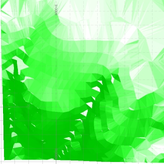
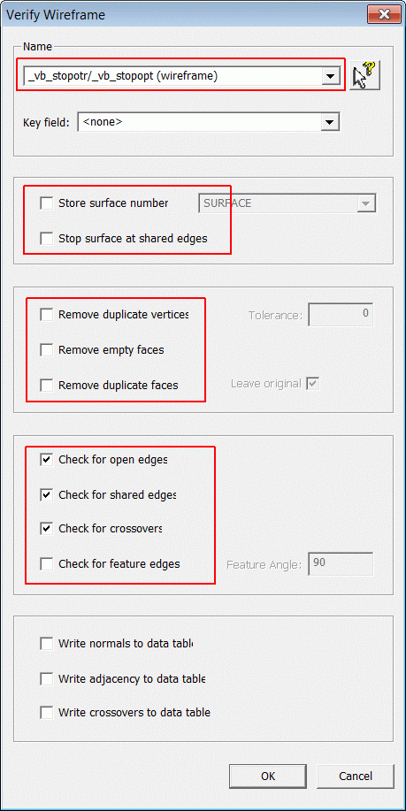
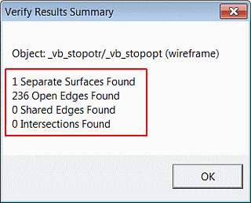
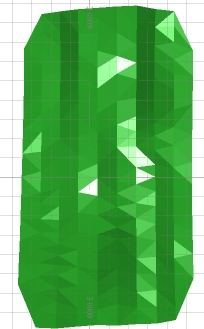
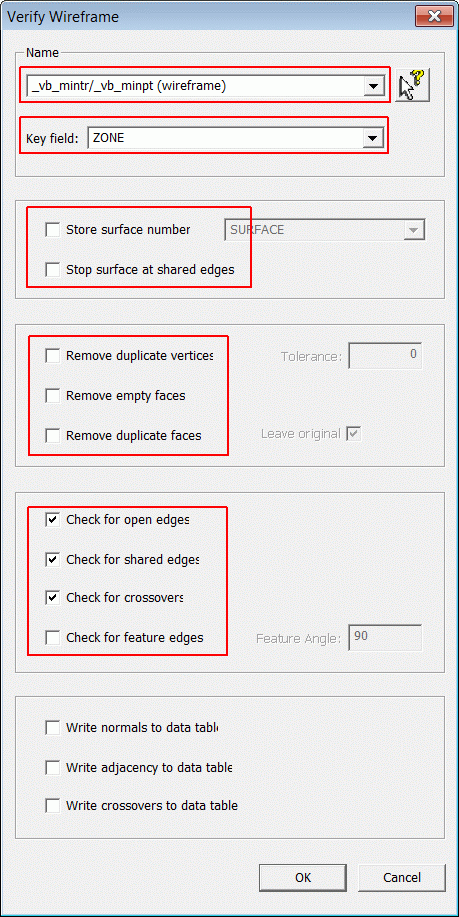
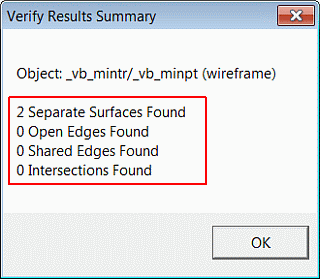

 |  Verifying Wireframe Models Verifying surface and closed volume wireframe models.  
---|---  
  
# Overview

In this part of the tutorial you will use the 3D window's wireframe verification tools to verify the topography and ore body wireframe models.

## Prerequisites

  * Completed the [Creating a New Project](<Creating_a_New_Project.md>) exercise.

  * Completed the [Defining Geological Modeling Settings](<Defining_Geological_Modeling_Settings.md#Exercise1>) exercise.

  * [Files](<Tutorial_Files_List.md>) required for the exercises on this page:

  *     * _vb_minpt.dm

    * _vb_mintr.dm

    * _vb_stopopt.dm

    * _vb_stopotr.dm

    * _vb_viewdefs.dm

## Links to exercises

The following exercises are available on this page:

  * Verifying the Topography Wireframe Model

  * Verifying the Ore Body Wireframe Model

## Exercise: Verifying the Topography Wireframe Model

In this exercise, you will use wireframe verification tools to verify the topography object stopotr/stopopt (wireframe) .

 |  Verify wireframes before:

  * calculating wireframe volumes,
  * evaluating wireframes (for tonnes and average grades) against drillholes or block models,
  * using wireframes for block modeling purposes.

  
---|---  
 | Unverified wireframes can potentially cause problems with:

  * wireframe volume calculations,
  * block modeling using wireframes,
  * other processes which use wireframes as input e.g. SELTRI.

  
---|---  
  
## Loading and Formatting the Data

  1. Unload any data that may already be loaded.

  2. Select the Project Files control bar, All Tables folder.

  3. Drag-and-drop the following files (if not already loaded) into the 3D window:  

     * _vb_stopotr

     * _vb_viewdefs

  4. In the Sheets control bar, expand the 3D-Overlays folder.

  5. Select only the following check boxes (i.e. display these objects):  

     * Default Grid

     * _vb_stopotr/_vb_stopopt (wireframe)

  6. Activate the View ribbon and select Zoom Fit | Zoom Plan, confirm that the 'Plan 195' view showing the topography surface wireframe model is displayed as shown below:**  
  
**

## Verifying an Open Surface Wireframe Object

  1. Activate the Structure ribbon and click Verify
  2. In the Verify Wireframe dialog, Name group, select [_vb_stopotr/_vb_stopopt (wireframe)].
  3. Select the options as shown below, and click OK:**  
  
**  
  
 | 
     * This wireframe verification function is a whole object function: the verification is performed on the whole of the selected object, with the optional use of a key field.
     * The Wireframe Selection option By Object is the default and only selection method for this function. The various options in the Verify Wireframe dialog perform the following operations, when selected:
     * Store surface number \- stores the calculated surface number in the selected field (the field SURFACE is typically selected for this), starting at 1, incremented by 1 for each separate surface. The Key field option can additionally be used to guide this. Existing surfaces numbers in the SURFACE field will be replaced.
     *        * Remove duplicate vertices \- removes duplicate face vertices (each wireframe face or triangle has three vertices).
       * Tolerance \- the tolerance value (distance in metres),is used when removing duplicate vertices.
       * Remove duplicate faces \- removes duplicate wireframe triangle faces.
       * Remove empty faces \- removes empty wireframe triangle faces.  
---|---  
  
| 
     * Use the Remove ... options with caution as they have the ability to alter the state of the wireframe.
     * If a wireframe is verified and altered, this process cannot be undone.  
---|---  
  
 | 
     * When you first verify a wireframe, de-select the Store ... and Remove ... options, and select the Check ... options
     * Check any reported open edges, shared edges or crossovers by viewing the corresponding string files in the 3D window.
     * Refer to the Help for further details.  
---|---  
  4. In the Verify Results Summary dialog, check that your results are as shown below, click OK:**  
  
**
  5. In the Loaded Data control bar, check that the strings object _vb_stopotr/_vb_stopopt (Verified Open Edges) is listed:**  
  
**| 
     * These verification string objects can be viewed in the 3D window, and used to visually check the locations of the verification features against the wireframe.
     * In the above case, the verified open edges define the outer rim of the topography DTM and do not indicate any potential problems with the wireframe surface.  
---|---  

## Exercise: Verifying the Ore Body Wireframe Model

In this exercise, you will use wireframe verification tools to verify the ore body closed volume _vb_mintr/_vb_minpt (wireframe)

## Loading and Formatting the Data

  1. Unload any previously loaded data.

  2. Select the Project Files control bar, All Tables folder.

  3. Drag-and-drop the following files (if not already loaded) into the 3D window:  

     * _vb_mintr

     * _vb_viewdefs

  4. Select the Sheets control bar and fully expand the 3D folder.

  5. Select only the following check boxes (i.e. display these objects):  

     * Default Grid

     * _vb_mintr/_vb_minpt (wireframe)

  6. Activate the View ribbon and select Zoom Fit | Zoom Plan:**  
  
**

## Verifying a Closed Volume Wireframe Object

  1. Activate the Structure ribbon and click Verify
  2. Right-click _vb_mintr/_vb_minpt (wireframe), and select Verify.

In theVerify Wireframedialog, select the options shown in the dialog below:  

| 

  * Ensure that all the Remove ... options have been unchecked - failure to uncheck these options will result in portions of the wireframe being removed.

  
---|---  
  
****  
  

| 

  * This wireframe verification function is a whole object function.
  * The ore body wireframe volume consists of two adjacent closed surfaces which are treated as one object for verification purposes.
  * These two surfaces contain faces (wireframe triangles) that share the same space - that is, they have the same coordinates.
  * Part, or all each of these faces will be identified as duplicate vertices, edges or faces, and will be removed; this would be incorrect.
  * In this exercise, checking for open or shared edges and crossovers is done. No open edges should be found as this wireframe consists of two closed surfaces.

  
---|---  
  
  1. In theVerify Results Summarydialog, check that your results are as shown below:**  
  
**  
  

  2. In the Sheetscontrol bar, expand the 3D-Overlays folder.
  3. Uncheck_vb_mintr/_vb_minpt (Wireframe),and turn on the display for_vb_mintr/_vb_minpt (Wireframe) (Verified Crossovers)

 | Wireframes can be selected by object name when running a dialog-based command, or interactively when working in the Design window. One of the following selection methods controls how wireframes are selected:

  * **By Object** : selects all wireframes contained within the current object. An 'object' can contain more than one item of data - for example, wireframes.
  * **By Group** : selects wireframes matching the Group number (field GROUP in the wireframe triangles file) of the selected triangle.
  * **By Surface** : selects wireframes matching the Group number and the Surface number (field SURFACE) of the selected triangle.
  * **By Attribute** : selects wireframes matching the non-system attributes of the selected triangle.
  * **By Field** : selects wireframes matching the value in the user-specified field ( etc.) of the selected triangle.
  * By Filter: selects wireframes matching the defined Filter Expressions for wireframe points and triangles.

The wireframe selection method is set using W _i_ reframes | Wireframe Settings; in the Project Settings dialog, specify the Selection Method.  
---|---  
  
 [Next Page](<Calculating_Wireframe_Model_Volumes.md>)