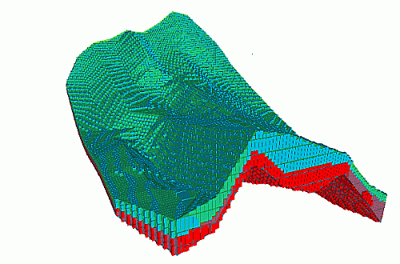
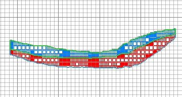
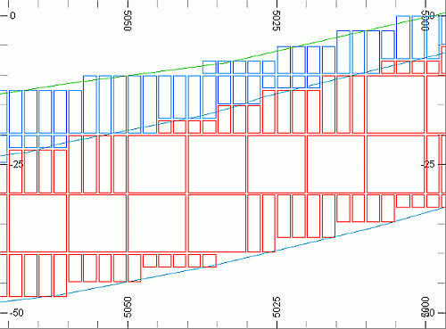
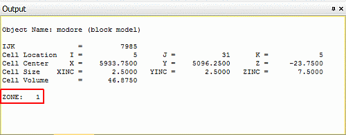
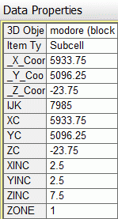

 |  Visually Checking the Ore Body Block Model Checking the Ore Body Block Model using 3D wiindow commands.  
---|---  
  
# Overview

In this portion of the tutorial you are going to check the ore body block model using 3D window commands.

## Prerequisites

  * Created a new project and added all the required tutorial files i.e. the exercise on the [Creating a New Project page](<Creating_a_New_Project.md>).

  * Defined project settings i.e. completed the [Defining Geological Modeling Settings](<Defining_Geological_Modeling_Settings.md#Exercise1>) exercise.

  * Read through the relevant heading on the Principles page [Working with Block Models](<Working_with_Block_Models.md>).

  * [Files](<Tutorial_Files_List.md>) required for the exercises on this page:

  *     * _vb_minpt.dm

    * _vb_mintr.dm

    * _vb_modore.dm

    * _vb_viewdefs.dm

## Links to exercises

The following exercises are available on this page:

  * Visually Checking the Ore Body Block Model

## Exercise: Visually Checking the Ore Body Block Model

In this exercise, you are going to use commands to visually check the ore body block model _vb_modore (block model) against the ore body wireframe model **_vb_mintr/_vb_minpt (wireframe)**. The ore body block model and closed volume wireframe (displayed as transparent) are shown below:

****

| 

  * Visually check a block model against its wireframe for the following errors:
  *     * cells extending beyond the limits of the wireframe i.e. the cell centre lies beyond the wireframe (the surface may be damaged or contain holes)
    * gaps in the block model (the prototype may be too small).
  * Visually check a block model after:
  *     * creation using wireframes or other methods
    * optimization or manipulation
    * grade estimation.

  
---|---  
| 

  * Use the following to assist in the visual checking process:
  *     * views and clipping limits
    * object formatting e.g. wireframe intersection
    * color and filter legends.

  
---|---  
  
| Visual checking is often time consuming and potentially less effective than expected - use complementary methods e.g. Studio processes, recorded in macros, to make checking more efficient.  
---|---  
  
## Loading and Formatting the Data

  1. Unload any data that you may have loaded previously.

  2. Select the Project Files control bar, All Tables folder.

  3. Drag-and-drop the following files (if not already loaded) into the 3D window:

     * _vb_mintr

     * _vb_modore

     * _vb_viewdefs

  4. Select the Sheets control bar and expand the 3D folder.

  5. Select only the following check boxes (i.e. display these objects):  

     * Default Grid

     * _vb_mintr/_vb_minpt (wireframes)

     * _vb_modore (block model)

  6. In the Sheets control bar, 3D-Overlays folder, double-click on _vb_mintr/_vb_minpt (wireframe).

  7. In the Wireframe Properties dialog, select the Intersection option and click OK

## Checking the Block Model

  1. Double click the _vb_modore overlay and set the display type to Intersection, with an Exaggeration of '80%'. Disable the Fill check box and enable the Show Edges check box. Click OK.
  2. Next double-click theDefault Sectionand click theNorth-South button. Click OK.
  3. Click theViewribbon and enable theLocktoggle.
  4. Check that the model cells completely fill the volume defined by the ore body wireframe, as shown below:  
  

  5. Use the View ribbon to select Zoom Area, select Zoom In and define a zoom rectangle around a portion of the block model and wireframe.
  6. Check that subcells have been generated along the boundary of the wireframe, as shown below:  
  
  
  
| The subcells have been generated with a fixed X and Y dimension of 2.5m, as defined by the parameters CELLXMIN and CELLYMIN; the Z dimensions of the subcells are multiples of 2.5m i.e. 2.5, 5.0 etc. 
     * A cell or subcell is created when it's centre point (defined by the coordinate values in fields XC, YC, ZC) lies within the volume defined by the prototype parameters and the wireframe.  
---|---  
  7. Activate the Edit ribbon and select Query | Point
  8. Select (left-click) a point within a model cell in the upper (blue) mineralized zone.
  9. In the Output control bar, check the listed parameters and values for the queried point, noting that the value for the ZONE field is '1':  
  

  10. In theData Propertiescontrol bar, check the list of tabulated cells properties (they should be the same):  
  

  11. Select (left-click) a point within a model cell in the lower mineralized zone.
  12. In the Output control bar, check the listed parameters and values for the queried point, check the listed parameters and values for the queried point, noting that the value for the ZONE field should be "2". 
  13. In theData Propertiescontrol bar, check the list of tabulated cells properties is the same as in the previous step.

##  [Next Page](<Checking_the_Ore_Body_Block_Model_using_Summary_Statistics.md>)