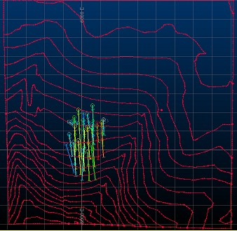
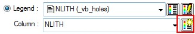
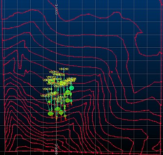
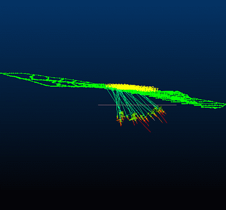
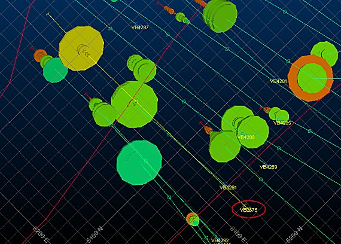
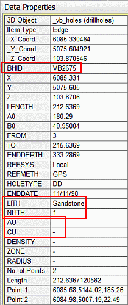
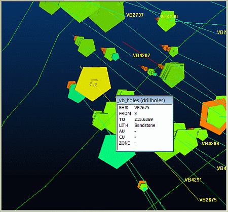

# Visually Validating Static Drillholes

 |  Visually Validating Static Drillholes Introducing different visual methods in validating static drillholes and data  
---|---  
  
# Overview

In this part of the tutorial you will use visual 3D methods for validating static drillholes in the 3D windowDesign and VR windows.

## Prerequisites

  * Completed the [Creating a New Project](<Creating_a_New_Project.md>) exercise.

  * Read the Principles page: [Working with Drillholes](<Working_with_Drillholes.md>).

  * Completed the [Defining Geological Modeling Settings](<Defining_Geological_Modeling_Settings.md#Exercise1>) exercise.

  * [Files](<Tutorial_Files_List.md>) required for the exercises on this page:

  *     * _vb_collars.dm

    * _vb_holes.dm

    * _vb_stopo.dm

## Exercise: Visually Validating Static Drillholes

In this exercise you will visually validate the drillhole collars file _vb_collars, and the static drillholes file _vb_holes in the 3D window, as well as the topography contours file _vb_stopo. You will then query samples down a hole - including the following tasks:

  * updating the 3D window data

  * annotating the collar points

  * checking the drillhole color formatting

  * graphing the drillholes

  * definining info mode columns

  * saving data and format settings

  * viewing data

  * finding and querying static drillholes.

 |  Use 3D visual validation methods tocheck the following:

  * relative location of drillhole collars and topography
  * drillhole traces (lengths, orientations)
  * stratigraphic sequence
  * positions, length and size (graph bar length) of grade zones
  * relationship of grades and lithological or expected domains or zones.

  
---|---  
  
## Checking and updating 3D Window Data

  1. Unload any previously loaded data by clicking inside the 3D window and typing "ua" - accept all prompts if any appear.

  2. Select the Project Files control bar, All Tables folder.

  3. Drag-and-drop the following collars, drillholes and strings files into the 3D window.

  1.      * _vb_collars

     * _vb_holes

     * _vb_stopo

  1. In the 3D window, expand the Sheets control bar 3D folder, followed by the Sections folder.

  2. Double-click the [Default Section] entry to display the Section Properties dialog.

  3. Click the Horizontal button and click OK

  4. Using the View ribbon, click View | Lock.

  5. Click inside the 3D and type 'za' to zoom to the current data extents.

  6. In the 3D window, confirm that the following data is displayed:  
  

## Annotating the Collar Points

  1. In the Sheets control bar, 3D\- Points folder, right-click _vb_collars(points), select .....Properties.

  2. In the Properties dialog, select the Labels tab.

  3. Select the Display Labels check box.

  4. Using the Column drop-down menu, select the column [BHID] and click Insert to add it to the Text display window above.

  5. Click OK to display the BHID at the collar positions.

## Checking the Drillhole Color Formatting

 |  When the update-vr-objects command was used in the first section of this exercise, the _vb_holes(drillholes) overlay in the VR window was reset with the format setting's associated with the same overlay in the Design window. As a result, it is not necessary to again define the color format settings; here you will just check the settings.   
---|---  
  
  1. In the Sheets control bar, 3D\- Drillholes folder, right-click [_vb_holes(drillholes)], and select .....Properties.
  2. In the Properties dialog, select the Lines & Symbols tab.
  3. In the Lines tab, Color group, ensure that Column is set to [NLITH].
  4. Click the auto-create button to create a legend called [NLITH (_vb_holes)]:  
  

  5. Click Apply \- note the change in the coloring of the drillhole data.

## Graphing Drillholes

  1. In the Properties dialog, Lines & Symbols tab, Display Options group, select Default Cylinder and Guideline.

  2. In the Size group, select the Column [AU], and define Minimum as '0', and Maximum as '10'. You will need to select the Maximum check box to enter a second value.

  3. Click Apply \- note the extended radii of the samples in the drillhole data set.

 |  The graphing defined here results in 3D cylinderspentagons, of varying size being generated at locations down the drillholes, where the selected column has values. The size of the shape is scaled according to the column values and the defined minimum and maximum parameters.   
---|---  

## Defining Info Mode Columns

  1. Still in the Properties dialog, select the Info Mode List tab.

  2. In the Columns group, using <Ctrl>+Left-click, select [BHID], [FROM], [TO], [LITH], [AU], [CU], [ZONE], and click the black Down Arrow.

  3. In the Info Mode List pane, check that the above fields are listed, and click OK.

  4. In the 3D window, check that your data is displayed as follows:  
  
  

 |  Note the annotated collar points, colored drillhole traces and scaled graph cylinderspentagons on the drillholes. Both the traces and graph are colored by NLITH (rock type code).  
---|---  

## Saving the Data and Formatting Settings

  1. Use the Project button to select Save

  2. In the Save Data/Set Auto Reload dialog, select all Auto Reload check boxes and click OK.

## Viewing Data

  1. Activate the View ribbon and expand the Zoom Fit menu.

  2. Select the Zoom North option, then open the menu again to select Zoom East

  3. Confirm that your 3D view is as shown below:  
  
  

 |  The grey square in the 3D window indicates the position of the 3D windows's Design View Plane section. These view navigation buttons define the 'towards' direction in which the data is being viewed i.e. not the orientation of the view plane as in the Design window, which would be perpendicular to this. In addition, the full extents of the data are included in the view.  
---|---  
  4. Use <Shift> with a Left and Right mouse click to zoom the view (the mouse wheel also zooms the view).

  5. Use <Shift> and Left-click to rotate the view.

  6. Use <Shift> and Right-click to pan the view.

  7. Using the View ribbon's Zoom Fit menu, select Zoom Plan  

 |  A quick way to align the view with the current default section is to use the View ribbon's Align function. Alternatively, if you wish to lock your plan view in place for digitizing/designing, you can also re-enable the Lock function (this will have been automatically disabled when you previously used the Zoom Fit menu commands.  
---|---  

##  Finding and Querying Drillholes

  1. In the Sheets control bar, 3D\- Drillholes folder, expand _vb_holes(drillholes).

  2. Right-click VB2675, select Look At.

 |  This command can be used to find specific drillholes without using data filters.  
---|---  
  3. Select the drillhole VB2675 (circled in red) just below the collar:  
  
  

 |  Note that the selected drillhole is highlighted in yellow.  
---|---  
  4. Select the Data Properties control bar (you may need to resize it to see the full contents) and note the rock type description, rock code values and gold and copper grades (absent values):  
  
  
  
(You can enable or disable the display of the Data Properties control bar using the Home ribbon's Show menu.)

  5. Select the Home ribbon and toggle on the Dynamic information icon

  6. In the 3D window, click-hold-drag to locations down the drillhole VB2675, from the collar to the end-of-hole.

  7. In the Information dialog, check the displayed column values and identify which rock type zones contain Au and Cu grade values:  
  

  8. Toggle information mode off.

 |  Pressing <Esc> will also toggle off the selected mode.  
---|---  

##   [Next Page](<Compositing_Drillholes.md>)