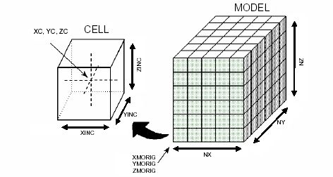
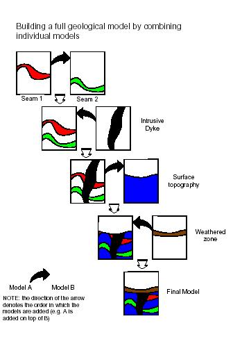

 |  Working with Block Models Understanding block model data  
---|---  
  
# Introduction

Block models are typically created as part of the geological modeling process, but can also be created during the grade estimation, optimization and mine design processes which form part of the general mine planning cycle. They are used as a 2D or 3D representation of the ground volume of interest and contain the different rock properties, mineral grade, economic optimization results, mine planning and other relevant parameters. The sections below describe some of the principles used when working with block model data.

What is a Block Model?

Creating Block Models

Combining Block Models

Manipulating Block Models

Block Models and Grade Estimation

Evaluating Block Models

## What Is a Block Model?

A block model is a regularly-packed collection of six-sided orthogonal cells. These are either parent cells (maximum sized cells) or subcells (cells smaller than a parent cell). The following diagram shows the relationship between the block model and its cells (parent and subcells).

The following conventions apply:

  * X coordinates increase eastwards

  * Y coordinates increase northwards

  * Z coordinates (elevation) increase upwards.

Block models typically consist of both implicit and explicit fields. The minimum field requirements for these tables are as follows:

  * XMORIG* - X-coordinate model origin

  * YMORIG* - Y-coordinate model origin

  * ZMORIG* - Z-coordinate model origin

  * XINC* - cell size in X-axis

  * YINC* - cell size in Y-axis

  * ZINC* - cell size in Z-axis

  * NX* - number of parent cells along X-axis

  * NY* - number of parent cells along Y-axis

  * NZ* - number of parent cells along Z-axis

  * XC** - cell centre X-coordinate

  * YC** - cell centre Y-coordinate

  * ZC** - cell centre Z-coordinate.

* Implicit fields: field information is only stored in the file header (data definition). and does not appear as records in the data table.

** Explicit fields: field appears both in the file header, and as records in the data table.

 | 

  * A block model prototype consists of only the block model definition (the Implicit fields listed above, but does contain any data table records).
  * A block model contains both the model definition fields, and additional fields (examples shown below) and contains data table records.

  
---|---  
  
 |  Store information in a block model as an Implicit field when the field has a constant value for all records. This will result in the block model file being smaller than if the field was stored as Explicit, and would thus occupy an additional field in the data table.  
---|---  
  
Additional fields typically include:

  * ZONE* - mineralization zone identifier (default name) - used for zonal control in the grade estimation processes.

  * DENSITY* - rock density (default name).

  * numeric or alphanumeric rocktype codes.

  * mineral grades (numeric) in your unit of choice. For example, g/t, %, ppm.

  * economic optimization parameters. For example, economic pit shell numbers, period numbers.

  * mine design parameters. For example, mining block identifier, extraction sequence number.

 |  Store rock type codes (and other flag fields) as a numeric rather than an alphanumeric field, as this will allow you to perform numeric, statistical and evaluation functions using this data.  
---|---  
  
## Creating Block Models

Block models are created by the following general methods:

  * Filling perimeters (closed strings) with cells

  * Filling wireframes with cells

  * Estimating grades into a block model prototype

  * Output from an open pit optimizer.

## Combining Block Models

The order in which block models are combined is important. The following flow diagram gives an example of the sequence in which individually-modeled features must be added in order to create a final block model.

## Manipulating Block Models

Block models are typically manipulated in order to:

  * optimize the model cells using PROMOD. For example, after combining two or more block models.

  * place the block model in a new prototype using SLIMOD.

  * modify block values using EXTRA. For example, to correct numeric flag values after optimizing or regularizing a block model.

## Block Models and Grade Estimation

Block models, sample data (point or drillhole data) and geostatistical parameters often form the inputs into the process of grade estimation. Refer to the Grade Estimation tutorial, Block Model Estimation section, for further details.

## Evaluating Block Models

Block models can be used, often in conjunction with string and wireframe models (representing geological, ore body or mine design features) as input into the process of evaluation. During this process, the volume, mass and average properties (rock type characteristics, mineral grades, economic optimization results, mine planning parameters) are calculated for the volume(s) of interest, and according to user-defined categories, e.g. grade or rock type categories. There are both interactive commands and processes available for doing this. Refer to the following for further information:

  * Evaluation and Reporting sections of the Grade Estimation tutorial.

  * Your online Help system.

 |  Related Topics  
---|---  
| [Working with Drillholes](<Working_with_Drillholes.md>)