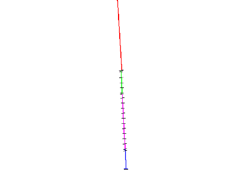
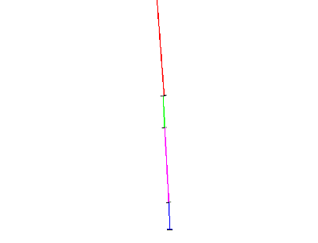

 |  Working with Drillholes Understanding drillhole data  
---|---  
  
# Introduction

Drillhole data are often used as a basis for creating geological models, and are stored in tables of various file formats. To use these drillhole data for modeling purposes, they must first be converted into 3D drillholes, so that they can be loaded into the Design,Plots or 3D windows. These 3D drillholes can either be Static or Dynamic. The sections below introduce some of the principles of working with drillhole data in Studio RM.

Bearing and Dip Conventions

Drillhole Data Tables

Static or Dynamic Drillholes?

Creating Static Drillholes

Creating Dynamic Drillholes

Compositing Drillholes

## Bearing and Dip Conventions

The following default bearing and dip conventions are used when working with drillhole data in Studio RM:

  * Bearings (or dip directions) are measured in degrees, zero at the North position, and measured clockwise (range 0 to 180 degrees)

  * Dips are measured in degrees, zero horizontal, positive down (range -90 to 90 degrees).

  * X coordinates increase towards the East

  * Y coordinates increase towards the North

  * Z coordinates (elevation) increase upwards

****[Top of page](<Working_with_Drillholes.md>)

## Drillhole Data Tables

To create 3D drillholes, the data must be stored in the following tables:

  * Collars \- drillhole collar coordinates.

  * Surveys \- downhole surveys (orientation of the drillhole segment).

  * Assays \- drillhole assays.

  * Depth tables \- features and parameters recorded at depths down the drillhole. For example, geological structural data, geophysical survey data.

  * Interval tables \- features and measurements, or quantities recorded by interval down a drillhole. For example, rock mass rating, density data, and mineralization zones.

The minimum field requirements for these tables are as follows:

  * Collars:

  *     * BHID* - drillhole identifier

    * XCOLLAR* - collar X coordinate

    * YCOLLAR* - collar Y coordinate

    * ZCOLLAR* - collar elevation

  * Surveys:

  *     * BHID* - drillhole identifier

    * AT* - downhole depth

    * BRG* - bearing in degrees

    * DIP* - dip in degrees

  * Assays:

  *     * BHID* - drillhole identifier

    * FROM* - downhole interval start depth

    * TO* - downhole interval end depth

    * ASSAY1 \- first assay field (numeric values, units as defined by the user e.g. g/t, %, ppm)

    * ASSAY2 \- second assay field (up to 20 assay fields are permitted)

  * Depth Data tables:

  *     * BHID* - drillhole identifier.

    * AT* - downhole depth

    * ATTRIBUTE1 ** \- alpha or numeric attribute e.g. geological structural measurement, downhole geophysical survey parameter.

  * Interval Data tables:

  *     * BHID* - drillhole identifier

    * FROM* - collar X coordinate

    * TO* - collar Y coordinate

    * ATTRIBUTE1 ** \- alpha or numeric attribute e.g. interpreted mineralization zone flag code, rock density.

 |  * Standard drillhole tables' field names. Other names can also be used as the static and dynamic drillhole creation processes prompt you for the corresponding field names. ** Multiple attribute fields can be defined.  
---|---  
  
****[Top of page](<Working_with_Drillholes.md>)

## Static or Dynamic Drillholes?

Studio recognizes the following types of drillholes, each with their own characteristics:

  * **Static Drillholes**
  *     * generated by the HOLES3D or COMPDH (or equivalent) processes
    * drillholes are refreshed by running the relevant HOLES3D and/or COMPDH processes
    * the desurvey report is displayed in the Output pane of the Command control bar
    * segment midpoints and lengths are precise.
  * **Dynamic Drillholes**
  *     * generated by loading the drillhole data tables
    * drillholes are refreshed by reloading the Project File or by performing a Refresh from the Loaded Data control bar
    * the desurvey report is displayed in the Desurvey Report control bar
    * segment endpoints are spatially precise.
    * It is suggested that these two drillhole types are used for the following:
  * **Static Drillholes**
  *     * drillhole compositing using the COMPDH , COMPBE or COMPBR commands
    * grade estimation using the GRADE or ESTIMATE Commands
    * string modeling in the Design window drillhole segment startpoints/midpoints/endpoints as a reference
    * visualization in the Design, Visualizer and 3D windows.
  * **Dynamic Drillholes**
  *     * advanced visualization and presentation in the Design, Visualizer and 3D windows
    * generation of drillhole Logs in the Logs window
    * validation of drillhole data by using linked data views between the Plots, Logs and tables windows
    * string modeling in the 3D window using drillhole segment endpoints as a reference
    * plotting from the Plots window.

[Top of page](<Working_with_Drillholes.md>)

## Creating Static Drillholes

Static drillholes are typically created from Datamine-format drillhole data tables which have either been created or imported from an external source. These drillhole tables typically consist of collars, downhole surveys and downhole samples tables. These tables are desurveyed (that is, coordinated 3D drillhole traces are created) using the process HOLES3D. Updating the static drillhole traces requires the drillhole data tables to be re-imported and HOLES3D to be rerun.

Static drillholes are typically used for:

  * modeling using composited drillholes

  * grade estimation

****[Top of page](<Working_with_Drillholes.md>)

## Creating Dynamic Drillholes

Dynamic drillholes are generated by loading a set of drillhole tables using the Data ribbon's Hole Wizard option. These tables are not imported to create Datamine-format files, as required for static drillholes. The traces are created on completion of the loading process. Updating of the traces occurs automatically each time the project is opened, or when the tables are refreshed or reloaded.

Dynamic drillhole traces can be used for:

  * visualization

  * drillhole validation

  * data presentation

****[Top of page](<Working_with_Drillholes.md>)

## Compositing Drillhole Data

Compositing drillhole traces involves the splitting up or combining of consecutive drillhole segments into segments of either fixed or variable length, typically within a defined compositing ZONE control field. The range of parameter settings in COMPDH allows for the generation of composites down the length of the holes to suit different output scenarios. For example, short fixed length composites for statistical analysis and grade estimation vs. single variable length composites per rock type interval for interpretation or string modeling purposes.

The effect of compositing drillholes, in this case combining intervals by common rocktype code, is shown below.

 |   |    
---|---|---  
  
Split drillhole segments into standard lengths for:

  * statistics

  * grade estimation

Combine drillhole segments for:

  * modeling rock type or mineralization zone contacts

  * visual validation

The other compositing process COMPBE allows drillholes to be composited by elevation. COMPSE composites drillholes using cutoff grade, and minimum mining width parameters.

****[Next Page](<Working_with_Block_Models.md>)

 |  Related Topics  
---|---  
| [Working with Block Models](<Working_with_Block_Models.md>)