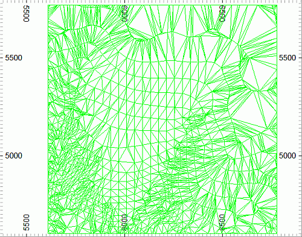
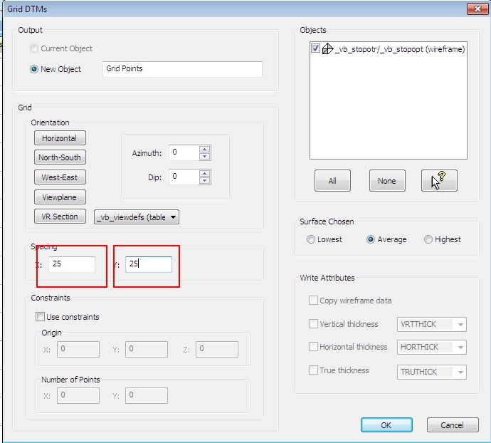
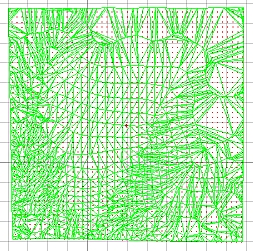
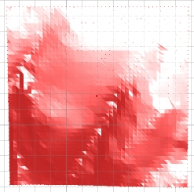

# Creating Surfaces from Grids

 |  Creating Surfaces from Grids Creating wireframe surfaces using Grid Points and Digital Terrain Modeling tools.  
---|---  
  
# Overview

In this part of the tutorial you are going to use the 3D window's DTM tools to create a gridded surface wireframe model.

## Prerequisites

  * Completed the [Creating a New Project](<Creating_a_New_Project.md>) exercise.

  * Completed the [Defining Geological Modeling Settings](<Defining_Geological_Modeling_Settings.md#Exercise1>) exercise.

  * [Files](<Tutorial_Files_List.md>) required for the exercises on this page:

  *     * _vb_stopopt.dm

    * _vb_stopotr.dm

    * _vb_viewdefs.dm

## Exercise: Creating the Gridded Topography Surface Wireframe Model Using DTM Tools

In this exercise, you will use the DTM Creation toolbar functions to create a grid-surface wireframe model of the topography. This will be done by:

  * generating grid points from the topography surface _vb_stopotr/_vb_stopopt (wireframe) object

  * creating a new surface wireframe using DTM creation tools.

 |  Use the gridded surface wireframe method for generating:

  * smoother surface wireframes;
  * surfaces with a regular triangular grid at a fixed grid spacing.

  
---|---  
  
| DTM Creation functions should generally not be used to create wireframe models of complex surfaces - for example, recumbent folds or overhanging pit walls. Instead, use the Wireframe Linking tools.   
---|---  
  
## Loading and Formatting the Data

  1. Unload any data if it is currently loaded.

  2. In the Project Files control bar, select All Tables folder.

  3. Drag-and-drop the following files (if not already loaded) into the 3D window:  

     * _vb_stopotr

     * _vb_viewdefs

  4. Select the Sheets control bar and expand the Design-Overlays folder.

  5. Select only the following check boxes (i.e. display these objects) :

     * Default Grid

     * _vb_stopotr/_vb_stopopt (wireframe)

  6. In the Sheets control bar, double-click  _vb_stopotr/_vb_stopopt (wireframe).
  7. In the Wireframe Properties dialog, select the Wireframe shading option and click OKIn the Format Display dialog, Overlay Format group, Style tab, Display As group, select Faces and click OK.
  8. Right-click to delete the Default Section item if it exists, and double-click the _vb_viewdefs item to display the Section Properties dialog.
  9. Disable theUse DimensionsandSection Plane - Fillcheck boxes and clickOK.
  10. Click Lock in the View ribbon to show the 'Plan 195m viewIn the Design window, confirm that the 'Plan 195m' view of the topography wireframe surface is displayed, as shown below:  
  

## Generating the Point Data Grid

  1. Activate the Structure ribbon and select DTMs | Grid DTMs

  2. In the Grid DTMs dialog, define the settings as shown below, click OK:  
  
  

  3. In theSheetscontrol bar, confirm that theGrid Pointsobject is listed in thePointsfolder.
  4. In the 3D window confirm that the grid points (here shown in red) cover the topography wireframe, as shown below:  
  
  

## Creating the Gridded Surface Wireframe

  1. Activate the Structure ribbon and select the top level DTMs icon
  2. In the Make DTM - General Options dialog, define the following settings (only non-default settings shown):  
  

     * New object: "New DTM"
     * Use Boundary Strings: disabled

.... and click Next:  

|  Here, boundary strings are not being used to confine the limits of the DTM.  
---|---  
  
  3. In the Make DTM - Select DTM Points and Strings... dialog, select the Grid Points (points) object, and click Finish.  

  4. In the Sheets control bar and expand the 3D-Overlays folder.

  5. Select only the following check boxes (i.e. display these objects):  

     * Default Grid

     * New DTM

  6. In the 3D window, you should now see a reformed wireframe as shown below:  
  
  
