# Geological Interpretation Using a Background Image

 |  Interpretation using a Background Image Using background images to create geological string model interpretations  
---|---  
  
# Overview

In this part of the tutorial you will model geological features by drawing strings onto a background image.

## Prerequisites

  * Completed the [Creating a New Project](<../Studio_3_Geological_Modeling_Tutorial/Creating_a_New_Project.md>) exercise.

  * Completed the [Defining Geological Modeling Settings](<../Studio_3_Geological_Modeling_Tutorial/Defining_Geological_Modeling_Settings.md#Exercise1>) exercise.

  * [Files](<../Studio_3_Geological_Modeling_Tutorial/Tutorial_Files_List.md>) required for the exercises on this page:

  *     * _vb_Seismic_Section_NS_5985.bmp

    * _vb_stopopt.dm

    * _vb_stopotr.dm

    * _vb_viewdefs.dm

## Exercise: Geological Interpretation Using Background Images

In this exercise you will interpret the geological features displayed on a seismic section. This will be done by loading the seismic section image file _vb_Seismic_Section_NS_5985.bmp as a background image, and then digitizing strings in the view plane, using different colors to represent the various geological features displayed in the seismic section.

The strings are then saved to a new Datamine file seisinterp.dm . The image below shows the completed interpretation consisting of two vertically dipping faults in orange (3), and untrimmed upper, middle and lower ore body contacts shown in green (5), cyan (6) and magenta (7) respectively:

 |  Use background images:

  * as a reference for creating geological string models in plan or section;
  * as a visual enhancement for existing drillhole data and geological string or wireframe models.

  
---|---  
| The following formats can be used for background images: *.bmp, *.ecw, *.jpg or *.tif .  
---|---  
  
## Loading and Formatting the Data

  1. In the Project Files control bar, expand the All Tables folder.

  2. Unload any data that has been loaded from previous exercises.

  3. Drag-and-drop the following wireframe triangles and section definitions files (if not already loaded) into the 3D window:

     * _vb_stopotr

     * _vb_viewdefs

  4. Select the Sheets control bar and expand the 3D folder.

  5. Select only the following check boxes (i.e. display these objects):  

     * Grids folder - Default Grid

     * Wireframes folder - _vb_stopotr/_vb_stopopt (wireframe)

  6. Double-click the _vb_stopotr/_vb_stopopt (wireframe) overlay.
  7. In the Wireframe Properties dialog, select the Intersection option, and select [_vb_viewdefs] from the Intersection Section drop-down list.
  8. Right-click the Default Section item in the Sheets control bar and delete it. 
  9. Double-click the _vb_viewdefs item to show the Section Properties dialog (you should be becoming familiar with this one).
  10. Use the right arrow to select the ever-popular N-S Secn 5935 section. Again, remove the Use Dimensions selection.
  11. Click OK and Lock the section, then zoom-all. 

## Loading the Background Image

  1. The quickest way to show a background image in the 3D window is to automatically create a rectangular wireframe plane and drape it:  
  
Activate the Data ribbon and select Load | External | Image  

  2. Select _vb_Seismic_Section_NS_5985 from your project folder and Open it.

  3. You will be asked if you wish to use the existing positional information held by this geo-referenced image. That would be far too easy for a tutorial, so select No.

  4. You will be shown the Image Registration dialog. This is a powerful utility for aligning real-world images or scans/survey information with data in the 3D window. The rules are:

     * You need to align at least 3 points on the image with 3 in the 3D window

     * It must be possible to align all points in a flat plane - the image you are importing is flat - where minor discrepancies occur, they will be evened out to determine an average plane  
  
  
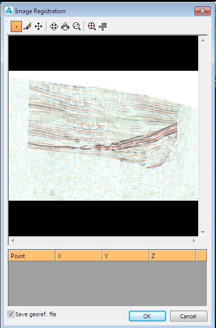

  5. You're going to digitize 3 points (top left, top right and bottom left, in that order). To insert the first point, select the New Point icon as highlighted above and then click at the top left of the image preview:  
  
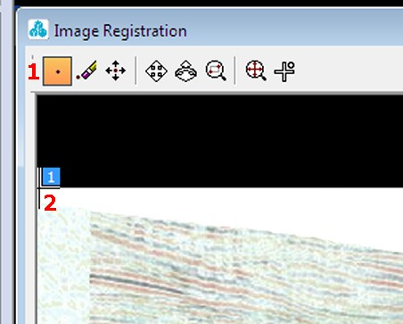  

  6. Next, repeat the same procedure to select the top right and bottom right points. You should now see an image with the 3 reference points, and a table beneath, full of zeroes:  
  
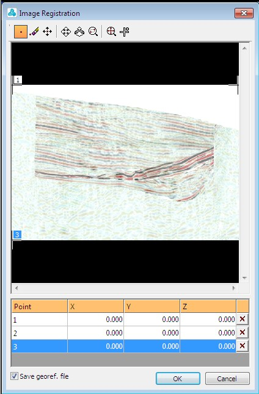
  7. Next step is to enter the positions of the 3 points into the table. There are multiple ways of doing this - you can either click in the 3D space to interactively match up each point with its Studio-RM-3D-world equivalent, or you can type numbers into the table. You're going to do the latter for this example. Enter the following information by overtyping the relevant zeroes:  
  
Point| X| Y| Z  
---|---|---|---  
1(top left)| 5985| 5270| 220  
2(top right)| 5985| 4760| 220  
3(bottom left)| 5985| 5270| -130  
  8. Click OK to generate the image drape in the 3D window:  
  
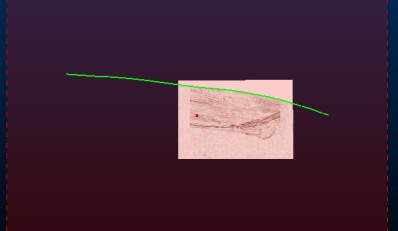
  9. Zoom in to an area surrounding the image itself (using the View ribbon's Zoom Area command):  
  
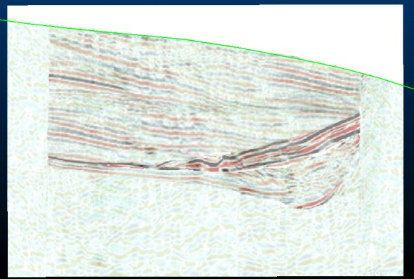

## Creating a Section String from a Topography Wireframe

  1. With the imported image in full view, turn the _vb_viewdefs section off using the Sheets bar.

  2. Activate the Structure ribbon and select Section from the Operations | Plane menu.

  3. In the Section dialog, select [_vb_stopotr/_vb_stopopt] from the Object drop-down list.

  4. In the Section dialog, click Use View Planeand click OK.

  5. In the Sheets control bar, expand the 3D folder.

  6. Select only the following check boxes (i.e. display these objects):  

     * Grids folder - Default Grid

     * Strings folder - Section 1: _vb_stopotr/_vb_stopopt

     * Wireframes folder - _vb_Seismic_Section_NS_5985.bmp

  7. Double-click Section 1: _vb_stopotr/_vb_stopopt

  8. In the String Properties dialog, select the Lines tab and set a Fixed Color of Red. Click OK. 

  9. In the 3Dwindow, confirm that the red topography section string appears as shown below:  
  
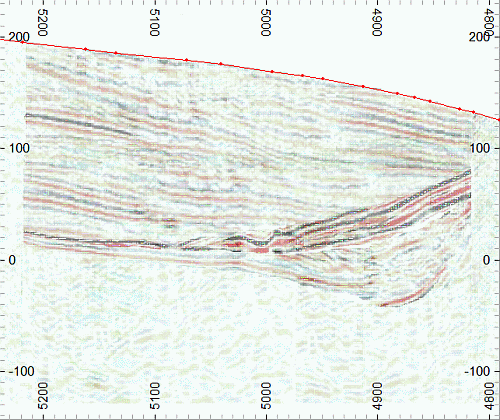  
  

| The new section strings object Section 1:_vb_stopotr/_vb_stoppt is colored on the column COLOUR, by default. This was transferred from the wireframe when the slice was generated.   
---|---  

## Creating a New Strings Object

  1. In theCurrent Objectstoolbar, select theObject Type [Strings] and then click Create New Object Applying Default Template.
  2. In theSheetscontrol bar, confirm that theNew Stringsobject is listed in the3D | Stringsfolder, and is highlighted in bold - identifying it as the current strings object.

## Digitizing the Fault Strings

  1. Use the Home ribbon to set the Snap mode to [Lines].

  2. Create a new, external 3D window by selecting Show | New External 3D - position and resize this window, then use <SHIFT> and the mouse to rotate the view so it sits alongside the main view similar to that shown here:  
  
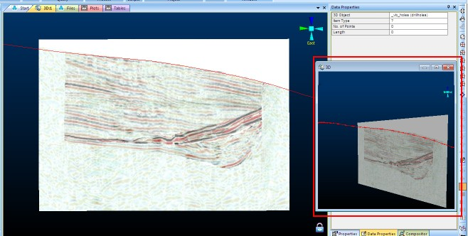  

  3. Next, you're going to digitize two fault lines as shown below:  
  
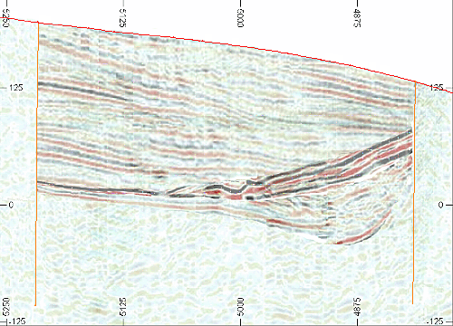  
  
First step - In the Current Objects toolbar, select the attribute [COLOUR], set the value to [3] (Orange).

  4. Initiate digitizing by typing 'ns' (new-string) with the cursor in the 3D window. Digitize two strings (between points 1 and 2, then 3 and 4 - don't forget to initiate a 'new string' between them, and click Done when both have been digitized)  
  
  
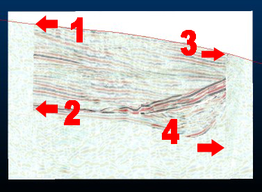

  5. You should end up with something like this:  
  
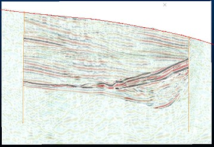

## Digitizing the First Ore Body String  
  
In this part of the tutorial, you're going to digitize a string representing the uppermost face of the orebody, as indicated by the dark red and black reflectors in the Seismic image (highlight below in bright green):  
  
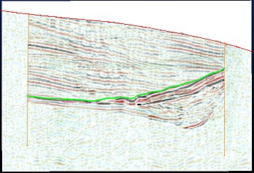  
  

  1. In the Current Objects toolbar, select the attribute [COLOUR], set the value to [5] (Green).

  2. Move the cursor to the top of the northern (left) end of the set of thick, dark red and black reflectors.

  3. Type 'ns' to initiate digitizing, then left-click and define the first point just to the north of the northern fault string.

  4. Moving along the top contact of this horizon, digitize in further points (approximately 10 real-world meters apart, but as long as you capture the shape required it doesn't matter how many you use - it's also ok if you even out some of the more obvious bumps) using left-click.

  5. Left-click and define the last point just to the south (right) of the southern fault string.

  6. In the 3D window, click Done.

  7. In the 3D window, click away from the newly-digitized string to deselect it.

  8. In the 3D window confirm that a new Green (5) ore body string has been digitized, and appears similar to the image below:  
  

## Digitizing the Second Ore Body String

As above, but this time you are going to digitize the base of the upper zone, similar to that shown below in light cyan:  
  
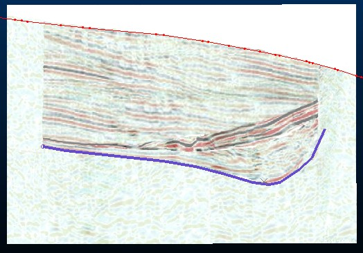

  1. In the Current Objects toolbar, select the attribute [COLOUR], set the value to [6] (Cyan).

  2. Start to digitize a new string (into the same object as before - New Strings); move the cursor to the bottom of the northern (left) end of the set of thick, dark red and black reflectors.

  3. Left-click and define the first point just to the north of the northern fault string.

  4. Moving along the top contact of this horizon, digitize further points (x10) using left-click.

  5. Left-click, and define the last point just to the south (right) of the southern fault string.

  6. In the 3D window, click Done.

  7. In the 3D window check that a new Cyan (6) ore body string has been digitized and appears similar to the image below:  
  
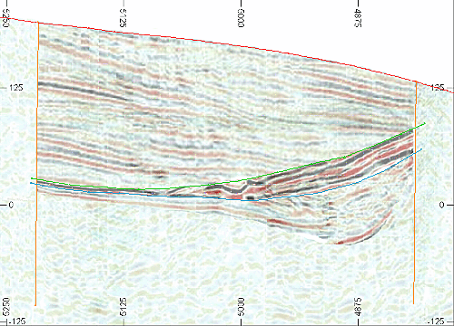  

## Digitizing the Third Ore Body String

Final string represents the base of the orebody (lowermost surface), as shown below in purple:  
  

  1. In the Current Objects toolbar, select the attribute [COLOUR], set the value to [7] (Magenta).

  2. Initiate a new string as before and - move the cursor to the bottom of the northern (left) end of the set of thick, continuous red and black reflectors.

  3. Left-click and define the first point just to the north of the northern fault string.

  4. Moving along the top contact of this horizon, digitize in further points using left-click.

  5. Left-click and define the last point just to the south (right) of the southern fault string.

  6. In the 3D window, click Done.

  7. In the 3D window check that a new Magenta (7) ore body string has been digitized.

## Trimming the Ore Body Strings against the Faults Strings

  1. Activate the Edit ribbon and select the Clip | Trim to String command.

| Take note of the messages and follow the instructions displayed in the Status Bar at the bottom left corner of the application window.  
---|---  
  2. Select (left-click) the northern fault string - this is the vertical line on the left of the image.

  3. In turn, select (left-click) each of the three ore body string start points - click to the north (left) of the fault string - zoom in if you need to:  
  
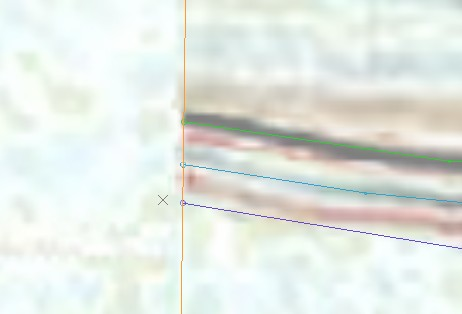

  4. Click Done.

  5. Activate the Edit ribbon and select the Clip | Trim to String command again.

  6. Select (left-click) the southern fault string (on the right of the image)

  7. In turn, select (left-click) each of the three ore body string end points i.e. click to the south (right) of the fault string, again, zoom if you need to:  
  
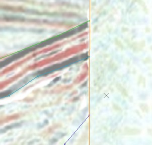

  8. Click Done. Your orebody strings should now be neatly trimmed to the fault lines.

## Hiding the Background Image

  1. To hide the background image, disable the _vb_Seismic_Section_NS_5985 item in the Sheets | 3D | Wireframes folder.

## Saving the New Strings to a Datamine File

  1. In the Sheets control bar, right-click the New Strings object and select Data | Save As.

  2. In the Save New 3D Object dialog, click Extended Precision Datamine (.dm) File.

  3. In the Save New Strings dialog, select your project folder, define the File name as 'seisinterp_NS5985', and click Save.

  4. In the Sheets control bar, confirm that the New Strings object has been replaced by the object seisinterp_NS5985 (strings).

 | 

  * Multiple background images can be loaded and managed independently.
  * You can also load multiple images (georeferenced) by dragging them into the 3D window from an external folder - this is an excellent way of lining up section maps created over a wide area.
  * You can export the 'world file' for your image maps separately from your image.

  
---|---  
  

****[Next Section](<../Studio_3_Geological_Modeling_Tutorial/Digitizing_Vertical_Section_Strings.md>)