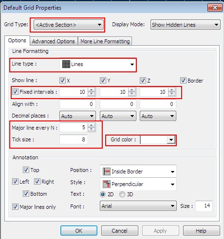
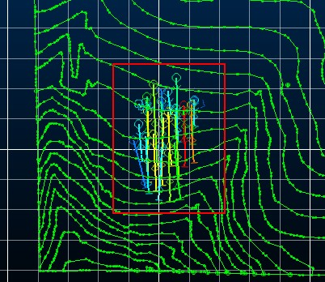
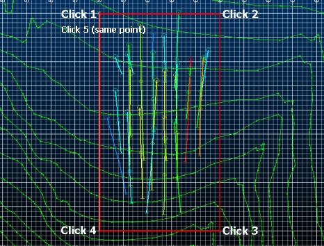
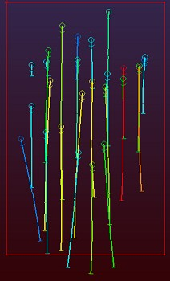
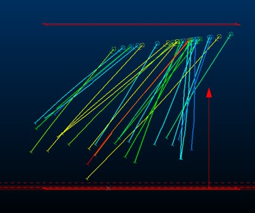
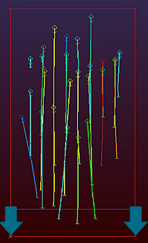
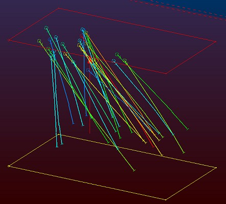

# StudioRM_Creating a Modeling Boundary

 |  Creating a Rectangular Modeling Boundary Drawing a pair of rectangular modeling boundary strings in the Design window using fixed coordinates.  
---|---  
  
# Overview

In this part of the tutorial you will create a pair of modeling boundary strings with fixed coordinates.

## Prerequisites

  * Completed the [Creating a New Project](<../Studio_3_Geological_Modeling_Tutorial/Creating_a_New_Project.md>) exercise.

  * Completed the [Defining Geological Modeling Settings](<../Studio_3_Geological_Modeling_Tutorial/Defining_Geological_Modeling_Settings.md#Exercise1>) exercise.

  * [Files](<../Studio_3_Geological_Modeling_Tutorial/Tutorial_Files_List.md>) required for the exercises on this page:

  *     * _vb_holes.dm

    * _vb_stopo.dm

## Links to exercises

The following exercise is available on this page:

  * Creating Modeling Boundary Strings in the Design Window

## Exercise: Creating Modeling Boundary Strings in the 3D Window

In this exercise you will use grid snapping and locked coordinates to digitize a pair of horizontal, rectangular perimeters (closed strings), one at 220m elevation and the other at -80m elevation. These perimeters define the extents of a block model prototype used in later block modeling exercises. These rectangular boundary strings, relative to the drillhole positions, are shown below:

 |  Use modeling boundary strings:

  * as input perimeters when selecting (and additionally flagging) data usingSELPER
  * to visualize block model prototype extents before defining a prototype block model.

  
---|---  
 | 

  * perimeters used as input into SELPER are typically single perimeters and not pairs of perimeters as created in this exercise. In this case one would use only the upper or lower perimeter for data selection or flagging; using Retrieval Criteria and the PVALUE attribute to use only the required string when running the process.

  
---|---  
  
## Loading the Data and Aligning the View

  1. Unload any date you may have loaded.

  2. Using the View ribbon, make sure the Locked toggle is OFF.

  3. Using the View ribbon, make sure the Perspective toggle is OFF.

  4. Double-click and empty portion of the 3D screen and set the background color to a Single [Black]

  5. In the Project Files control bar, select the All Tables folder.

  6. Drag-and-drop the following strings and drillholes files (if not already loaded) into the Design window:  

     * _vb_holes

     * _vb_stopo

  7. In the Sheets control bar, expand the 3Dfolder.

  8. Select only the following objects:

     * Grids folder - Default Grid

     * Strings folder - _vb_stopo.dm (strings)

     * Drillholes folder - _vb_holes (drillholes)

  9. Using the View ribbon, select View | Zoom Fit | Zoom Plan and click the Lock toggle.

  10. Expand the 3D | Sections folder and double-click the Default Section item.

  11. In the Section Properties dialog, enter the following data into the Section Ref Point fields:

     * X: 6195

     * Y: 5185

     * Z: 220

  12. Click the Horizontal button and click OK.

## Creating a New Strings Object

  1. In theCurrent Objectstoolbar, select theObject Type [Strings] and then click Create New Object Applying Default Template, as shown below:  
  

  2. In theSheetscontrol bar, confirm that theNew Stringsobject has been added to theStringsfolder.

##   
Digitizing the Upper Perimeter by Snapping to Grids

  1. Double-click the Default Grid item found in the 3D | Grids folder.

  2. In the Default Grid Properties dialog, define the grid settings as shown below and click OK:  
  
  

  3. Activate the Home ribbon and select Snapping | Snap to Grid \- note that the ribbon description will update to show "Snap: Grid"

  4. Using the View ribbon, select Zoom Area and drag a rectangle around the displayed drillholes in plan view, e.g.:  
  

  5. Click inside the 3D window and "ns" to start digitizing a new string.

  6. Using the Current Objects toolbar, select Red (2) from the right-hand drop-down list.

  7. In the 3D window, digitize a rectangle by right-clicking (snapping to grid points) approximately as shown below  
  

  8. Click Done to complete the digitizing operation

  9. Disable the view of the grid to see the string more clearly - disable the check box in the Sheets control bar.

  10. Also, disable the view of _vb_stopotr/_vb_stopopt as you will shortly be snap-digitizing and don't want to inadvertently snap to one of the topography contour vertices.

  11. Activate the Home ribbon and select Snapping | Snap to Points.

## Digitizing the Lower Perimeter using the Mouse Position dialog

  1. Next, you need to lower the digitizing plane to create the boundary strings representing the base surface of the model prototype. Using the Sheets control bar, double-click the Default Section item.

  2. In the Section Properties dialog, enter the following Section Ref Point information and click OK:

     * X: 6195

     * Y:5185

     * Z: -120

  3. For safe measures, activate the View ribbon and click Zoom Fit | Zoom Plan again - looking very similar to before? It should do - it is the same view direction, but this time the active section is further away (lower) from the camera than before.

  4. Digitize another new string (but do not create a new object you want the additional data to be added to the current object), right-clicking the previous string points and clicking done after point 5. In the view you're using, it will be just like digitizing over the top of the previous string, but this time, the points will fall several hundred meters below.

  5. You should end up with something like this:  
  

  6. Good, but not quite good enough - the lower boundary string doesn't quite catch the full extents of the loaded drillhole data. You can see this more easily by disabling the Lock toggle and spinning the 3D view to a side view like this:  
  

  7. Definitely trimming valuable data on the left here (imagine the top and bottom strings joined together to form a cuboid. Many options are open to you to drag the bottom rectangle out further, but the simplest is probably to go back to a plan view and move points on the current section. Activate the View ribbon and click Zoom Fit | Zoom Plan again.

  8. Zoom out slightly to give yourself some space around your data to drag points (use the View ribbon's Zoom option and use the cursor to dynamically zoom out)

  9. Drag the points on the active section by entering move points mode. Activate the Edit ribbon and click the top-level Move Points command. Move the points as shown below:  
  

  10. Click Done when complete.

  11. To keep things neat (and to practice adjusting the section plane again, next you're going to move the points on the top boundary rectangle to match those of the lower outline.

  12. Activate the View ribbon and click Zoom Fit | Zoom Plan again.

  13. This time, use edit points mode to snap the non-adjusted points to the position of the adjusted points.mpo. Again, click Done when complete - both rectangle should now align properly.

  14. Spin the view around - your drillhole data should now fit nicely between the top of bottom boundary strings, with no data hanging outside of the expected cuboid volume:  
  

## Saving the New Strings to a Datamine File

  1. In the Sheets control bar, right-click on the New Strings object, select Data | Save As.

  2. In the Save New 3D Object dialog, click Extended Precision Datamine (.dm) File.
  3. In the Save New Strings dialog, select your project folder, define the File name 'modbound.dm', click Save
  4. In the Sheets control bar, check that the New Strings object has been replaced by the strings object modbound (strings). 

| Your pair of modeling boundary strings (perimeters) modbound.dm can be checked against the example file _vb_modbound.dm  
---|---  
  
****[Next Section](<Geological_Interpretation_Using_a_Background_Image.md>)