# Using Locked Sections

 |  Digitizing Vertical Section Strings Ore body interpretation by digitizing vertical section strings and using drillholes.  
---|---  
  
# Overview

In this part of the tutorial you will create the basic framework for a geological ore body string model, consisting of sets of vertical section strings, which are guided by the mineralized zones displayed in the drillhole data.

## Prerequisites

  * Completed the [Creating a New Project](<../Studio_3_Geological_Modeling_Tutorial/Creating_a_New_Project.md>) exercise.

  * Completed the [Defining Geological Modeling Settings](<../Studio_3_Geological_Modeling_Tutorial/Defining_Geological_Modeling_Settings.md#Exercise1>) exercise.

  * [Files](<../Studio_3_Geological_Modeling_Tutorial/Tutorial_Files_List.md>) required for the exercises on this page:

  *     * _vb_stopopt.dm

    * _vb_stopotr.dm

    * _vb_faultpt.dm

    * _vb_faulttr.dm

    * _vb_holesc.dm

    * _vb_viewdefs.dm

## Exercise: Digitizing Vertical Section Strings using Drillholes

In this exercise you will create a geological ore body string model consisting of sets of vertical section perimeter strings. This will be done for each of the two mineralized zones displayed in the composited static drillhole file _vb_holesc.dm , for each of the vertical N-S sections.

The northern and southern limits of the ore body strings will be defined by the vertically dipping faults. Different colors will be used to represent each zone. The strings will then be saved to a Datamine file min1st.dm .

The image below shows the digitized and conditioned set of strings for the upper (Green 5) and lower (Cyan 6) mineralization zones, relative to the drillhole, topography and fault surface data, for one of the sections:

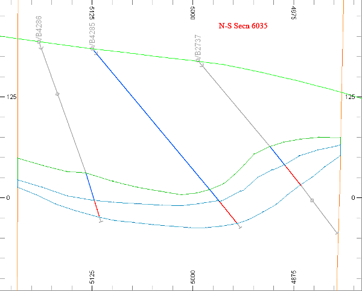

In this exercise, you will be using a North-South section view of drillholes to determine the approximate orebody zone strings. In the previous exercise, you were using a seismic report to guide you, shown as a draped image in the background. Studio RM allows you to use either (or both) of these techniques, using multiple section maps in any orientation (or mix of orientations if required) in order to abstract the most accurate skeleton of strings for constructing a bounding wireframe for eventual block modelling.

In this tutorial, you will be asked to follow the approximate design of section strings - you don't have to be 100% accurate, but get as close as you can to the displayed images at each stage.

This tutorial will also introduce you to the concept of locked sections and multiple, dynamic 3D views.  

## Loading and Formatting the Data

  1. Unload any data that you currently have loaded, and display the 3D window.

  2. In the Project Files control bar, select the All Tables folder.

  3. Drag-and-drop the following files (if not already loaded) into the 3D window:

     * _vb_faulttr

     * _vb_holesc

     * _vb_stopotr

     * _vb_viewdefs

  4. Select the Sheets control bar and expand the 3D folder.

  5. Select only the following check boxes (i.e. display these objects) :

  1.      * Grids folder - Default Grid

     * Wireframes folder - _vb_faulttr/_vb_faultpt (wireframe)

     * Wireframes folder _vb_stopotr/_vb_stopopt (wireframe)

     * Drillholes folder - _vb_holesc (drillholes)

  5. n the Sheets control bar, open the 3D | Sections folder and right-click to delete the [Default Section] item if it exists.
  6. In the Sheets control bar, open the 3D | Wireframes folder and double click _vb_faulttr/_vb_faultpt (wireframe).
  7. In the Wireframe Properties dialog, choose the Intersection display option, and select [_vb_viewdefs (table)] as the Intersection Section. Click OK.
  8. Using the View ribbon, select the Split Vertically option. You should be looking at something similar to the following:  
  
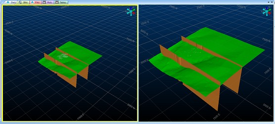
  9. See the yellow border around the left hand window? That indicates the currently active window - any view modification commands will be applied to the active window. This will be updated automatically if you attempt to perform any function that interacts with another window (digitizing, querying, linking strings etc.).  
  
Click into the right-hand window to show this in action, then click the left window again to return focus to it.
  10. With the left window highlighted, select Lock from the View ribbon. The view automatically spins to a plan view (the first view available in the loaded Section Definition file). The left window also sports a handy padlock icon (bottom right corner), to show it is locked to a view that is orthogonal to the camera.
  11. As a plan view isn't ideal for digitizing orebody strings in a North-South alignment, locate and double click the _vb_viewdefsitem in theSheetscontrol bar.
  12. Disable the Use Dimensions check box and click the right arrow twice to show the "N-S 5935" section (as indicated by the status bar). Note how the view of the left hand window updates each time you press the arrow - this is because the section is locked to the view definition. The right-hand window will show movement of the section indicator, but the view of the data will remain static  
  
Click Apply:  
  
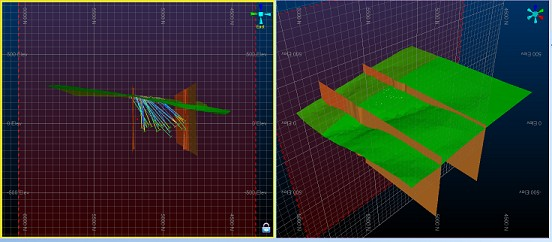
  13. Switch the Perspective mode off - note that this is only disabled in the active view (the right-hand view still shows perspective).
  14. Now, set the section clipping limits to "1" in each direction and set Clipping to Outside. Clipping is also a Global setting, so applies to all views.
  15. To make the topography intersection a bit clearer, first disable the Fill check box and click OK in the Section Properties dialog
  16. Double-click any empty space in either window and set the background color to [White] (no gradient). This time, all windows are affected - this is because Environment Settings are global and affect all windows.
  17. Disable the view of the Default Grid, using the Sheets | 3D | Grids menu.
  18. Finally, zoom in (View ribbon | Zoom Area) around the cluster of 3 drillholes shown in section in the left window (you can zoom a locked section - you just can't change its orientation). Now, you should be looking at something like this in the left (locked) window:  
  
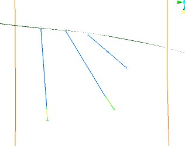
  19. The section is almost in the right position. Next, you'll use the interactive section edit to move the section in 3D to fully expose the right-hand drillhole area of interest (clipped in the image above).  
  
For now, click inside the right-hand window to highlight it.
  20. With the right-hand window outlined in yellow, activate the View ribbon and select the Edit Interactively option.  
  
This makes a set of 'widgets' appear around the 3D section:  
  
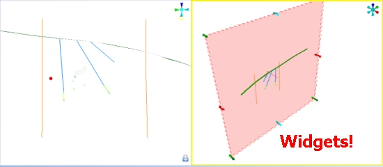
  21. Hold <SHIFT> and use the mouse to rotate the right-hand window approximately to the position shown below:  
  
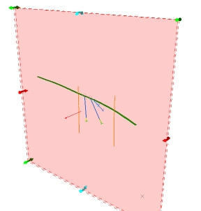
  22. Next, grab and move the top right Green widget very slightly towards the top right of the screen (it's a small movement). Watch the left-hand window and see how it automatically updates. You're aiming to expose the lower section of the far right drillhole, as shown:  
  
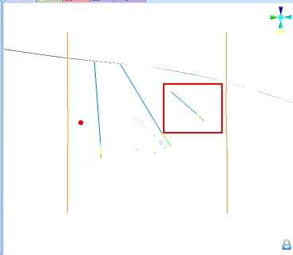

## Creating a New String Object

  1. In theCurrent Objectstoolbar, select theObject Type [Strings], and click Create New Object Applying Default Template.
  2. In theSheetscontrol bar, confirm that theNew Stringsobject is listed, and is highlighted in bold to indicate that it is the current strings object.

## Digitizing the Upper Zone String for the "N-S Secn 5935"

 | 

  * The perimeter will be digitized in a clockwise direction.
  * The start point is the extrapolated top of the upper zone (blue drillhole segments) position, on the fault just north (left) of drillhole VB4267.
  * Points will be digitized on the top (top contact) or bottom (bottom contact) of the relevant drillhole segments, by pointing (extrapolated positions e.g. off-section drillhole VB2832) or snapping to segment ends.
  * Points are digitized where the extrapolated northern and southern ends of the ore zone is truncated by the faults.
  * The string will be closed to create a closed string (perimeter).

  
---|---  
  
  

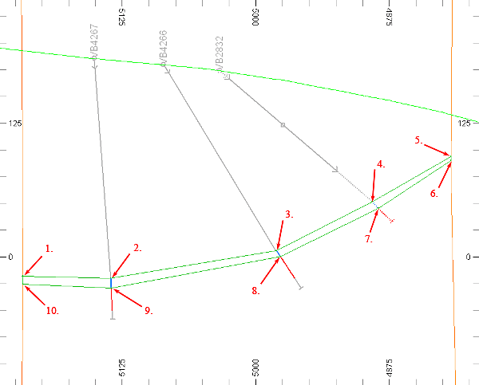

String points labeled with the digitizing sequence.

  1. First thing to do is color the holes on the ore zone field. Double-click _vb_holesc in the Sheets control bar, select the Lines & Symbols tab and auto-create a legend for the ZONE column, then click OK.
  2. Using the Home ribbon, set the Snap mode to points.
  3. Using the View ribbon, enable the section Indicator.
  4. Zoom Area(Viewribbon) and define an area including the North fault (indicated by the digitizing point "1" above) and the bottom of drillhole VB4267, as shown below (indicator lines removed):  
  
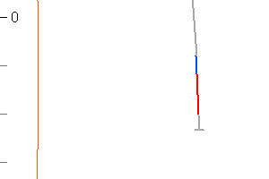
  5. Type 'ns' to initiate digitizing and left-click a point on the northern fault line, approximately as shown below:   
  

  6. Click theZoombutton and scroll the mouse to dynamically zoom out so that the 1st drillhole is visible (point 2) - right-click to create the first string segment (indicator lines removed):   
  
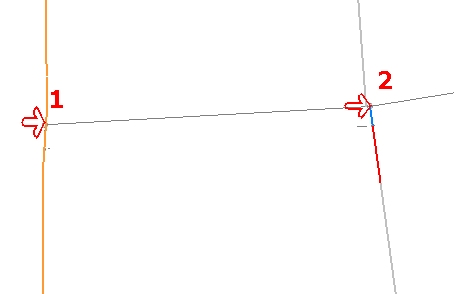   
  

  7. Create another segment by right-clicking to the top of the same zone indicated on the 2nd drillhole:  
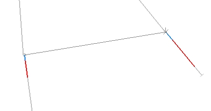  

  8. Using a combination of zoom and pan commands, digitize a closed string shown in the digitizing sequence shown further above (capturing the zone area indicated by blue sections of drillhole) - remember to extend your closed string to the southern fault line, and to right-click position 1 again to close the string, then clickDoneto complete digitizing.  
  
You should now see a closed string in the left hand window, similar to that shown.  
  
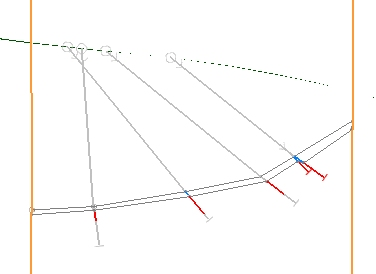

 |  When digitizing points or string points:

  * Right-click (snap) will snap to the nearest point, which may or may not be in the current view plane, and place a point.
  * Left-click will place a point in the current Design view plane

Use the following Edit ribbon burrons to modify your digitized points:

  * Undo Edit (you can also use CTRL + Z)
  * Move Points
  * Delete Points

  
---|---  
  
## Smoothing the Upper Zone Perimeter for the "N-S Secn 5935"

  1. Click on (i.e. select) the newly digitized upper zone string to highlight it in yellow.
  2. Activate theEditribbon and clickCondition | Smooth String
  3. Studio attempts to smooth all of the closed string, including the square edges at the fault lines, so now you'll need to remove two automatically inserted points. Click inside the 3D window and type "dpo" to enter delete points mode.   
Click the two points shown below:  
  
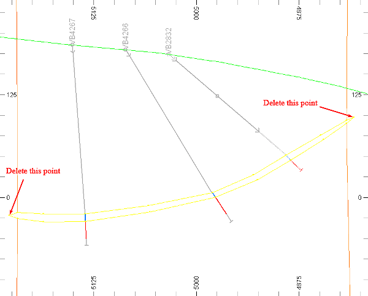
  4. Also - delete the point creating the unsightly bump on the lower string:   
  
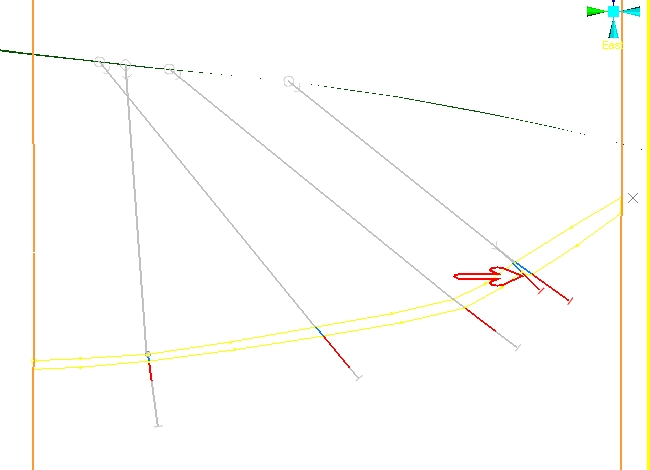
  5. String 1 (the upper zone) is now complete - now for the lower zone, indicated by the red drillhole segments.  
  
Referring to the steps above for guidance, digitize a new string (this time, make sure you set the color to 'Green' before you start digitizing).  
  
(Tip: to align your zones correctly, use a right-click digitize action to snap to the lower points of the upper zone)  
  
You should end up with something similar to the following:  
  
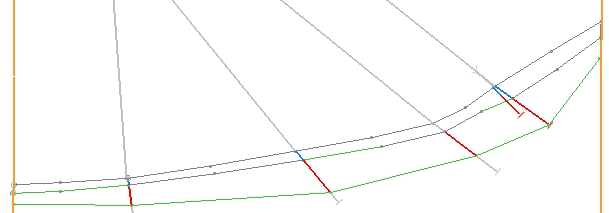  

  6. After all that effort, you should save your new string data to a new file: activate the Data ribbon.
  7. In the Sheets control bar, right-click the New Strings item and select Data | Save As.
  8. Save an Extended Precision file called "min1st.dm".

Creating the Strings for the Remaining Sections (Optional)

Creating the remaining string sections, in essence, replicates the process you've followed so far; you select the next section in the _vb_viewdefs file, digitize the two closed ore zone strings, then move onto the next. If you want to complete your zone string digitizing for practice, refer to the general procedure below, otherwise, you can load a completed string file in the next exercise.

  1. Double-click the _vb_viewdefs file in the Sheets control bar to open the Section Properties dialog.

  2. Snap to each of the following sections, and complete the upper/lower string digitizing procedure:

     * N-S Sec 6010:  
  
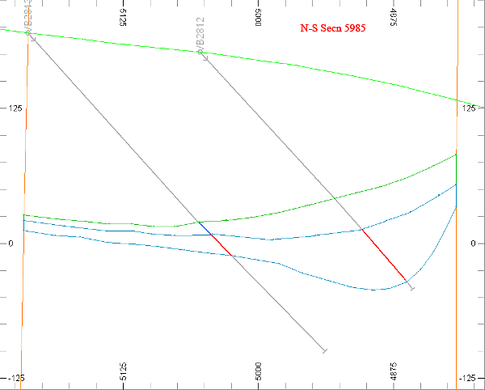

     * N-S Secn 6060:  
  
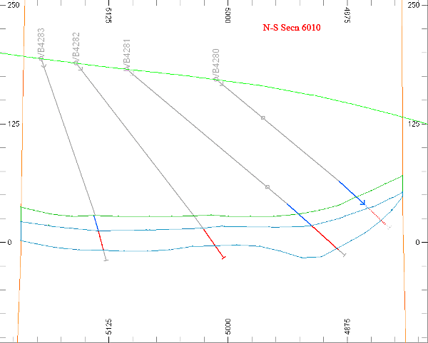

     * N-S Secn 6085:  
  

     * N-S Secn 6110:  
  
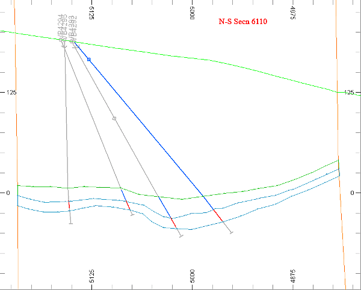

  3. Select the Sheets control bar.

  4. Right-click on the min1st (strings) object , select Save

 |  Your interpretation of the ore zone strings can be checked against the example file _vb_min1st.dm  
---|---  
  
  

 [Next Page](<../Studio_3_Geological_Modeling_Tutorial/Extrapolating_Section_Strings.md>)