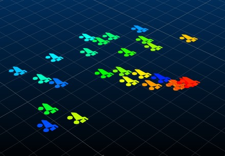
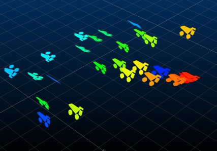
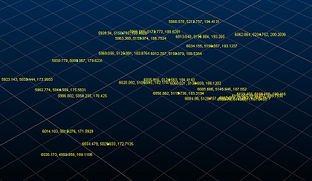
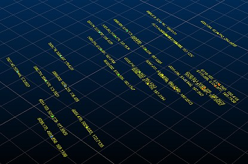

 |  3D Strings and Points Formatting strings and points data in the 3D window  
---|---  
  
# Overview

In this part of the tutorial you will modify various visual properties of 3D window points and strings

## Prerequisites

  * There are no prerequisites for this exercise

  * [Files](<../Studio_3_Geological_Modeling_Tutorial/Tutorial_Files_List.md>) required for these exercises:

  *     * _vb_collars.dm

    * _vb_minst.dm

## Exercise: Formatting Static Drillholes using Filter Legends

In this exercise, you will load demonstration collar points into the 3D window and set display properties to highlight different options for visual formatting

You will complete the following tasks in this exercise:

  * Display points as pixels and scaled symbols

  * Applying labels to points

  * Adjusting string edge and point formatting

Display points as pixels and scaled symbols

  1. Load the file _vb_collars.dm into the 3D window by dragging it from the Project Files control bar.
  2. Activate the View ribbon and make sure the Perspective toggle is ON.
  3. Zoom-all-graphics ("za"):  
  

  4. Expand the Sheets | 3D folder and double-click the loaded collars overlay.

  5. Select the Symbols tab and ensure the 2D option is selected.

  6. By default a (tiny) circle is used to represent each collar position. The default Scale is set to "2" - change it to "20" and click Apply:  
  

  7. No surprises so far...next, select the small Haultruck (tooltip is "Truck") symbol from the Style drop-down list, change the scale to "30" and Apply:  
  

  8. Next, select the Dip option and click Apply \- note how the symbols are shown in isometric 3D:  
  

  9. Now that you've enabled the Dip option, you can edit the Dip, Dip Direction and Roll of the symbols independently, according to a data field in the underlying data object. For example (and not a particularly practical example), select the _X_Coord option from the Dip drop-down list and click Apply:  
  

  10. So where could you make use of this, other than showing cut-out haultrucks in various rotations? One potential usage is to display an arrow symbol in place of points, and select a data field containing dynamic anisotropy information - you can then select the relevant field(s) to govern the 3D rotation of the arrows, making the directional trend easier to see in relation to a loaded model.

Applying Labels to Points

3D labels can be any information you like, and can even be a mixture of data field values and custom text:

  1. Reset the previous points display to actual points by clicking the 2D option, selecting the [Filled Circle] Fixed symbol, setting the rotation to Fixed (0) and setting the Scale to 2.
  2. In the Points Properties dialog, select the Labels tab.
  3. Select the Display Labels check box.
  4. Make sure the Text field is empty (delete any text found there if it is present).
  5. In this exercise, you are going to display the X, Y and Z coordinates of each point, separated by a comma. This will require setting 3 items relating to a data field, with a custom comma character between them:  
  
First, make sure [_X_Coord] is selected in the Column drop-down list and click Insert \- note how the field description is added to the Text field, wrapped in square brackets. Square brackets indicate that a value from the underlying object database will be displayed.  
  
Next, click to the right of the inserted Text and type a comma and space (no brackets) - this indicates that the typed text will be shown as typed.
  6. Select [_Y_Coord] and click Insert. Type a comma and space after
  7. Select [_Z_Coord] and click Insert. You should see the following in the Text field:  
  
[_X_Coord], [_Y_Coord], [_Z_Coord]
  8. Click Apply - instant coordinates!   
  

  9. Try a 3D font: click the 3D option, set the Size to '5' and click Apply \- looks remarkably similar to the previous effort doesn't it? This is because you are viewing a 3D font orthogonally. Select the Plane and Azimuth check boxes and set the Azimuth to '15' - this time, when you click Apply, the text is rotated and shown in vanishing point perspective:  
  

Associating a data file with a point/VR Object

In previous exercises, you will already have seen how the Information Mode operates. In this exercise, you will add a 3D Object (a small 3D Haultruck model) to a textured surface

Adjusting string edge and point formatting

After the brief introduction to

 |  Related Topics  
---|---  
| [Related Topic link 1](<../TOPIC 1>)[  
Related Topic link 2](<../TOPIC 2>)[  
Related Topic link 3](<../TOPIC 3>)