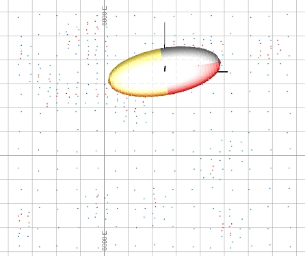
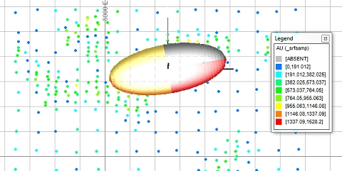

 |  Checking Search Parameters Checking search parameters using a wireframe ellipsoid.  
---|---  
  
# Overview

In this portion of the tutorial you are going to be introduced to a visual method of checking a set of search parameters. This will be done by first, by creating a search ellipsoid wireframe using the process ELLIPSE and a search parameters file and secondly, by viewing this ellipse wireframe together with the sample data in the Design window.

## Prerequisites

  * Created a new project and added all the required tutorial files - exercises on the [Creating a New Grade Estimation Project](<Creating_a_New_Grade_Estimation_Project.md>) page.

  * Displayed toolbars and defined project settings - exercises in the [Displaying Grade Estimation Toolbars](<Display_Grade_estimate_Toolbars.md>) and [Defining Settings](<Defining_Settings.md>) pages.

  * Read the introductory page [Defining Search Volumes,](<../Studio_3_General/Grade Estimation Search Volume Introduction.md>) in the Grade Estimation User Guide.

  * Read the help documentation page [ELLIPSE](<../Process_Full_Descriptions/ellipse-d.md>) .

  * [Files](<tutorial_files.md>) required for the exercises on this page:

  *     * _srfsamp

    * _2dspar1

## Exercise: Checking Search Parameters Using a Wireframe Ellipsoid

In this exercise you are going to check the search parameters stored in the search parameter file _2dspar1.This includes the following tasks:

  * Creating a wireframe search ellipsoid using the ELLIPSE process

  * Loading and inspecting the sample data and the wireframe ellipsoid.

 |  Checking your search parameter file (or parameters if using GRADE) using a wireframe ellipsoid and sample data loaded in theDesignwindow to:

  * check that the orientation and distance of the axes have been correctly defined
  * check to see if sample coverage in different areas of the data set matches your MINNUMn and MAXNUMn parameters i.e. the parameters defining the minimum and maximum numbers of samples required for estimating a grade value
  * check that the quardrant search criteria (if used) are valid within different areas of your data set.

  
---|---  
  
The search parameters stored in the search parameters file _2dspar1 are listed in the table below:

Parameter |  Value |  Description  
---|---|---  
SREFNUM |  1 |  Unique search volume reference number  
SMETHOD |  2 |  1=Rectangular search, 2=Elliptical search  
SDIST1 |  240 |  Search distance 1 [m]  
SDIST2 |  100 |  Search distance 2 [m]  
SDIST3 |  1 |  Search distance 3 [m]; a value of 0 cannot be used  
SANGLE1 |  -10 |  1st rotation angle i.e. about SAXIS1  
SANGLE2 |  0 |  2nd rotation angle i.e. about SAXIS2  
SANGLE3 |  0 |  3rd rotation angle i.e. about SAXIS3  
SAXIS1 |  3 |  1st rotation axis (1=X, 2=Y, 3=Z axis)  
SAXIS2 |  1 |  2nd rotation axis  
SAXIS3 |  3 |  3rd rotation axis  
OCTMETH |  0 |  Use Octant search; 1=Yes, 2=No  
MINOCT |  0 |  Number of octants to contain samples; Set if OCTMETH=1  
MINPEROC |  0 |  Minimum number of samples per octant; Set if OCTMETH=1  
MAXPEROC |  10 |  Maximum number of samples per octant; Set if OCTMETH=1  
MINNUM1 |  3 |  Minimum total number of samples in the first search volume  
MAXNUM1 |  20 |  Maximum total number of samples in the first search volume  
SVOLFAC2 |  2 |  Multiplying factor defining the size of the second search volume based on size of the first search volume i.e. the SDIST1, SDIST2 and SDIST3 parameters  
MINNUM2 |  3 |  Minimum total number of samples in the second search volume  
MAXNUM2 |  20 |  Maximum total number of samples in the second search volume  
SVOLFAC3 |  0 |  Multiplying factor defining the size of the third search volume based on size of the first search volume i.e. the SDIST1, SDIST2 and SDIST3 parameters  
MINNUM3 |  0 |  Minimum total number of samples in the third search volume  
MAXNUM3 |  0 |  Maximum total number of samples in the third search volume  
MAXKEY |  0 |  Maximum number of samples with same key field value  
  
## Creating a Wireframe Search Ellipsoid

  1. Select the Design window.

  2. Activate the  Estimate ribbon and select  Estimate | Ellipse Select  Models | Interpolation Processes | Create Wireframe Ellipse .

  3. In the ELLIPSE dialog, Files tab, Input files group, set SRCPARM* by browsing for and selecting the file _2dspar1.

  4. In the Output files group, define WIRETR* as '2delp1tr'.

  5. In the Output files group, define WIREPT* as '2delp1pt'.

  6. In the Parameters tab, define a value of '1' for SREFNUM* .  

 |  This SREFNUM* value i.e. the search reference number, refers to a search reference number in the search parameter file which contains the relevant set of search volume parameters.  
---|---  
  7. In the Parameters tab, define a value of '6250' for XCENTRE* .
  8. In the Parameters tab, define a value of '5350' for YCENTRE* .

  9. In the Parameters tab, define a value of '280.1' for ZCENTRE* , as shown below.  
  
  

 |  The sample data lies at an elevation of 280m. Setting the wireframe ellipse ZCENTRE=280.1 makes sure that the wireframe plan view intersection lies slightly above and not on the same plane as the wireframe ellipsoid octant boundary. The resultant intersection view shows as four octant boundaries and not a mass of wireframe triangles.   
---|---  
  10. Click OK.

  11. Select the Command control bar, check that ELLIPSE has finished running, check that the output files 2delp1tr and 2delp1pt have been created and confirm the ellipsoid parameters listed in the output summary.  

 |  The wireframe containing the ellipsoid is: 2delp1tr , 2delp1pt This can now be loaded into the Design Window and Visualiser. The following parameters were used: Length of X,Y,Z axes: 240 , 100 , 10 Rotation angles: -10 , 0 , 0 Rotation axes: 3, 1, 3 There are 3 components to the ellipsoid wireframe, each with a different value for field ZONE in the triangle file: 1 - the outside surface of the ellipsoid 2 - the three planes orthogonal to the axes of the ellipsoid 3 - a set of wireframed axes for the world coordinate system Each octant of the ellipsoid is displayed in a different COLOUR (1 to 8), and the axes are COLOUR 13. You can use the filter-wireframe-triangles (fwt) command to select components of the wireframe, for example:
     * NOT COLOUR=1 will filter out the first octant.
     * ZONE=1 will show only the outside of the ellipsoid.  
---|---  

## Loading the Sample Points and Wireframe Ellipsoid into the Design Window

  1. Select the Design window.

  2. Select the Project Files control bar.

  3. Double-click the Points folder to display all project points files.

  4. Select , drag and drop the following points file into the 3DDesign window:

     * _srfsamp

  5. Double-click the Wireframe Triangles folder to display all project wireframe triangles files.

  6. Select , drag and drop the following wireframe triangles file into the Design window:

     * 2delp1tr

  7. Activate the  View ribbon and select  Zoom Fit | Zoom Plan In the  View Control toolbar, click  Plane by One Point .

  8. Right-click on a sample point in the Design window.

  9. In the Select View Orientation dialog, select Plan and click OK.

  10. Click Zoom Extents in the View Control toolbar.

  11. Set the background of the 3D window to white (double-click an empty 3D area and used the Single background color option).

  12. View the loaded data in the 3DDesign window and compare your view to that shown in the image below:  
  
  
  

 |  The sample data have the following spatial characteristics:
     * sampling covers an area 970m in the X and 1130m in the Y direction.
     * sampling locations are clustered, with a higher sampling density in the higher value areas (indicated by the red points)
     * lower value areas have a sample spacing of approximately 80m in both X- and Y-coordinate directions.  
---|---  

## Formatting the Sample Points

  1. Select the Design window.

  2. In the Sheets control bar, expand the 3DDesign-Overlays folder.

  3. Double-click the _srfsamp (points)item to display thePoints Propertiesdialog. Select theSymbolstab.

  4. Set a Scale of '6'

  5. Ensure the [AU] legend column is selected, and auto-create a default legend using theUse Default Legend for this Columnbutton.

  6. ClickOK.

## Checking the Search Ellipsoid Against the Sample Data

  1. Select the Design window.

  2. Inspect the wireframe ellipsoid and sample points for the following:  
  
  
  

     * check the orientation of the major ellipsoid axis against the orientation of the high and low value zones

     * check the lengths of the major and minor axes against the search parameters SDIST1 and SDIST3

     * count the number of samples falling within the ellipse and compare the total to the MINNUMn and MAXNUMn search parameter values

     * check to see if the MINNUMn and MAXNUMn search parameter criteria would be met if the search ellipse lay in a less densely sampled area

     * select potential octant search parameters for the displayed sampling density.

****Top of page