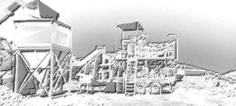
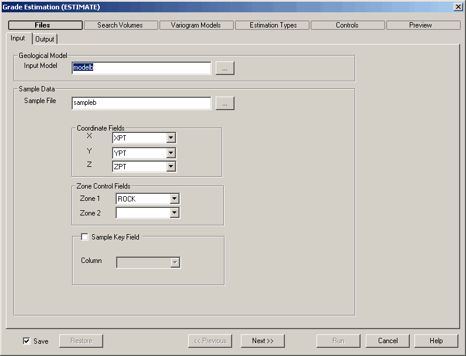

 |  Grade Estimation Interpolating sample grades into block models  
---|---  
  
#  

# Introduction to Grade Estimation Methods

This topic is part of the [Grade Estimation](<Grade%20Estimate%20Overview.md>) range of topics.

The information contained in the following topics concentrates on the different methods of interpolating grades into the model cells using methods such as [Inverse Power of Distance](<Grade%20Estimation%20Inverse%20Power%20of%20Distance.md>) and [Kriging](<Grade%20Estimation%20Kriging.md>).

There are four commands that deal specifically with grade estimation into a block model. All four commands use the same application code but have different interfaces and provide different sets of functions.

  * GRADE: this is the simplest command and has the least number of options. It is restricted to Nearest Neighbor (NN), Inverse Power of Distance (IPD) and Ordinary Kriging (OK) using a 1 or 2 structure spherical model variogram model. Only one grade can be estimated at a time.[  
GRADE command Help...](<../Process_Full_Descriptions/grade-d.md>)

  * ESTIMA: a multi-featured command allowing all options except Indicator Estimation. Multiple grades can be estimated using multi-structure variogram models of different types. The interface is the standard files, fields, parameters dialog.[  
ESTIMA command Help...](<../Process_Full_Descriptions/estima-d.md>)

  * INDEST: this is similar to ESTIMA except that it only offers Indicator Estimation. It uses the standard files, fields, parameters dialog.[  
INDEST Command Help...](<../Process_Full_Descriptions/indest-d.md>)

  * ESTIMATE: 

  
---  
[Enlarge this image...](<../Images/Estimate.gif>)  

offers all the functionality of ESTIMA and INDEST (excluding unfolding) plus more through a tailored dialog. It includes the ability to save and restore search volume, estimation type and variogram model information through the use of parameter files.[  
ESTIMATE Dialog Help...](<EstimateDialog.md>)

All four commands are available through the Models | Interpolation Processes menu or can be run by typing the name in the Command window.

  * GRADE: Basic Grade Interpolation

  * ESTIMA: Interpolate Grades into Model

  * ESTIMATE: Interpolate Grades from Menu

  * INDEST: Indicator Estimation

Overview of Estimation Method

All four commands require an input model to define the cell structure and an input sample file to define the sample grades to be used for making the estimates. They then create an output model where the estimated grade is a field in the model file.

## Input Model

All the estimation methods require an input prototype block model into which the sample grades are interpolated.

The usual situation is that the prototype model already contains cells and subcells defining the geology, so that values will be interpolated into the existing cell structure. If the prototype model is empty, however, then cells and subcells will be created if there are sufficient samples within the search volume.

A prototype model containing cells and sub-cells may also contain one or two classification fields e.g. rocktype, lithology, weathering profile, fault block zone. If the same classification field(s) also exist in the input sample file then zone control can be selected. This means, for example, that only samples that are rocktype A would be used to estimate cells that are rocktype A.

Output Model

If the input model contains cells and sub-cells then the output model will contain the same set of cells and sub-cells. It will also include additional fields corresponding to the grades that were estimated.

Input Samples

The input sample file must contain the three coordinate fields X, Y and Z and at least one grade field. This will often be a desurveyed drillhole file which may also contain classification fields if zone control is to be selected.

Search Volume Parameters

A Search Volume is a 3D shape containing the samples to be used for the grade estimation and is centered on the cell being estimated. The volume may be either a 3D ellipsoid or a cuboid.

All methods require a search volume. For GRADE, a single search volume is defined in the parameters tab, whereas the other commands (ESTIMA, ESTIMATE, INDEST) allow multiple search volumes which are stored in a Search Volume Parameter file. The ESTIMATE command provides specific dialogs to facilitate the definition, import and export of search volumes. Multiple search volumes allow different grades to be estimated with different search volumes.

Variogram Model Parameters

If [kriging](<Grade%20Estimation%20Kriging.md>) is selected as one of the estimation methods then a variogram model must be defined. As for search volumes, GRADE allows a single model to be defined through the parameters tab, whereas ESTIMATE provides specific dialogs for definition and import and export to and from the Variogram Model Parameter file. Variograms are calculated using the [VGRAM](<../Process_Full_Descriptions/vgram-d.md>) command, and models fitted using [VARFIT](<../Process_Full_Descriptions/varfit-d.md>).

Estimation Type Parameters

It is necessary to provide a set of estimation parameters for each grade to be estimated. For GRADE with a single estimate these parameters are defined on the parameters tab. For the other processes the parameters may be imported as an Estimation Parameter file. ESTIMATE provides dialogs to define and save these parameters. The parameters include items such as the estimation method, the search volume reference number and estimation-method-specific data like the power, if the Inverse Power of Distance method has been selected.

[Proceed to the next section](<Grade%20Estimation%20Search%20Volume%20Introduction.md>) (Search Volume Introduction)

 |  Related Topics  
---|---  
|  [Grade Estimation Search Volume Introduction](<Grade%20Estimation%20Search%20Volume%20Introduction.md>)[  
Grade Estimation Dynamic Search Volumes](<Grade%20Estimation%20Dynamic%20Search%20Volumes.md>)[  
Grade Estimation Octants](<Grade%20Estimation%20Octants.md>)[  
Grade Estimation Key Fields](<Grade%20Estimation%20Key%20Fields.md>)[  
Grade Estimation Search Volume Parameter File](<Grade%20Estimation%20Search%20Volume%20Parameter%20File.md>)[  
Grade Estimation Cell Discretisation](<Grade%20Estimation%20Cell%20Discretisation.md>)[  
Grade Estimation Methods](<Grade%20Estimation%20Methods.md>)[  
Grade Estimation Parameter File](<Grade%20Estimation%20Parameter%20File.md>)[  
Grade Estimation Additional Features  
Grade Estimation Variograms  
Grade Estimation Run Time Optimization  
Grade Estimation Rotated Models  
Grade Estimation Output and Results  
Grade Estimation Parameter Summary  
Grade Estimation System Limits](<Grade%20Estimation%20Additional%20Features.md>)[  
Grade Estimation References  
  
ESTIMA command Help   
ESTIMATE command Help  
The Estimate dialog  
VARFIT Command Help](<Grade%20Estimation%20References.md>)