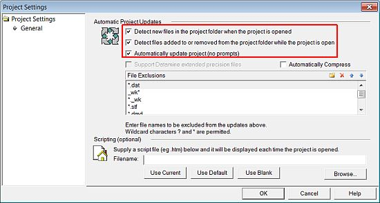

 |  Creating a new Grade Estimation Project Creating a new project file for the grade estimation tutorial.  
---|---  
  
# Overview

The sections below introduce you to the creation and saving of a project.

## Prerequisites

  * Check that you have the Datamine tutorial data folders. These are located (with a standard installation) under C:\Database\DMTutorials. This path should exist and contain two sub-folders; Data and Projects. The contents of the Data folder will be accessed throughout the tutorial, and any files you create will be stored in the Projects area.  
  
If you cannot locate these folders, please contact your Datamine Support Consultant.

## Exercise: Creating and Saving a New Project

In this lesson, you are going to crate a new Studio project file "GradeEst", in a new folder C:\Database\MyTutorials\GradeEst, add the relevant data files and then save the project. This includes the following tasks:

  * Creating a tutorial folder and copying in files

  * Creating a new project

  * Checking and saving the project.

## Creating a Tutorial Folder and Copying In Files

  1. In Windows Explorer create the folder C:\Database\MyTutorials\GradeEst.

  2. Browse to and open the folder C:\Database\DMTutorials\Data\VBOP\Datamine.

  3. Copy these 21 files:

     * _2dblks.dm

     * _2delp1pt.dm

     * _2delp1tr.dm

     * _2depar1.dm

     * _2depar2.dm

     * _2depar3.dm

     * _2depar4.dm

     * _2dgmod1.dm

     * _2dgmod2.dm

     * _2dgmod3.dm

     * _2dgmod4.dm

     * _2dpmod1.dm

     * _2dpres1.dm

     * _2dres1.dm

     * _2dspar1.dm

     * _2dvpar1.dm

     * _2dvpar2.dm

     * _2dxvs1.dm

     * _2dzmod1.dm

     * _ostopo.dm

     * _srfsamp.dm

  4. Paste the files into your new tutorial folder C:\Database\MyTutorials\GradeEst.

  5. Browse to and open the folder C:\Database\DMTutorials\Data\VBUG\Datamine.

  6. Select the following 21 files, click Open:

     * _3depar1.dm

     * _3dspar1.dm

     * _caf5so.dm

     * _geres2.dm

     * _geres3.dm

     * _geres4.dm

     * _qqouAU.dm

     * _qqplAU.dm

     * _ubm5cat.dm

     * _ubm5g.dm

     * _ubm5z.dm

     * _ubmlim.dm

     * _ubmm.dm

     * _ubmz.dm

     * _udhz.dm

     * _udhz5c.dm

     * _uepe.dm

     * _ueps.dm

     * _uepv.dm

     * _uorept.dm

     * _uoretr.dm

  7. Paste the files into your new tutorial folder C:\Database\MyTutorials\GradeEst.

  8. Important: using Windows Explorer, make sure all files in your Tutorial Project folder are read/write (not read-only).

  9. Minimize or close the Explorer Window.

## Creating a New Project

  1. Ensure your application is running.

  2. Using theProjectbutton, clickNew Projectto launch theProject Wizard.

  3. If the Studio Project Wizard (Welcome ...) dialog is displayed, click Next.

 |  The welcome screen is not displayed if the 'Skip this page in future' option was selected the last time a new project was created.  
---|---  
  4. In the Studio Project Wizard (Project Properties) dialog, define the project Name as 'GradeEst', browse for the Location 'C:\Database\MyTutorials\GradeEst', select the Automatically add files... option, click Project Settings...: 

  5. In the Project Settings dialog, Automatic Project Updates group, set the options as shown below, click OK:  
  
  

  6. Back in the Studio Project Wizard (Project Properties) dialog, click Next.

  7. In the Studio Project Wizard (Project Files) dialog, check that 42 files have been added automatically, click Next.

  8. In the Studio Project Wizard (Your project is ready to create) dialog, click Finish.

## Checking and Saving the Project

  1. In the Project Files control bar, check that all of the files, selected in the previous sections, have been added to the project and that they are listed in one or more of the various data folders.

  2. With the Files window displayed, select different folders in the Project Files control bar and view their details in the Files window.  

 |  Take general note of which files are listed in each folder and that:
     * all added files (36), irrespective of file type, are listed in the All Files folder
     * all Datamine (*.dm) files are listed in the All Tables folder.  
---|---  
  3. Repeat step 2 for individual files.

  4. .Select the Save Project button on the Quick Access bar