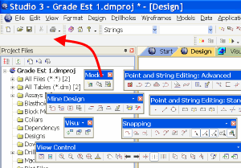
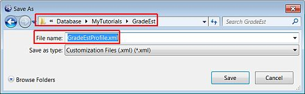

# Displaying Grade Estimation Toolbars

 |  Displaying Grade Estimation Toolbars Displaying and customizing toolbars used in the grade estimation process.  
---|---  
  
# Overview

In this portion of the tutorial you are going to display and customize the Design window toolbars that are typically used in the mine design process.

## Prerequisites

  * Created a new project and added all the required tutorial files i.e. the exercises on the [Creating a New Grade Estimation Project](<Creating_a_New_Grade_Estimation_Project.md>) page

## Links to exercises

The following exercises are available on this page:

  * Displaying Grade Estimation Toolbars

  * Customizing a Toolbar

  * Saving the Toolbar Settings to a Profile

## Exercise: Displaying Grade Estimation Toolbars

In this exercise you are going to display and dock the toolbars required for completing the exercises in this tutorial.

## Displaying the Toolbars

  1. Select the Design window tab.

  2. Select View |Customization |Toolbars | Mine Design.

  3. Select View |Customization |Toolbars | Modeling.

  4. Select View |Customization |Toolbars | Point and String Editing: Standard.

  5. Select View |Customization |Toolbars | Point and String Editing: Advanced.

  6. Select View |Customization |Toolbars | Snapping.

  7. Select View |Customization |Toolbars | View Control.

## Docking the Floating Toolbars

  1. Drag-and-drop (selecting the toolbar inside the title bar) the floating Modeling toolbar into the grey area below the Menu Bar, as shown in the image below:  
  

  2. Repeat the above step for the remaining, floating toolbars.

 |  Toolbars can be floated inside the main window, docked in the header area or docked against the bottom or sides of the main window.  
---|---  
  
****Top of page

## Exercise: Customizing a Toolbar

In this exercise you are going to add the Query Line, Query String and Gradient Convention buttons to the Mine Design toolbar.

## Adding Buttons to the Toolbar

  1. Select the Design window tab.

  2. In the Modeling toolbar, click More Buttons, select Add or Remove Buttons | Customize....

  3. In the Customize dialog, Commands tab, Categories list, select [Models].

  4. In the Commands list, drag-and-drop [Interpolate Grades from Menu] into the right side of the Modeling toolbar.

  5. In the Commands list, drag-and-drop [Create Wireframe Ellipse] into the right side of the Modeling toolbar.

  6. In the Customize dialog, click Close.

  7. The toolbar should now contain the extra button as shown in the image below:  
  
  

 |  The button image and text can be customized, e.g. shortened, using the Button Appearance dialog. This dialog is accessed by right-clicking a toolbar button, when the Customize dialog is displayed, and selecting Button Appearance....  
---|---  

****Top of page

**Saving the Toolbar Settings to a Profile**

  1. Select View | Customization | Customization State | Save....

  2. In the Save As dialog, select your project folder and define the File name 'GradeEstProfile.xml', click Save:  
  
  

 | 
     * Each time Studio is exited, the currently displayed toolbars, menu and control bars are saved to the default Customization File profile.xml, which is located under C:\Users\\[Username]\AppData\Roaming\Datamine\Studio (Windows 7).
     * A custom profile can be loaded from a saved Customization File using View | Customization | Customization State | Load...  
---|---  

****[Top of page](<file:///D:/Database/Studio 3 Tutorials/Geological Modeling Tutorial/Studio_3_Geological_Modeling_Tutorial/Displaying_the_Toolbars.md#TOP>)

Document History |   
---|---  
Date |  Description  
2007 | 

  * Created

  
201205 | 

  * Updated to reflect MR 21 functionality
  * Added 'Saving the toolbar settings to a Profile' exercise.