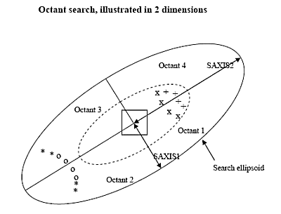

 |  Grade Estimation - Octants Using octants to handle clustered data  
---|---  
  
# Using Octant Calculations

This topic is part of the [Grade Estimation](<Grade%20Estimate%20Overview.md>) range of topics.

Generally samples are not evenly distributed around the cell being estimated, but are clustered together. Using the search volume shrinking method described previously, this may lead to samples in one area having an undue influence on the grade of the cell. This problem is avoided by dividing the search volume into octants and ensuring that a minimum number of octants have samples in them.

By defining three planes parallel to the axes of the search ellipsoid eight octants are created. These planes intersect at the ellipsoid origin, which is also the centre of the cell being estimated, e.g.:

The previous diagram illustrates the octant method. The search ellipsoid contains sixteen samples annotated by O, *, X, and +, and for the purpose of this example all sixteen samples lie above the XY plane. If MAXNUM1 were sixteen or greater, then all sixteen samples would be selected. However if MAXNUM1 is set to eight, then the eight samples annotated X and + will be selected. The estimated grade of the cell would obviously then be biased towards the samples in the North-East of the search volume.

If octant search were applied with the maximum number of samples per octant set to 2, then the two samples in each octant, which are nearest to the cell centre, would be selected. These samples are annotated O and X. This would definitely be preferable to selecting all eight samples from the North-East area.

Octants 1 to 4 lie above the XY plane as illustrated in the diagram, with octant 1 lying in the North-East top octant. Octants 5 to 8 lie below the XY plane, underneath octants 1 to 4 respectively.

There are four values controlling the octant search, defined by fields in the Search Volume Parameter file. If there are sufficient samples in an octant, it is considered 'filled'. If sufficient octants are 'filled' then the cell is estimated:

Process |  Description  
---|---  
OCTMETH |  The octant definition method: 0 = do not use octant search 1 = use octant search  
MINOCT |  the minimum number of octants to be filled before a cell will be estimated.  
MINPEROC |  the minimum number of samples in an octant before it is considered to be filled.  
MAXPEROC |  the maximum number of samples in an octant, to be used for estimation. If there are more than MAXPEROC samples in an octant, then the samples nearest to the cell centre are selected, using the transformed distance of the shrinking ellipsoid method.  
  
MINNUMn and MAXNUMn still apply even if octant search is selected. If the total number of samples is less than MINNUMn then the cell will not be estimated. If the total number of samples is greater than MAXNUMn then the furthest sample (transformed distance) is removed until MAXNUMn is reached. However if removing the sample would cause the number of samples in the octant to be less than MINPEROC then that sample is NOT removed. The next furthest away is used instead. It may be impossible to satisfy both MAXNUMn and the octant constraints; in this case the cell will not be estimated.

[Proceed to the next section](<Grade%20Estimation%20Key%20Fields.md>) (Key fields)

|  Related Topics  
---|---  
| [Introducing the Grade Estimation User Guide](<Grade%20Estimate%20Overview.md>)[  
Grade Estimation Search Volume Introduction](<Grade%20Estimation%20Search%20Volume%20Introduction.md>)[  
Grade Estimation Dynamic Search Volumes](<Grade%20Estimation%20Dynamic%20Search%20Volumes.md>)[  
Grade Estimation Key Fields](<Grade%20Estimation%20Key%20Fields.md>)[  
Grade Estimation Search Volume Parameter File](<Grade%20Estimation%20Search%20Volume%20Parameter%20File.md>)[  
Grade Estimation Cell Discretisation](<Grade%20Estimation%20Cell%20Discretisation.md>)[  
Grade Estimation Methods](<Grade%20Estimation%20Methods.md>)[  
Grade Estimation Parameter File](<Grade%20Estimation%20Parameter%20File.md>)[  
Grade Estimation Additional Features  
Grade Estimation Variograms  
Grade Estimation Run Time Optimization  
Grade Estimation Rotated Models  
Grade Estimation Output and Results  
Grade Estimation Parameter Summary  
Grade Estimation System Limits](<Grade%20Estimation%20Additional%20Features.md>)[  
Grade Estimation References  
  
ESTIMA command Help   
ESTIMATE command Help  
The Estimate dialog  
VARFIT Command Help](<Grade%20Estimation%20References.md>)