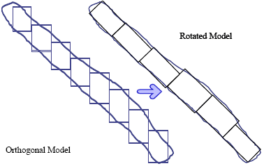
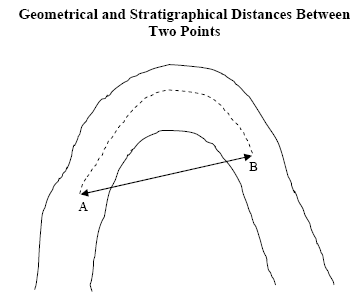

 |  Grade Estimation - Rotated Models How model rotation affects the grade estimation process.  
---|---  
  
# Rotated Models

This topic is part of the [Grade Estimation](<Grade%20Estimate%20Overview.md>) range of topics.

A Rotated Model is one whose axes, and therefore cells, are rotated with respect to the coordinate system. It is particularly useful in the situation where a stratified orebody is dipping and/or plunging. As can be seen from the diagram below the model cells provide a much better fit when the model is rotated. A detailed description is given in the Rotated Block Models User Guide.

Fig 1. The Rotated Model Concept

ESTIMA will automatically recognize if the Input Prototype Model is a rotated model. If it is then ESTIMA will inversely translate and rotate the model cell coordinates back into the world system before calculating the grade estimates. It does this by rotating the actual [discretised](<Grade%20Estimation%20Cell%20Discretisation.md>) points immediately prior to estimation. This is an internal operation only - the coordinates of the cells in the Output Model file will be rotated; i.e. they will be the same as the Input Prototype Model.

Because the process rotates the model cells internally, this means that it is necessary to supply all search volumes, anisotropy parameters, [variogram](<Grade%20Estimation%20Variograms.md>) models, coordinates of the Sample Data, etc. in the world coordinate system. In summary, a rotated model must be supplied as the Input Prototype Model. There are no other files, fields or parameters which need to be set.

## Unfolding

The estimation methods of [Nearest Neighbor](<Grade%20Estimation%20Nearest%20Neighbour.md>), [Inverse Power of Distance](<Grade%20Estimation%20Inverse%20Power%20of%20Distance.md>) and [Kriging](<Grade%20Estimation%20Kriging.md>) all involve calculating the distance between each sample and either the centre of the cell or the discretisation points. These measurements are usually made in the standard Cartesian XYZ coordinate system.

However, for a folded deposit, where mineralization has occurred pre-folding, a line measured in the pre-folded orebody is required.

The problem is illustrated by the simple example above, which shows two samples either side of an anticline. Using the XYZ coordinate system, the standard geometrical distance between A and B is a straight line. However, from a geological point of view the distance separating them is a line following the anticline structure, shown as a broken line in the diagram. This is the distance between samples prior to folding.

The unfolding method allows the sample coordinates and model cells to be transformed into the original unfolded system, grade estimation is carried out in the unfolded system, and then converted back to the folded system for reserve evaluation and planning. The method is described in detail in the Unfold User Guide (available on request). There is also a description in a paper by Dr. M.J.Newton, referenced in [Grade Estimation References](<Grade%20Estimation%20References.md>).

The UNFOLD process must be used prior to grade estimation to calculate the unfolded coordinates of sample data. This file should then be input to ESTIMA as the Sample Data file. All search volumes, anisotropy parameters, variogram models, etc must be specified in the unfolded system. The only exception to this is the Input Prototype Model, which is in the world (i.e. folded) coordinate system. The way ESTIMA works is to unfold the discretisation points so that the estimation is carried out in the unfolded system. The estimated grade and any secondary variables are then assigned back to the corresponding cell in the folded model. The unfolding option is selected by specifying the optional String file. This must contain the string data describing the hangingwall and footwall outlines on two or more sections. It is also necessary to specify the unfolding parameters and fields, as described in the Unfold Reference Manual.

 | Unfolding is not allowed for a rotated model. If this combination is selected then the process will terminate with an error message.  
---|---  
  
[Proceed to the next section](<Grade%20Estimation%20Output%20and%20Results.md>) (System limits)

 |  Related Topics  
---|---  
|  [Introducing the Grade Estimation User Guide](<Grade%20Estimate%20Overview.md>)[  
Grade Estimation Search Volume Introduction](<Grade%20Estimation%20Search%20Volume%20Introduction.md>)[  
Grade Estimation Dynamic Search Volumes](<Grade%20Estimation%20Dynamic%20Search%20Volumes.md>)[  
Grade Estimation Octants](<Grade%20Estimation%20Octants.md>)[  
Grade Estimation Key Fields](<Grade%20Estimation%20Key%20Fields.md>)[  
Grade Estimation Search Volume Parameter File](<Grade%20Estimation%20Search%20Volume%20Parameter%20File.md>)[  
Grade Estimation Cell Discretisation](<Grade%20Estimation%20Cell%20Discretisation.md>)[  
Grade Estimation Methods](<Grade%20Estimation%20Methods.md>)[  
Grade Estimation Parameter File](<Grade%20Estimation%20Parameter%20File.md>)[  
Grade Estimation Additional Features  
Grade Estimation Variograms  
Grade Estimation Run Time Optimization  
Grade Estimation Output and Results  
Grade Estimation Parameter Summary  
Grade Estimation System Limits](<Grade%20Estimation%20Additional%20Features.md>)[  
Grade Estimation References  
  
ESTIMA command Help   
ESTIMATE command Help  
The Estimate dialog  
VARFIT Command Help](<Grade%20Estimation%20References.md>)