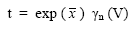
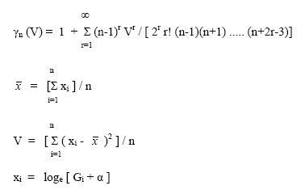

 |  Grade Estimation - Sichel's T Estimator More details on Sichel's T Estimator method  
---|---  
  
# Sichel's T Estimator

This topic is part of the [Grade Estimation](<Grade%20Estimate%20Overview.md>) range of topics.

For overview information on all grade estimation methods in general, see [Grade Estimation Methods](<Grade%20Estimation%20Methods.md>).

## IMETHOD = 5

Sichel's T Estimator can be used to estimate the grade of a cell when the statistical distribution of the samples is lognormal. Unlike [IPD](<Grade%20Estimation%20Inverse%20Power%20of%20Distance.md>) and [kriging](<Grade%20Estimation%20Kriging.md>) it does not take account of the distance of the sample from the cell. Therefore, it is most suitable for estimating large cells each of which contain several samples, and where the search volume is approximately the same size as the cell.

In summary the t estimator is defined as:

where:

  * Gi is the grade of sample i

  * α is a constant such that [Gi+α] is lognormally distributed

If the distribution of the samples follows a 3 parameter lognormal distribution, then you should specify the additive constant α using field ADDCON in the Estimation Parameter file. This is the same field as used by IPD, but it has a totally different meaning in this context. The secondary fields NUMSAM_F, SVOL_F, VAR_F and MINDIS_F are defined in an identical manner to the Inverse Power of Distance method.

[Proceed to the next section](<Grade%20Estimation%20Parameter%20Summary.md>) (Estimation Parameter File summary)

 |  Related Topics  
---|---  
|  [Introducing the Grade Estimation User Guide](<Grade%20Estimate%20Overview.md>)[  
Grade Estimation Search Volume Introduction](<Grade%20Estimation%20Search%20Volume%20Introduction.md>)[  
Grade Estimation Dynamic Search Volumes](<Grade%20Estimation%20Dynamic%20Search%20Volumes.md>)[  
Grade Estimation Octants](<Grade%20Estimation%20Octants.md>)[  
Grade Estimation Key Fields](<Grade%20Estimation%20Key%20Fields.md>)[  
Grade Estimation Search Volume Parameter File](<Grade%20Estimation%20Search%20Volume%20Parameter%20File.md>)[  
Grade Estimation Cell Discretisation](<Grade%20Estimation%20Cell%20Discretisation.md>)[  
Grade Estimation Methods](<Grade%20Estimation%20Methods.md>)[  
Grade Estimation Parameter File](<Grade%20Estimation%20Parameter%20File.md>)[  
Grade Estimation Additional Features  
Grade Estimation Variograms  
Grade Estimation Run Time Optimization  
Grade Estimation Rotated Models  
Grade Estimation Output and Results  
Grade Estimation Parameter Summary  
Grade Estimation System Limits](<Grade%20Estimation%20Additional%20Features.md>)[  
Grade Estimation References  
  
ESTIMA command Help   
ESTIMATE command Help  
The Estimate dialog  
VARFIT Command Help](<Grade%20Estimation%20References.md>)