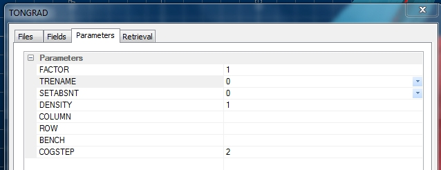

 |  Grade-Tonnage Reports Creating a cut-off grades results table using the process TONGRAD.`  
---|---  
  
# Overview

In this portion of the tutorial you are going to use the process TONGRAD to evaluate a block model and generate a cut-off grades results table.

## Prerequisites

  * Created a new project and added all the required tutorial files - exercises on the [Creating a New Grade Estimation Project](<Creating_a_New_Grade_Estimation_Project.md>) page.

  * Displayed toolbars and defined project settings - exercises in the [Displaying Grade Estimation Toolbars](<Display_Grade_estimate_Toolbars.md>) and [Defining Settings](<Defining_Settings.md>) pages.

  * Created and applied an evaluation legend - exercises on the [Creating an Evaluation Legend](<Creating_an_Evaluation_Legend1.md#Exercise1>) page.

  * Defined evaluation settings - exercise on the [Defining Evaluation Settings](<Defining_Evaluation_Settings1.md#Exercise1>) page.

  * [Files](<tutorial_files.md>) required for the exercises on this page:

  *     * _ubm5g

## Exercise: Creating a Grade-Tonnage Report using TONGRAD

In this exercise you are going to use the grade block model _ubm5g and the process TONGRAD to generate a cut-off grades results table. The tonnes and average grades will be saved to the results file geres4 and calculated for 10 cut-off intervals, each 2 g/t in size.

 |  What is a Tonnage Grade Report?

  * A table containing tonnes and average grades that have been calculated above a series of cut-off grades (typically for equally sized grade intervals)
  * This cut-off grades results table can be used to directly generate a grade-tonnage curve i.e. typically a combined plot of Tonnage (Y axis 1) vs Cut-off Grade and Average Grade Above Cutoff (Y axis 2) vs Cut-off Grade

  
---|---  
  
 |  UseTONGRADfor evaluating when generating:

  * an evaluation for a specific cut-off grade(s)
  * generating Grade-Tonnage tables or charts.

  
---|---  
  
## Evaluating the Block Model

  1. In the Command toolbar, click Find Command.

  2. In the Find Command dialog, drag the vertical slider bar down to the very bottom and then page up by clicking in the space above the slider bar (x1).

  3. In the Name column, select the command tongrad , click Run:  
  
  
  
(TONGRAD is also available from the Report ribbon | Report | Model Reserves \- a quicker route for next time!)

  4. In the TONGRAD dialog, Files tab, Input files group, set IN* by browsing for and selecting the file _ubm5g.

  5. In the Output files group, define a new OUT* file 'geres4'.  
  
  

 |  The optional CSVOUT output file is a Comma Separated Variable (CSV) file, suitable for input to a spreadsheet. The extension .CSV is added automatically. This system file is automatically saved to the project folder.   
---|---  
  6. In the Fields tab, select the DENSITY field [DENSITY].

  7. Select : the F1 field [AU], the F2 field [CU], the F3 field [AG] and the F4 field [CO]  
  

  8. In the Parameters tab, define COGSTEP as '2' , click OK:  
  
  

 |  The COGSTEP cut-off grade step parameter applies to the selected F1 field, in this case AU.  
---|---  
  9. Select the Command control bar, check that TONGRAD has run to completion and that the output file contains 7 records, as shown below:  
  
  

##  Checking the Results Table

  1. Select the Project Files control bar, Results folder.

  2. Right-click on geres4 , select Open.

  3. In the Datamine Table Editor dialog, check that your results are as shown below:  
  
  

 |  The results shown above are for a Full Cell evaluation. TONGRAD does not have a Partial Cell evaluation option. Differences in the evaluation results from the different methods i.e. using Wireframes, Strings and processes, are to be expected.  
---|---  
  4. In the Datamine Table Editor dialog, select File | Exit.

 |  The process SMUHIS can also be used to generate cut-off grade results tables. It includes the ability to generate results for different SMU sizes. The input to this process is typically a grade block model and a variogram model file.  
---|---  
  
****Top of page