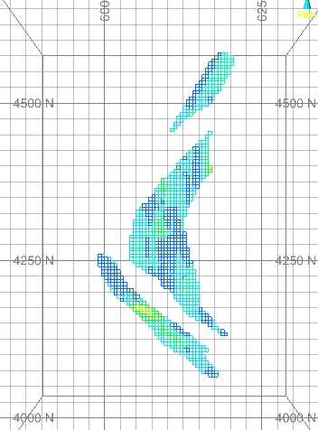
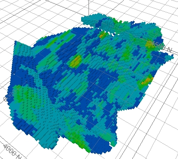

 |  Creating an Evaluation Legend Creating a legend to be used in evaluating a block model.  
---|---  
  
# Overview

In this portion of the tutorial you are going to create a legend for the grade and tonnage evaluation of block models (or drillholes). It is recommended that you complete the exercises in the order shown below. The results of these exercises will be used later in the tutorial.

## Prerequisites

  * Created a new project and added all the required tutorial files - exercises on the [Creating a New Grade Estimation Project](<Creating_a_New_Grade_Estimation_Project.md>) page.

  * Displayed toolbars and defined project settings - exercises in the [Displaying Grade Estimation Toolbars](<Display_Grade_estimate_Toolbars.md>) and [Defining Settings](<Defining_Settings.md>) pages.

  * [Files](<tutorial_files.md>) required for the exercises on this page:

  *     * _ubm5g

## Links to exercises

The following exercises are available on this page:

  * Creating an Evaluation Legend

  * Applying a Legend

## Exercise: Creating an Evaluation Legend

In this exercise you are going to create a new interval legend named Au Evaluation, using the following parameters:

  * block model: _ubm5g.

  * Gold grade field: AU [g/t]

  * Legend details: 20 intervals, each 0.25% in size; linear; colored using the standard rainbow color palette.

## Loading the Block Model

  1. Unload any data that may already be loaded from previous exercises.

  2. Select the Project Files control bar.

  3. Drag-and-drop the following Block Models file (if not already loaded) into the 3D window:

     * _ubm5g

  4. In the Sheets control bar, Design-Overlays folder, select only the following check boxes (i.e. display these objects) :

     * _ubm5g (block model)

  5. Use theViewribbon to selectZoom Fit | Zoom Plan   
  

 |  The block model is currently colored on the ZONE field, using the automatically generated project file legend Datamine: ZONE (_ubm5g (block model)).  
---|---  
  
##    
Creating the Legend

  1. Activate theFormatribbon and selectOverlays | Format Legends

  2. In the Legends Manager dialog, click New Legend...

  3. In the Legend Wizard: Data Table Column dialog, select the Use Explicit Ranges option, click Next.

  4. In the Legend Wizard: Legend Storage dialog, select the Current Project File option, click Next.

  5. In the Legend Wizard: General dialog, define the legend Name as 'Au Evaluation', select the Type [Numeric], select the Ranges option, click Next.

  6. In the Legend Wizard: Data Range dialog, define the legend's Number of Items as '9', the Minimum Value as '0', the Maximum Value as '18', click Next.

  7. In the Legend Wizard: Legend Distribution dialog, select the Distribution Type [Linear], select the Equal Widths option, click Next.

  8. In the Legend Wizard: Coloring dialog, select the Color Type Range [Rainbow blue-red], select the Anti Clockwise transition option, click Preview Legend....

  9. In the Legend dialog, check that your legend appears as shown below:  
  
  

  10. Close the preview window and ,back in the Legend Wizard: Coloring dialog click Finish.

  11. Back in the Legends Manager dialog, check that the new Au Evaluation legend has been added to the list of project file legends, click Close.

 |  Any legend with suitable categories i.e. unique values or ranges, can be used as an evaluation legend.  
---|---  
  
****Top of page

## Exercise: Applying a Legend

In this exercise you are going to format the _ubm5g (block model) overlay in the Design window by coloring the block model slice using the newly created Au Evaluation legend.

 |  This exercise follows on directly from the previous exercise i.e. Creating an Evaluation Legend, and assumes that it has already been completed.  
---|---  
  
## Applying the Legend

  1. In the Sheets control bar, 3D folder, double-click _ubm5g(block model).

  2. In the Block Model Properties dialog, select [AU] for Column and expand the Legend drop-down list to select [AU Evaluation].

  3. Select the Intersection display type, disable the Show Fill check box and enable the Show Edges check box. Click OK

  4. Set the 3D window background window to White by right-clicking an empty area of screen, and enable the display of the Default Grid.

  5. Check that your data appears as follows  
  
  

  6. Use the Block Model Properties dialog to display the model as Blocks \- enable Show Fill and disable Show Edges.

  7. In the 3D window, rotate and zoom the view, check that the block model is colored according to the legend categories shown below:  
  
  

  8. Identify the low, medium and high grade areas of the block model.

****Top of page