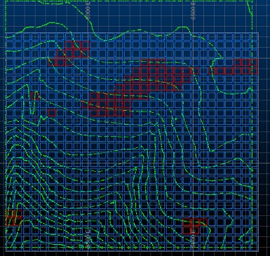
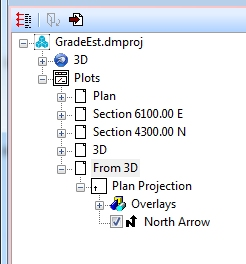
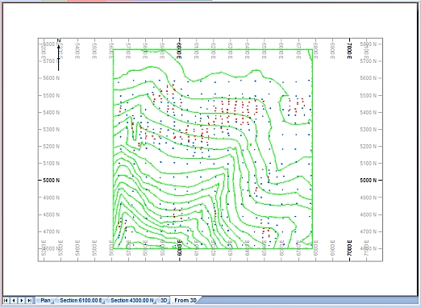
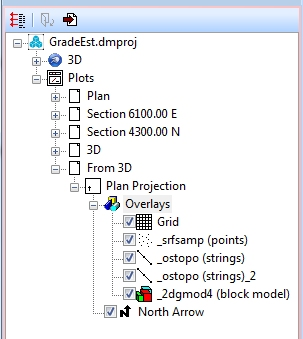

 |  Creating Plot Sheets Creating and formatting a plan plot sheet.  
---|---  
  
# Overview

In this portion of the tutorial you are going to be introduced to the general procedures and tools, used in the Plots window, to create and enhance a basic plot sheet. It is suggested that all four of the exercises on this page are completed in the order shown below.

## Prerequisites

  * Created a new project and added all the required tutorial files - exercises on the [Creating a New Grade Estimation Project](<Creating_a_New_Grade_Estimation_Project.md>) page.

  * Displayed toolbars and defined project settings - exercises in the [Displaying Grade Estimation Toolbars](<Display_Grade_estimate_Toolbars.md>) and [Defining Settings](<Defining_Settings.md>) pages.

  * [Files](<tutorial_files.md>) required for the exercises on this page:

  *     * _srfsamp

    * _ostopo

    * _2dgmod4

    * _2dres1

## Links to exercises

The following exercises are available on this page:

  * Creating a new Plot Sheet

  * Setting View, Page Orientation and Scale options

  * Formatting the Overlays

  * Inserting Plot Items

## Exercise: Creating a new Plot Sheet

In this exercise you are going to create a new plan view plot sheet in the Plots window and display the following data:

  * _srfsamp \- surface sampling point data

  * _ostopo \- topography contours

  * _2dgmod4 \- 2D block model

  * _2dres1 \- evaluation results table.

## Loading the Existing Data

  1. Unload any data that may be loaded from previous exercises.

  2. Select the Project Files control bar.

  3. Drag-and-drop the following files into the 3D window:  
  

     * _2dgmod4

     * _2dres1

     * _ostopo

     * _srfsamp

  4. In the Sheets control bar, 3D folder, select only the following check boxes (i.e. display these objects) :

     * Default grid

     * _srfsamp (points)

     * _ostopo (strings)

     * _2dgmod4 (block model)

  5. Use the Sheets control bar to double-click the loaded block model (_2dgmod4).

  6. Display the block model as an Intersection, disable the Show Fill check box and enable the Show Edges check box.

  7. Set the Exaggeration to 80% and click OK.

  8. Double-click the Default Section item and set the Section Ref Point for Z to '280' and click OK.

  9. Click theZoom Fit | Zoom Plancommand on theViewribbon.

  10. In the 3D window, check that you have the following data displayed i.e. a horizontal slice through the block model at 280m elevation, sample points and topography contours.  
  
  
  
  

  11. Using the View ribbon, select the Plot View command.

## Creating a New Plot Sheet

  1. Check that the Plots folder contains the following sheets:  
  
  

  2. In the Plots window, check that the new From 3D sheet tab is selected and displayed:  
  
  

  3. In the Sheets control bar, Plots folder, expand the new Plan-Overlays folder and check that you have the following:  
  
  

****Top of page

## Exercise: Setting View, Page Orientation and Scale options

 |  This exercise follows on directly from the previous exercise and assumes that it has been completed.  
---|---  
  
In this exercise you are going to define the following options:

  * a horizontal view at 280m elevation without clipping

  * a portrait page layout

  * a plot scale of 1:10000.

## Setting View Parameters

  1. Using thePlot Viewribbon, clickSet

  2. In the View Settings dialog, Section Definition tab, Section Orientation group, select Horizontal.

  3. In the Mid-Point group, define the Z: elevation as '280', clear the Apply Clipping check box, click OK:  
  
  

  4. In the Plots window, new Plan sheet, check that your sheet is as shown below:  
  
  

## Defining a Portrait Page Orientation and Scale

  1. In the Sheets control bar, right-click on the From 3DPlan folder, select From 3DPlan Properties....

  2. In the From 3DPlan dialog, Page Size tab, Paper Size and Orientation group, select the Portrait option, click OK.

  3. In the 'Rescale all plot items?' confirmation dialog, click Yes.

  4. In the new Plan sheet tab, click inside the plan projection frame, so that it displays as dashed lines:  
  
  

 |  The above step ensures that the necessary toolbars are active.  
---|---  
  5. Again using thePlot Viewribbon, select [1:10000] from theScaledrop-down list

  6. Check that your sheet appears as shown below:  
  

****Top of page

## Exercise: Formatting the Overlays

 |  This exercise follows on directly from the previous exercise and assumes that it has been completed.  
---|---  
  
In the exercise you are going to format the overlays by:

  * coloring the block model with a new default Au legend

  * colouring the contour strings a fixed colour

  * labeling the contour strings with the elevation field _Z_COORD .

## Formatting the Grade Block Model

  1. In the Sheets control bar, From 3D-Overlays folder, double-click _2dgmod4 (block model).

  2. In the Format Display dialog, Overlay Format group, Color sub-tab, select the Legend option.

  3. Select the Column: [AU], click Use Default Legend.

  4. Click Apply (do not close the dialog).

  5. Check that the block model has been colored as shown below:  
  
  

## Formatting the Contour Strings

  1. In the Format Display dialog, Overlay Objects group, select the overlay _ostopo (strings).

  2. In the Overlay Format group, Color sub-tab, Color group, select the Fixed option and the Color [Black].

  3. Click Apply (do not close the dialog).

  4. In the Overlay Format group, Labelssub-tab, click Reset....

  5. In the Reset Labels dialog, Labels to include group, select _Z_Coord from the list (tick the box), click OK.

  6. In the Labels subtab, click Position....  
  
  

  7. In the Annotation Position dialog, Points to label group, select the Specific Points option, select Start Point.

  8. In the Rotation Angle group, select Fixed Angle and define the angle as '315' degrees.

  9. In the Position Offset group, define the Horizontal offset as '5' mm, define the Vertical offset as '-5' mm, click OK:  
  
  

  10. In the Labels sub-tab, select the Style sub-tab, click _Z_Coord:  
  
  

  11. In the Format for _Z_Coord dialog, Text tab, select Show Text.

  12. In the Style group, select Bold.

  13. In the Font Size group, clear the Use Defaults check box, select [7].

  14. In the Color group, select the Fixed Color option, select the color [Black], click OK.

  15. Back in the Format Display dialog, click Apply and OK.

  16. In the new Plan sheet, check that the contour strings have been colored and annotated as shown below:  
  

****Top of page

## Exercise: Inserting Plot Items

 |  This exercise follows on directly from the previous exercise and assumes that it has been completed.  
---|---  
  
In this exercise you are going to enhance the plot by inserting the following plot items:  
  

  * Title Box

  * Scale bar

  * Evaluation results table.

##  Inserting a Title Box

  1. Select the new From 3D Plots sheet tab.

  2. Activate theManageribbon and selectInsert | Plot Item | Title Box

  3. In the Title Box dialog, Contents tab, select Row [1], select Cell [1], click Contents....

  4. In the Cell Contents dialog, Category group, select the Static option.

  5. In the Value group, type 'Au(g/t) Grade Model - 40x40m blocks' in the text box, click OK.

  6. Back in the Title Box dialog, click Format....

  7. In the Cell Format dialog, Font group, clear the Use default font check box, click Modify....

  8. In the Font dialog, Font style: list, select Narrow Bold.

  9. In the Size: list, select 8, click OK.

  10. Back in the Cell Format dialog, click OK.

  11. Back in the Title Box dialog, click OK.

  12. In the plot sheet, select (click in the first row) and drag the Title Box to the top left of the contour data outline.

  13. Drag the North Arrow to the right of the Title Box.

  14. Double-click the North Arrow.

  15. In the North Arrow dialog, select Bold, click OK.

  16. Check that your plot is similar to that shown below:  
  
  

## Inserting a Scale Bar

  1. Activate theManageribbon and selectInsert | Plot Item | Scale Bar

  2. In the Scale Bar Properties dialog, select the Color [Black], click Font.

  3. In the Font dialog, define the Size as '6', click OK.

  4. Back in the Scale Bar Properties dialog, click Finish.

  5. Drag the Scale Bar to just right of the top right of the contour data boundary.

  6. Click outside the plot area and check that your plot is similar to that shown below:  
  
  

## Inserting a Results Table

  1. Activate theManageribbon and selectInsert | Plot Item | Table

  2. In the Table dialog, select _2dres1 (table) from the list, click OK.

  3. Click inside the first table row (four headed arrow) and drag the Table to below the contour data boundary.

  4. Increase the horizontal and vertical sizes of the Table by using the grabs.

  5. Right-click in the Table and select Table Properties....

  6. In the Table dialog, Contents tab, clear the Title Row check box.

  7. In the Headings group, click Format....

  8. In the Cell Format dialog, Font: group, clear the Use default font check box, click Modify....

  9. In the Font dialog, Font style: list, select Narrow Bold.

  10. Define the Size:as '6', click OK.

  11. Back in the Cell Format dialog, click Apply and OK.

  12. Back in the Table dialog, in the Columns group, use Delete and Up to order or remove all but the following columns:  

     * CATEGORY

     * DENSITY

     * VOLUME

     * TONNES

     * AU

     * CU

     * AG

     * CO

  13. In the Columns group, select the CATEGORY column from the list, click Format....

  14. In the Format for CATEGORY dialog, Text tab, Font Size group, clear the Use Defaults check box, select [5].

  15. In the Color group, select the Fixed Color option, select [Black].

  16. In the Number Format group, select the Decimal Placesoption, select [2], click OK.

  17. Repeat steps 13. to 16. for the remaining columns, the only exception, using the Integer format for the VOLUME and TONNES columns.

  18. Back in the Table dialog, Define Index tab, select the Column CATEGORY and move it across to the Index list.

  19. Click Apply and OK.

  20. In the plot sheet, press <Esc> to deselect the plot items, check that your plot sheet is similar to that shown below:  
  

  21. Use theProjecticon to save your projectSelectFile | Saveor, clickSaveon theStandardtoolbar.

****Top of page

Thank you for completing the Datamine Grade Estimation tutorial.

Hopefully it has given you some insight into the basic functionality available within your application for estimating/interpolating grades from a variety of input sources, data resolutions and data types, as well as displaying them.

The commands and functions covered in this tutorial barely scratch the surface of what can be achieved in full - some of the items not covered in this tutorial, but readily available in your software are:

  * A wide range of estimation methods

  * Uniform conditioning of panel models, and additional localized uniform conditioning

  * Preparing initial model information directly from drillhole data

  * Dynamic evaluation routines where results update in real-time as the evaluation limits are adjusted

  * Conditional simulation options

  * Cell and model confidence functions

  * Reporting with single and multivariate histograms

  * Transformations between gaussian distributions

  * Dynamic anisotropy options

If any of the above items are of interest to you - don't hesitate to contact your local Datamine office for more information about Grade Estimation training courses in your area