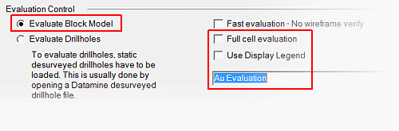

 |  Defining Evaluation Settings Defining tonnage grade evaluation settings.  
---|---  
  
# Overview

In this portion of the tutorial you are going to define the general settings to be used in tonnage grade evaluations. The results of these exercises will be used in later exercises.

## Prerequisites

  * Created a new project and added all the required tutorial files - exercises on the [Creating a New Grade Estimation Project](<Creating_a_New_Grade_Estimation_Project.md>) page.

  * Displayed toolbars and defined project settings - exercises in the [Displaying Grade Estimation Toolbars](<Display_Grade_estimate_Toolbars.md>) and [Defining Settings](<Defining_Settings.md>) pages.

  * Created and applied an evaluation legend - exercises on the [Creating an Evaluation Legend](<Creating_an_Evaluation_Legend1.md#Exercise1>) page.

  * [Files](<tutorial_files.md>) required for the exercises on this page:

  *     * none

## Exercise: Defining Evaluation Settings

In this exercise you are going to define the following evaluation settings:  

  * Object type to evaluate: a block model ( and not drill holes)

  * Type of cell evaluation: Partial Cell evaluation (and not Full Cell)

  * Evaluation legend: Au Evaluation

 |  Full or Partial Cell Evaluation? The Evaluation Control check box Full cell evaluation controls the way in which block model cells are treated during an evaluation:

  * Full cell evaluation option checked - use full cells
  * Full cell evaluation option cleared - use partial cells

In a full cell evaluation, cells, whose centres fall within the string or wireframe boundary, are included in the evaluation i.e. the entire cell volume is used. In a partial cell evaluation, only the portion of the cell falling within the boundary is included in the evaluation. This is generally relevant to cells straddling the string or wireframe defining the evaluation boundary. A partial cell evaluation will typically yield more accurate volume calculation results but takes longer to run.  
---|---  
  
 |  UseFull CellEvaluation when performing:

  * quick evaluations
  * approximate volume estimates
  * global estimates on equi-dimensional ore body volumes.

Use Partial Cell Evaluation when performing:

  * accurate evaluations of thinly shapes
  * accurate evaluations of irregular, convoluted shapes
  * shapes that do not follow cell boundaries.

  
---|---  
  
## Defining the Evaluation Settings

  1. Activate the  Home ribbon and select  Project | Settings Select  File | Settings... .

  2. In the Project Settings dialog, Project Settings folder, select Mine Design.

  3. In the Evaluation Control group, select the Evaluate Block Model option.

  4. Clear the Fast evaluation check box.

  5. Clear the Full cell evaluation check box.

  6. Clear the Use Display Legend check box.

  7. In the Legend Name drop-down, select [Au Evaluation], click OK:  
  
  

 | 
     * The Full cell evaluation option allows block model cells to be evaluated using either full or partial cell volumes.
     * The Use Display Legend option, when not selected i.e. the check box is cleared, allows the block model to be colored on one legend and evaluated on another.  
---|---  

****Top of page