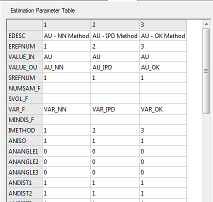
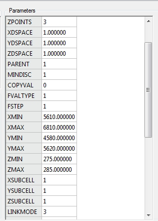

# ESTIMATE - NN, IPD and OK

 |  Nearest Neighbour, Inverse Distance and Ordinary Kriging Using ESTIMATE for Nearest Neighbour, Inverse Distance and Ordinary Kriging estimation.  
---|---  
  
# Overview

In this portion of the tutorial you are going to use the process ESTIMATE to estimate grades using Nearest Neighbour, Inverse Distance and Ordinary Kriging methods.

## Prerequisites

  * Created a new project and added all the required tutorial files - exercises on the [Creating a New Grade Estimation Project](<Creating_a_New_Grade_Estimation_Project.md>) page.

  * Displayed toolbars and defined project settings - exercises in the [Displaying Grade Estimation Toolbars](<Display_Grade_estimate_Toolbars.md>) and [Defining Settings](<Defining_Settings.md>) pages.

  * Read the help documentation notes page for ESTIMATE, in your Help file.

  * Read the Grade Estimation User Guide page on Grade Estimation Methods.

  * [Files](<tutorial_files.md>) required for the exercises on this page:

  *     * _2dzmod1

    * _srfsamp

    * _2depar2

    * _2dspar1

    * _2dvpar1

##  Using ESTIMATE for NN, IPD and OK grade estimates

In this exercise you are going to estimate Au grades into a 2D block model using three different estimation methods and the following parameters:

  * Input Grade field: AU

  * Output Grade fields: AU_NN, AU_IPD and AU_OK

  * Estimation methods: Nearest Neighbour (NN), Inverse Power Distance (IPD) and Ordinary Kriging

  * Search Volume: search volume 1 (SREFNUM=1)

  * Variogram model: variogram model 2 (VREFNUM=2)

  * Estimation options: zonal control (field ANOM).

The block model and sample points are shown in the image below. The blue block model cells represent the lower grade zone (field ANOM=1) while the red cells represent the higher grade zone (field ANOM=2). The displayed sample points have low grade values colored blue and higher grade values colored in red.  

 |  Use ESTIMATE to estimate grades into a block model when using:

  * multiple grade fields
  * estimation method NN, IPD, OK or Simple Kriging
  * Indicator Kriging or Sichel's T estimation
  * dynamic search volumes
  * advanced estimation options e.g. model updating
  * search, variogram and estimation parameters stored in files.

  
---|---  
  
## Defining the Input Block Model and Samples Files

  1. Select the Design window.

  2. Activate the  Estimate ribbon and select  Interpolate Select  Models | Interpolation Processes | Interpolate Grades from Menu .

  3. In the Grade Estimation (ESTIMATE) dialog, Files tab, select the Input sub-tab.

  4. In the Geological Model group, click Browse.

  5. In the Project Browser dialog, Database Tables pane, Block Models folder, select _2dzmod1 , click OK.

  6. In the Sample Data group, click Browse.

  7. In the Project Browser dialog, Database Tables pane, All Tables folder, select _srfsamp , click OK.

  8. In the Coordinates Fields group, select the X, Y and Z fields [XPT], [YPT], [ZPT].

  9. In the Zone Control Fields group, select the Zone 1 field [ANOM].

  10. Check that your parameters are as shown below:  
  
  

 | 
     * Drillholes or suitable points data can be used as Sample Data files. 
     * Both the Input Model and the Sample File need to be defined so that the Zone Control Fields can be selected.
     * The Zone Control Fields need to be present (and contain suitable matching zone field values) in both the Input Model and the Sample File.  
---|---  

## Defining the Output Block Model, Input/Output Search Volume and Variogram Model Files

  1. In the Grade Estimation (ESTIMATE) dialog, Files tab, select the Output sub-tab.

  2. In the Grade Model group, define a new model file '2dgmod2'.

  3. In the Parameter Files (Input and Output) group, clear the Use Defaults check box.

  4. Browse for and select the Search Volume File_2dspar1.

  5. Browse for and select the Estimation Parameter File _2depar2.

  6. Browse for and select the Variogram Model File _2dvpar1.

  7. Check that your parameters are as shown below:  
  
  

 |  The Search Volume File, Variogram Model File and the Estimation Parameter File need to be defined here so that the relevant search, variogram model and estimation parameters are displayed in the relevant tabs.  
---|---  

## Checking the Search Parameters

  1. In the Grade Estimation (ESTIMATE) dialog, Files tab, click Nexttwice.

  2. In the Search Volumes tab, Summary subtab, check that the Search Parameter Table contains a single sets of parameters, as shown below:  
  

## Checking the Variogram Model Parameters

  1. In the Grade Estimation (ESTIMATE) dialog, Search Volumes tab, click Next.

  2. In the Variogram Models tab, Summary subtab, check that the Variogram Model Table contains two sets of parameters, as shown below:  
  
 

## Checking the Estimation Types Parameters

  1. In the Grade Estimation (ESTIMATE) dialog, Variogram Models tab, click Next >>.

  2. In the Estimation Types tab, Summary sub-tab, check that the Estimation Parameter Table contains six sets of parameters, 4 are shown below:  
  
  
  

 |  The Estimation Parameter Table contains six sets of parameters i.e. one for each of the output grade fields AU_NN, AU_IPD and AU_OK for each of the two grade zones (ANOM=1 and ANOM=2). This zone field ANOM is present within the input block model and the sample points file. It contains one of two values: for the lower grade zone ANOM=1, while for the higher grade zone ANOM=2.  
---|---  

## Setting the Controls Parameters

  1. In the Grade Estimation (ESTIMATE) dialog, Estimation Types tab, click Next >>.

  2. In the Controls tab, Parameters subtab, check that the default parameters are selected, as shown below:  
  
  
  

 |  The input block model contains only parent cells and not subcells: this can be identified by all the cells having the same size in the image shown at the top of the page. In this case, the default subcells estimation option is selected; selecting the Parent cell estimation using a full 3D matrix of points option will produce the same results. These two options will produce different estimation results when selected using a block model with subcells.  
---|---  

## Checking the Parameters in the Preview tab

  1. In the Grade Estimation (ESTIMATE) dialog, Controls tab, click Next.

  2. In the Preview tab, Summary subtab, check that the Files group parameters are as shown below:  
  
  

  3. In the Preview tab, Summary sub-tab, check that the Fields group parameters are as shown below:  
  
  

  4. In the Preview tab, Summary sub-tab, check that the Parameters group settings are as shown below:  
  

  5. Click Run.

  6. In the Command control bar, check that ESTIMATE has run successfully and that the output file 2dgmod2 contains 780 records:  
  

****Top of page