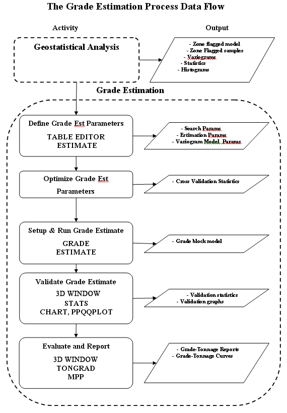

 |  Grade Estimation Methodology How to approach the grade estimation process  
---|---  
  
# The Grade Estimation Process

## Process Inputs

The process of grade estimation makes use of the following:

  * results of geostatistical analyses (identification of mineralization zones/populations, variogram modeling)

  * estimation parameters (search, variogram and estimation parameters)

  * sample data (points or drillholes)

  * block model(s)

  * perimeters for panel estimation or grade-tonnage evaluation.

The results of the geostatistical analysis are used to prepare the geological sample and block model data before it is used in the grade estimation process. This preparation typically includes the following (in no specific order):

  * flagging the following with a mineralization code (used for zonal control in grade estimation):

  *     * sample data

    * block model data

  * declustering:

  *     * point data

    * drillhole data

  * compositing drillhole data on fixed lengths

  * regularizing block model data to produce models with with fixed X, Y and Z cell sizes.

## The Process Flow

The general grade estimation process is summarized in the flow diagram below. The different activities, together with their processes (capitalized), are shown on the left; the outputs from the activity are shown on the right.

 

x