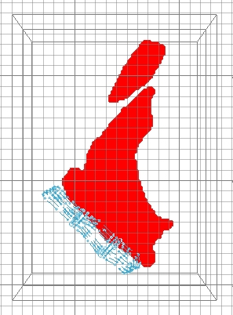
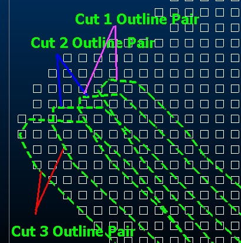
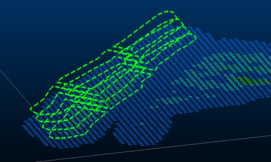
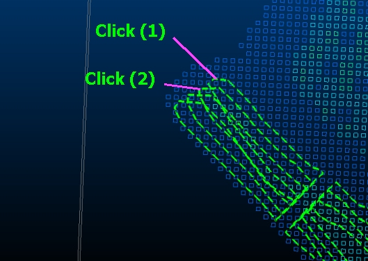

 |  Interactive Evaluation - String Pairs Evaluation of tonnes and grades using string pairs.  
---|---  
  
# Overview

In this portion of the tutorial you are going to evaluate a block model within a set of string pairs interactively in the Design window, in order to generate summary tonnes and grades.

## Prerequisites

  * Created a new project and added all the required tutorial files - exercises on the [Creating a New Grade Estimation Project](<Creating_a_New_Grade_Estimation_Project.md>) page.

  * Displayed toolbars and defined project settings - exercises in the [Displaying Grade Estimation Toolbars](<Display_Grade_estimate_Toolbars.md>) and [Defining Settings](<Defining_Settings.md>) pages.

  * Created and applied an evaluation legend - exercises on the [Creating an Evaluation Legend](<Creating_an_Evaluation_Legend1.md#Exercise1>) page.

  * Defined evaluation settings - exercise on the [Defining Evaluation Settings](<Defining_Evaluation_Settings1.md#Exercise1>) page.

  * [Files](<tutorial_files.md>) required for the exercises on this page:

  *     * _ubmm

    * _caf5so

    * If it doesn't already exist, create the gold evaluation legend for this exercise by running through[Creating an Evaluation Legend](<creating_an_evaluation_legend1.md>). You will need access to this file in this exercise

    * Make sure your Project Settings are as defined in [Creating an Evaluation Legend](<creating_an_evaluation_legend1.md>). This is important to ensure the evaluation results are accurate.

##  Exercise: Interactive Evaluation Using String Pairs

In this exercise you are going to evaluate the mining block model _ubmm within the -255m level cut-and-fill mining blocks _caf5so in order to generate a summary tonnes and grade table. The tonnes and average grades will be calculated for the intervals defined in the evaluation legend Au Evaluation, which was created in a previous exercise (see Prerequisites box).

 |  The mining block model _ubmm has the following characteristics:

  * it is a regularized block model consisting of 5x5x5m cells
  * contains a 15m thick 'waste' envelope around the ore (AU, CU, CO and AG grades set to '0')

The -255m level cut-and-fill stoping outlines (mining blocks) _caf5so have the following characteristics:

  * consist of 3 pairs of horizontal, closed strings
  * each string pair has both a hangingwall and footwall position string defining the upper and lower limits of the cut-and-fill stoping cut
  * each cut is 5m thick.

  
---|---  
  
 |  UseString Pairswhen evaluating:

  * open pit mining blocks represented by pairs of crest and toe elevation strings
  * underground cut-and-fill mining blocks represented by pairs of hanging- and footwall strings
  * pairs of dipping mining block strings e.g. sublevel open stoping, VCR or longwall mining blocks
  * primary and secondary mining development represented by pairs of strings.

  
---|---  
  
## Loading the Block Model and Strings

  1. Select the Design window.

  2. Select the Project Files control bar.

  3. Drag-and-drop the following block model and strings files into the 3DDesign window if they are not already loaded from the previous exercise:  

     * _ubmm

     * _caf5so

  4. In the Sheets control bar, 3DDesign folder, Overlays folder, select only the following check boxes (i.e. display only these objects):  

     * _ubmm (block model)

     * _caf5so (strings)

  5. In the View Control toolbar, click Zoom All Data.

  6. In the View Control toolbar, click View Settings.

  7. In the View Settings dialog, Section Definition tab, Section Orientation group, select the Horizontal option.

  8. In the Mid-Point group, define the Z: elevation as '-255', click OK:  
  

  9. Using the Sheets control bar, double-click the Default Section item in the 3D | Sections folder.

  10. Set the  Section Ref Point for  Z to '-255' and click  OK .

  11. Activate the View ribbon and select the Lock icon.

  12. In the 3DDesign window, check that you have the following data displayed i.e. a horizontal slice through the block model at-255m elevation and the Cut and Fill stoping outlines for the -255m level:  
  
  
  

  13. Use the View ribbon to deactivate the display of the default grid.
  14. Open the  Block Model Properties dialog for the  _ubmm model and change the display type as follows:   
Display Type: Intersection  
Show Fill: Disabled  
Show Edges: Enabled  
Exaggeration: 50%  
Color: Fixed - White  
.
  15. To make them clearer - double-click the _caf5so strings overlay and set the following properties:  
  
Lines tab - Fixed Color: Bright Green  
Lines tab - Scale: 4  

  16. Zoom in (use the View ribbon's Zoom Area option) to the area around the outlines and identify the 3 cut's 9 stoping blocks, each defined by a pair of horizontal strings. Note that the top string for the 1st cut string pair becomes the bottom string for the 2nd cut string pair:  
  

## Applying the Evaluation Legend to the Block Model

  1. If it doesn't already exist, create the gold evaluation legend for this exercise by running through[Creating an Evaluation Legend](<creating_an_evaluation_legend1.md>).

  2. In the Sheets control bar, Design-Overlays folder, double-click _ubmm(block model).

  3. In the Block Model PropertiesFormat Display dialog, Overlay Format group, Color grouptab, Color group, select the Legend option.

  4. Select the Legend [Au Evaluation], select the Column [AU].

  5. Click OKApply and then Close.

  6. if enabled, disable the Lock icon using the View ribbon.

  7. Check that the block model has been colored as shown below:  
  
  

  8. Select Format | VR View | Update VR Objects 'vro'.

  9. R In the  VR window, rotate and zoom the view, check that the block model is colored according to the legend categories shown below::  
  

## Unloading any Existing Results Tables

  1. Select the Loaded Data control bar.

  2. Right-click on an existing results table, e.g. geres1 from the single string evaluation exercise, select Data | Unload.

## Evaluating the First Pair of Outlines

  1. Select the Design window.

  2. Use the  View ribbon's  Zoom Area command In the  View Control toolbar, click  Zoom In and drag a zoom rectangle around the northern set of outlines.

  3. In the Mine Design toollbar, click Evaluate 2 Strings 'ev2'.

  4. Activate the Report ribbon and select Evaluate | String | Two Strings

  5. Following the prompts in the Status Bar (bottom left), select the footwall outline and then the hangingwall outline of the 1st cut, as shown below:  
  
  
  

  6. Define the Mining Block Identifier as '1.01' i.e. use the default value, click OK:  
  
  

  7. In the Accept dialog, compare your results to those shown below, click Yes:  
  
  
(Your results are different? Make sure your project settings are as defined in [Creating an Evaluation Legend](<creating_an_evaluation_legend1.md>))

 |  When Yes is clicked, the results listed in the Accept dialog are saved to a new results table object called RESULTS.  
---|---  

## Evaluating the Remaining Pairs of Outlines

  1. Repeat steps 3. to 6. shown in the above section to evaluate the remaining 2 cuts for the northern block.

  2. Increment the Mining Block Identifier by '0.01' for each evaluation i.e. '1.01, 1.02,...'

 |  Other Mining Block Identifier numbering methods can be used as long as each identifier is unique e.g. '1, 2, 3, ...'.  
---|---  
  3. Use the various View ribbon commandsPan Graphics view control and the above steps to evaluate the middle and southern sets.

  4. Check that you have completed a total of 9 evaluations.

## Saving the RESULTS Object

  1. In the Loaded Data control bar, right-click on RESULTS , select Data | Save As.

  2. In the Save 3D Object dialog, click Extended Precision Datamine(.dm) file.

  3. In the Save RESULTS dialog, browse to your project folder, define a new File name 'geres2.dm', click Save.

  4. In the Loaded Data control bar, check that the RESULTS object has been renamed to geres2 (table).

## Saving the updated _caf5so Object

  1. In the SheetsLoaded Data control bar, right-click on the _caf5so (strings) object, select Data | Save As.

  2. In the Save 3D Object dialog, click Extended Precision Datamine(.dm) file.

  3. In the Save dialog, browse to your project folder, define a new File name 'caf6so.dm', click Save.

  4. In the Loaded Data control bar, check that the _caf5so (strings) object has been renamed to caf6so.dm (strings).  

 |  The saved outlines file caf6so.dm now contains an extra field (column) BLOCKID and block values; the evaluation results table also contains this field and values. This allows the results in the results table to be linked to the correct outline in the string file. This can be used to check results and join the results to the outlines using the process JOIN.  
---|---  

## Checking the Results Table

  1. Select the Project Files control bar, Results folder.

  2. Right-click on geres2 and select Open.

  3. In the Datamine Table Editor dialog, check that your results are as follows:

     * the table contains a total of 90 records i.e. 10 records for each BLOCKID.

     * the evaluation has identified ore tonnage in the CATEGORY ranges '0,2', '2,4' and '2,6'.

  4. Compare your results for BLOCKID '1.01', to those shown below:  
  
  

  5. In the Datamine Table Editor dialog, select File | Exit.

 |  MODRES can also be used to generate a summary tonnes and grades results file from a grade block model. TABRES can then be used to tabulate the result file and generate an output system text file.  
---|---  
  
****Top of page