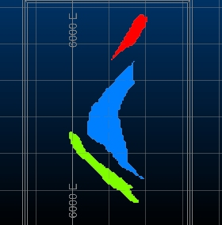
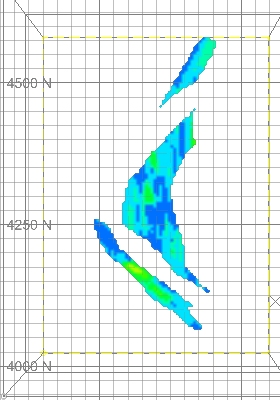

 |  Interactive Evaluation - Single Strings Evaluation of tonnes and grades within single strings.  
---|---  
  
# Overview

In this portion of the tutorial you are going to evaluate a block model within single strings, interactively in the Design window, in order to generate summary tonnes and grades.

## Prerequisites

  * Created a new project and added all the required tutorial files - exercises on the [Creating a New Grade Estimation Project](<Creating_a_New_Grade_Estimation_Project.md>) page.

  * Displayed toolbars and defined project settings - exercises in the [Displaying Grade Estimation Toolbars](<Display_Grade_estimate_Toolbars.md>) and [Defining Settings](<Defining_Settings.md>) pages.

  * Created and applied an evaluation legend - exercises on the [Creating an Evaluation Legend](<Creating_an_Evaluation_Legend1.md#Exercise1>) page.

  * Defined evaluation settings - exercise on the [Defining Evaluation Settings](<Defining_Evaluation_Settings1.md#Exercise1>) page.

  * [Files](<tutorial_files.md>) required for the exercises on this page:

  *     * _ubm5g

    * _ubmlim

## Exercise: Interactive Evaluation using Single Strings

In this exercise you are going to evaluate the grade block model _ubm5g within the block model limits defined by the outlines in the strings file _ubmlim. The summary tonnes and grades will be calculated for the intervals defined in the evaluation legend Au Evaluation and saved to a new results table.

 |  The strings file _ubmlim contains two coplanar closed strings, the upper one at -180m elevation and the other at -390m elevation. The upper string at -180m elevation will be used in this exercise.  
---|---  
  

 |  UseSingle Stringswhen evaluating:

  * block models or drillholes within a property boundary or lease area perimeter
  * open pit mining blocks represented by single mid-bench (or crest or toe elevation) outlines
  * cut-and-fill mining blocks represented by single horizontal outlines in steep dipping ore bodies
  * horizontal/sub-horizontal mining development represented by single outlines 

  
---|---  
  
## Loading the String and Block Model Data

  1. Unload any data that may already be loaded from previous exercises.

  2. Select the Project Files control bar.

  3. Drag-and-drop the following block model and strings files into the Design window:

     * _ubm5g

     * _ubmlim

  4. In the Sheets control bar, 3D folder, select only the following check boxes (i.e. display these objects):  

     * _ubm5g (block model)

     * _ubmlim (strings)

  5. In the 3D | Sheets | Sections folder, double-click the Default Section item to open the Section Properties dialog.

  6. Check that the Section Ref Point value for Z is "-285" then click OK.

  7. Use the View ribbon and enable the Lock icon.

  8. In the 3D window, check that you have the following data displayed i.e. a horizontal slice through the block model at-285m elevation and the model limit outlines.  
  
  

## Formatting the Block model With the Evaluation Legend

  1. In the Sheets control bar, 3D folder, double-click _ubm5g (block model)

  2. In the Block Model Properties dialog, Select the Legend [Au Evaluation], select the Column [AU]. Click OK.

  3. Set the3Dwindow background window to White by right-clicking an empty area of screen, and enable the display of theDefault Grid.

  4. In the 3D window, check that the block model has been colored as shown below:  
  

## Evaluating Using the Upper String

  1. Disable the view of the Default Grid (it's easier to see the evaluation limit outlines.

  2. Disable the Lock toggle using the View ribbon.

  3. Rotate the view so that the upper and lower limit outlines are displayed clearly.

  4. Activate theReportribbon and clickEvaluate | String

  5. Click on the upper outline (by default, the -180m elevation outline is selected).

  6. When prompted, define the Mining Block Identifier as '1.01' and click OK :  
  
  

  7. Next, define the NEAR projection distance as '0', FAR projection distance as '210', Default density as '1.0' and click OK :  
  
  

 |  The NEAR and FAR vertical projection distances define the upper and lower limits of the evaluation volume. In this exercise, these distances just need to be large enough so that the evaluation volume encloses the grade block model i.e. exact distances are not important. On the other hand, when the single outlines being evaluated represent open pit or cut-and-fill mining blocks, the NEAR and FAR projection distances need to accurately represent the vertical thickness of the mining block being evaluated.  
---|---  
  8. In the Accept dialog, compare your results to those shown below, click Yes:  
  
  

When Yes is clicked, the results listed in the Accept dialog are saved to a new results table object called RESULTS.  

 |  The results are listed according to the categories defined in the Au Evaluation legend  
---|---  

 |  Multiple single strings can be evaluated individually by repeating steps 3 to 5 before clicking Cancel.  
---|---  
 |  Multiple single strings can be evaluated in a single run by using the command Evaluate All Strings.  
---|---  
  
## Saving the RESULTS Object to File

  1. In the Loaded Datacontrol bar(you can enable this by activating theHomeribbon, thenShow | Loaded Data barcontrol bar), right-click on RESULTS , select Data | Save As.

  2. In the Save 3D Object dialog, click Extended Precision Datamine(.dm) file.

  3. In the Save RESULTS dialog, browse to your project folder, define a new File name 'geres1.dm', click Save.

  4. In the Loaded Data control bar, check that the RESULTS object has been renamed to geres1 (table).

## Saving the Updated _ubmlim (strings) Object

  1. In the Sheets control bar, right-click on the _ubmlim (strings) object, select Data | Save As(Sheets is used to manage visual objects - Loaded Data is only used for non-visual objects).

  2. In the Save 3D Object dialog, click Extended Precision Datamine(.dm) file.

  3. In the Save dialog, browse to your project folder, define a new File name 'ublim2.dm', click Save.

  4. In the Sheets control bar, check that the _ubmlim (strings) object has been renamed to _ubmlim2 (strings).  

 |  The saved strings file ubmlim2.dm now contains an extra field (column) BLOCKID with a set value i.e. '1.01'; the evaluation results table also contains this field and value. This allows the results in the results table to be linked to the correct outline in the string file. This can be used to check results and join the results to the outlines using the process JOIN.  
---|---  

## Checking the Results Table

  1. Select the Project Files control bar, Results folder.

  2. Right-click on geres1 , select Open.

  3. In the Datamine Table Editor dialog, check that your results are as follows:

     * the table contains a total of 10 records

     * the evaluation has only identified ore tonnage in 7 grade categories (the field CATEGORY is on the far right).

  4. Compare your results to those shown in the results table below:  
  
  

  5. In the Datamine Table Editor dialog, select File | Exit.

 |  The process MODRES can also be used to generate a summary tonnes and grades results file from a grade block model. TABRES can then be used to tabulate the result file and generate an output system text file.  
---|---  
  
****Top of page