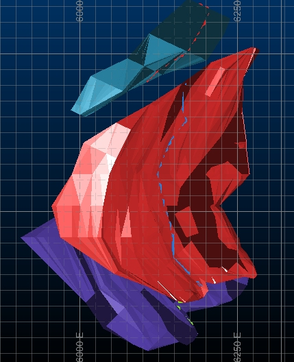

 |  Interactive Evaluation - Wireframes Evaluation of tonnes and grades using wireframes  
---|---  
  
# Overview

In this portion of the tutorial you are going to evaluate a block model within a set of wireframe volumes interactively in the Design window, in order to generate summary tonnes and grades.

## Prerequisites

  * Created a new project and added all the required tutorial files - exercises on the [Creating a New Grade Estimation Project](<Creating_a_New_Grade_Estimation_Project.md>) page.

  * Displayed toolbars and defined project settings - exercises in the [Displaying Grade Estimation Toolbars](<Display_Grade_estimate_Toolbars.md>) and [Defining Settings](<Defining_Settings.md>) pages.

  * Created and applied an evaluation legend - exercises on the [Creating an Evaluation Legend](<Creating_an_Evaluation_Legend1.md#Exercise1>) page.

  * Defined evaluation settings - exercise on the [Defining Evaluation Settings](<Defining_Evaluation_Settings1.md#Exercise1>) page.

  * [Files](<tutorial_files.md>) required for the exercises on this page:

  *     * _ubm5g

    * _uoretr / _uorept

## Exercise: Interactive Evaluation using Wireframes

In this exercise you are going to evaluate the block model _ubm5g within the ore body wireframe _vsoretr / _vsorept in order to generate summary tonnes and grade. The tonnes and average grades will be calculated for the intervals defined in the evaluation legend Au Evaluation, which was created in a previous exercise.

 |  UseWireframeswhen evaluating:

  * geological or ore body block models generated by wireframe volumes
  * open pit mining blocks represented by wireframe volumes
  * underground mining blocks represented by wireframe volumes
  * underground mining development represented by wireframe volumes.

  
---|---  
  
## Loading the Block Model and Wireframe Data

  1. Select the Design window.

  2. Unload any data that may be loaded from previous exercises.

  3. Select the Project Files control bar.

  4. Drag-and-drop the following block model and wireframe triangle file into the 3DDesign window:  
  

     * _ubm5g

     * _uoretr

  5. In the Sheets control bar, Design-Overlays folder, select only the following check boxes (i.e. display these objects) :  

     * _ubm5g (block model)

     * _uoretr/_uorept (wireframe)

  6. In the View Control toolbar, click Plane by One Point.

  7. Click at any point in the Design window.

  8. In the Plane By One Point dialog, select Plan , click OK.

  9. Use the View ribbon's Zoom Fit | Zoom plan commmand.

  10. In the View Control toolbar, click Zoom All Data.

  11. In the 3DDesign window, check that you have the following data displayed i.e. a horizontal slice through the block model and the ore body wireframes :  
  

## Verifying the Wireframe

  1. Activate the  Structure ribbon and select  Verify Select  W i reframes | Verify 'wvf'.

  2. In the Verify Wireframe dialog, Name group, select the Name [_uoretr/_uorept (wireframe)], select the Key Field [ZONE].

  3. Define the options as shown below, click OK:  
  
  

  4. In the Verify Results Summary dialog, click OK.

## Unloading any Existing Results Tables

  1. Select the Loaded Data control bar.

  2. If one exists in memory, right-click on any existing results tables, e.g. geres2 from the string pairs evaluation exercise, and select Data | Unload.

## Evaluating the Wireframe

  1. Activate the  Report ribbon and select the  Evaluate | Wireframe button In the  Mine Design toollbar, click  Evaluate Wireframe or, select  Models | Evaluate | Wireframe 'evw'.

  2. In the Evaluate Wireframe dialog, Wireframe Object group, select [_uoretr/_uorept (wireframe)].

  3. In the Type group, select the Closed Volume option, click OK:  
  
  

  4. Next, define the Mining Block Identifier: as '1.01', click OK.

  5. In the Accept dialog, compare your results to those shown below, click Yes:  
  
  

 |  When Yes is clicked, the results listed in the Accept dialog are saved to a new results table object called RESULTS.  
---|---  

## Saving the RESULTS Object

  1. In the Loaded Data control bar, right-click on RESULTS , select Data | Save As.

  2. In the Save 3D Object dialog, click Extended Precision Datamine(.dm) file.

  3. In the Save dialog, browse to your project folder, define a new File name 'geres3.dm', click Save.

  4. In the Loaded Data control bar, check that the RESULTS object has been renamed to geres3 (table).

## Checking the Results Table

  1. Select the Project Files control bar, Results folder.

  2. Right-click on geres3 , select Open.

  3. In the Datamine Table Editor dialog, check that your results are as shown below:  
  
  
  

 |  With reference to the above image:
     * Ignore the results listed in the ZONE and TONNESA columns.
     * Tonnes and average grades have been calculated per grade category (in this case the AU ranges defined in the Au Evaluation legend) listed in the column CATEGORY (on the right side of the table).
     * The TONNES column contains the total tonnes evaluated in a specific category (column CATEGORY).
     * The results shown above are for a Partial Cell evaluation. Evaluation using the Full Cell option will produce different results.  
---|---  
  4. In the Datamine Table Editor dialog, select File | Exit.

 |  The process MODRES can also be used to generate a summary tonnes and grades results file from a grade block model. TABRES can then be used to tabulate the result file and generate an output system text file.  
---|---  
  
## 

****Top of page