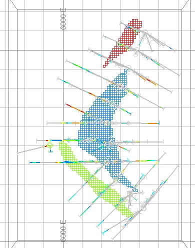
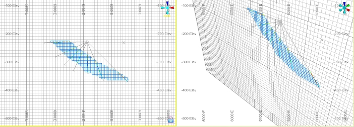
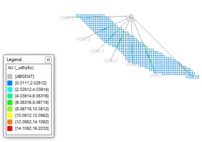
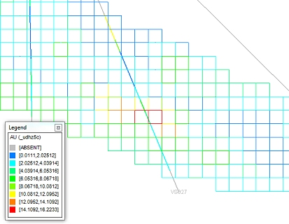

 |  Visual Validation Validating the estimated block model cell grades visually in the Design window.  
---|---  
  
# Overview

In this portion of the tutorial you are going to validate the estimated block model cell grades by comparing them to the drillhole grades in the Design window.

## Prerequisites

  * Created a new project and added all the required tutorial files - exercises on the [Creating a New Grade Estimation Project](<Creating_a_New_Grade_Estimation_Project.md>) page.

  * Displayed toolbars and defined project settings - exercises in the [Displaying Grade Estimation Toolbars](<Display_Grade_estimate_Toolbars.md>) and [Defining Settings](<Defining_Settings.md>) pages.

  * [Files](<tutorial_files.md>) required for the exercises on this page:

  *     * _ubm5g

    * _udhz5c

    * _ueps

    * _uepv

    * _uepe

## Exercise: Visual Validation of Grade Estimates in the Design Window

In this exercise you are going to visually compare grades in 5m composited drillhole sample intervals with corresponding grades in 5x5x5m block model cells in order to determine if the grade estimation process has run correctly:

  * Grade block model: 5m regular celled (no sub-cells), zone flagged, block model

  * Sample data file: 5m composited drillholes

  * Grade fields: AU (g/t), CU (%), AG (g/t), CO (%).

The grades were estimated using the Search, Variogram and Estimation parameter files _ueps,_uepv and _uepe respectively.

The 3D grade block model and drillhole samples are shown in the image below.  

   

 |  In the above image, the block model cells are colored according to three separate mineralization zones (cyan: ZONE=1, green: ZONE=2, red: ZONE=3). The fold axis of the ore body plunges at 35 degrees towards the East, the tabular to massive shaped limbs have a dip of 40 degrees, a maximum down dip length of 240m and a thichkness (perpendicular to the bottom contact) of 5m -45m . The drillholes are set in fans which are parallel with the dip direction of each limb and are spaced 50m apart .tom contact) of between 5 and 45m . The drillholes are set in fans which are parallel with the dip direction of each limb and are spaced approximately 50m apart.  
---|---  
  
 |  Visual validation of block model cell vs drillhole values can be used to check:

  * block model filling of geological wireframes or string boundaries
  * zone flagging of block model cells
  * grade estimates in block model cells according to grade and zone variations in drillholes.

  
---|---  
  
## Loading the Block Model and Static Drillhole Data

  1. Select the Design window.

  2. Unload any data that may be loaded into memory.

  3. Select the Project Files control bar.

  4. Drag-and-drop the following files (if not already loaded) into the 3DDesign window:  
  

     * _udhz5c (drillholes)

     * _ubm5g (block model)

  4. In the Sheets control bar, 3DDesign-Overlays folder, select only the following check boxes (i.e. display these objects) :

  1.      * _udhz5c (drillholes)

     * _ubm5g (block model)

     * Default Grid

  5. Activate the  View ribbon and select  Zoom Fit | Zoom Plan In the  View Control toolbar, click  Plane by One Point .

  6. Click at any point in the Design window.

  7. In the Plane By One Point dialog, select Plan , click OK.

  8. In the View Control toolbar, click Zoom All Data.

  9. Double-click the _ubm5g item in the Sheets | 3D | Block Models folder.

  10. Select an Intersection display type, disable the Show Fill check box and enable the Show Edges check box. Click OK.

  11. C In the  Design window, check that you have the following data displayed i.e. a horizontal slice through the block model and full-length drillholes displayed:  
  

## Defining a W-E Vertical Section

  1. Select the Design window.

  2. In the View Control toolbar, click View Settings.

  3. In the View Settings dialog, Section Orientation group, select East-West.

  4. Set the Width to '10', select Apply Clipping, click OK.

  5. In the View Control toolbar, click Zoom Extents .

  6. Activate the View ribbon and select the Split Vertically option.

  7. Select the left-hand window to highlight it and select the Lock toggle.

  8. Double-click the Default Section item in the 3D | Sheets | Sections folder.

  9. Click East-West, and ensure the Use Dimensions check box is disabled.

  10. Set a Front and Back section width of '5' and select Clipping Outside. Click OK.

  11. C In the  Design window, check that you have the data displayed in a vertical W-E section as shown below:  
  

 |  The management of a set of section and plan views is typically done using a Section Defintions file. This allows for set views to be defined and recalled in the Design window and increases the efficiency when working with different views of the data. Examples of section definitions can be viewed in the file _uviews. Please refer to the Help documentation and Geological Modeling tutorial for further details.  
---|---  
  
## Formatting The Drillholes

  1. In the Sheets control bar, 3DDesign-Overlays folder, double-clickright-click _dhz5c (drillholes), select Format... .

  2. In the Drillholes Properties dialog, select the Labels tab.
  3. Enable the Display Labels check box and make sure the text field contains the text "[BHID]" (including square brackets).
  4. In thePositiongroup, ensureEnd of holeis selected.
  5. In the Format Display dialog, Overlays tab, Overlay Format group, Drillholes tab, click Format... .  
  

  6. In theDrillhole Tracesdialog,Labelstab, select theEnd-of-Holeoption, select [_dhz5c (drilholes).BHID], clickApply.  
  
  

  7. In the  Color group, select the  Legend option, the [AU] column and then create a default legend by clicking the button to the right of the  Column field In the  Color tab,  On Section group, select the  Color using legend option.
  8. In the Legend group, select the Column option [_dhz5c (drilholes).AU].
  9. Select the project  Legend option [AU (_udhz5c)] or click  Use Default Legend , then click  Font... .   
 |  The selected legend can be previewed by clicking the Show Legend button.  
  
  
---|---  
  10. In the  Font area, select the  2D option and a size of '12' In the  Font dialog, select the  Size [8], click  OK .
  11. In the Drillhole Traces dialog, click Apply and then OK.
  12. Back in theFormat Displaydialog, clickApplyand thenOK.
  13. Disable the view of the Default Grid using the Sheets control bar.
  14. C In the  Design window, check that your drillholes are labelled and colored as shown below:  
  

## Formatting The Block Model Cells

  1. In the Sheets control bar, 3DDesign-Overlays folder, double-click _ubm5g (block model).

  2. Select a  Legend Column [AU] and create a default legend and click  OK In the  Format Display dialog,  Style tab, check that the  Visible and  Intersection options are selected:   
  

  3. In the Color tab, On Section group, Color group, select the Legend option.
  4. Select the  Column [AU] and the  Legend [AU (_udhz5c)].   
  
 | In the Legend drop-down, press <A> to move to each legend item starting with 'A'.   
---|---  
| This is the same legend that is used to color the drillholes.  
---|---  
  5. In the Format Display dialog, click Apply and then OK.
  6. C In the  Design window, check that your block model cells are colored as shown below:  
  
  

  7. Starting at the top, zooming in if necessary, work down the ore body (ZONE=1), using the colored grade ranges as a guide and check that the grades in the block model cells align with those shown in the drillholes.  
  
| Visual validation is typically used to check that the grades in the block model cells are consistent with:
     * the mineralization zone boundaries
     * the point or drillhole sample data
     * the estimation controls as defined by the search, variogram and estimation parameters
     * grade trends across or down the ore body
Visual validation is typically used to identify and investigate:
     * anomalous grades displayed in the block model cells that do not correspond with the point or drilhole sample grades
Visual validation is typically done:
     * for each estimated grade field, per mineralization zone
     * on both a local (in a region surrounding a group of samples) and global (across the entire ore body) scale
     * along the major variogram directions, in section and in plan views  
  
---|---  

## Querying Block Model Points and Drillholes

  1. Select the Design window.

  2. Using the  View ribbon, select  Zoom Area and In the  View Control toolbar, click  Zoom In , drag a zoom rectangle around the high grade zone shown in drillhole VS027:  
  
  

  3. Select the  Home ribbon and then  Query | Report | Point Select  Design | Query | Points .

  4. L In the  Design window, left-click in one of the red block model cells.

  5. In the Data Properties control bar, check your query results, noting the values for the density and grade fields (Au, Ag, Cu and Co):  
  
  

 |  These query results are also listed in the Output control bar, where they can be selected, copied and pasted into another document for comparison purposes.  
---|---  
  6. RIn the Design window, right-click on the red colored drillhole segment.

  7. In the Output control bar, check your query results against those of your previous query, noting the values for the density and grade fields (Au, Ag, Cu and Co):  
  

  8. Repeat steps 3 to 7 for various block model cells and drillhole segments.

  9. In the Design window, click Cancel.

****Top of page