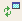
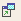
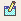

 |  About Visualizer Replay Files Introduction to presenting data using Visualizer Replay Files.  
---|---  
  
# Presenting Data using Visualizer Replay Files

Once geological and mine planning data have been loaded or created in a project, they are available for presentation using Visualizer Replay Files. These files are used to store dynamic 3D visualizer views of the loaded and displayed project data. The following types of Visualizer Replay Files are available:

  * **Standard Visualizer Replay Files** \- 3D visualizer views of the loaded and displayed project data (.gvp format).

  * **Animated Visualizer Replay Files** \- labeled 3D visualizer views (.gvz format).

  * **Dated Animated Visualizer Replay Files** \- date sequenced and labeled 3D visualizer views (.gvz format).

These files can be used as standalone 3D views or embedded in documents and visual presentations.

## Visualizer Replay File Tools

The following **Design** and **Visualizer** window tools are commonly used in the creation and viewing of Visualizer Replay Files.

**Button** |  **Button/Command Name** |  **Toolbar** |  **Function**  
---|---|---|---  
**Visualizer Viewing Tools** |  |  |   
 * |  Update Visualizer Objects |  Visualizer |  Format | Visualizer | Update Visualizer Objects  
 * |  Reset Visualizer View |  " |  ... | Update Visualizer View  
- |  - |  " |  ... | Update Visualizer Objects  
 * |  Update Design View |  " |  ... | Update Design View  
 * |  Read Visualizer View |  " |  ... | Read Visualizer View  
- |  - |  " |  ... | Unload All Data  
**Visualizer Settings Tools** |  |  |   
 ** |  Visualizer Settings |  Format |  Format | Visualizer | Visualizer Settings  
\- ** |  Display Settings |  " |  ... | Display Settings  
 ** |  Alternate Background Color |  " |  ... | Alternate Background Color  
\- ** |  Light Control |  " |  ... | Light Control  
**Replay Files Tools** |  |  |   
- |  Publish Visualizer View |  Menu Bar |  File | Publish Visualizer View  
- |  Publish Animated View |  " |  ... | Publish Animated View  
- |  Publish Dated Animated View |  " |  ... |Publish Dated Animated View  
- |  Update Animation |  " |  Format | Visualize | Update Animation  
- |  Update Animation with Date |  " |  ... | Update Animation with Date  
  
##  Table Notes:

* These buttons form part of the default display in the toolbars.

** The toolbars needs to be customized to display these toolbars or buttons.

[Proceed to the next section](<data_presentation_tutorial_exercises_list.md>)

 |  Related Topics  
---|---  
|  [Plot Sheets](<about_plot_sheets.md>)[  
Log Sheets](<about_log_sheets.md>)[  
Charts](<About_Chart_Sheets.md>)  
  
Checklist:

  1. The topic is stored in the relevant tutorial area of the RoboHelp X5 project.

  2. All topics created with this template are set at TOPIC-LEVEL to the relevant TUTORIAL build tag.

  3. Related topics are not normally required - use BROWSE SEQUENCES instead.

  4. Popups

  5. Browse sequences

  6. Index

  7. TOC

  8. Glossary Items

Document History |   
---|---  
Date |  Description  
201005 | 

  * Updated to reflect MR19 functionality

  
201107 | 

  * Updated to reflect MR20 functionality

  
201202 | 

  * Updated to:
  *     * reflect MR21 functionality
    * replace 'Datamine' term with 'Studio', 'CAE Mining', etc.
    * apply templates with new 'CAE Datamine Corporate' copyright notice