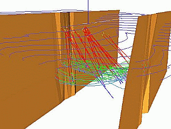
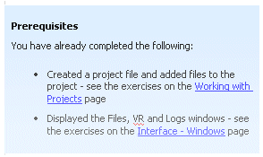

# Introduction to the Data Presentation Tutorial

 |  Data Presentation Tutorial Introducing the Data Presentation Tutorial.  
---|---  
  
 | 

# Data Presentation Tutorial

Welcome to the Data Presentation tutorial. This tutorial introduces you to the key features used for presenting the electronic data that you would typically create in the geological modeling, grade estimation, mine design and mine planning stages of a Mine Planning Cycle. This tutorial includes introductory sections, procedures and exercises covering the following topics:

  * Working with project files
  * Plot Sheets
  * Formatting Plot sheet data
  * Working with data Overlays
  * Log Sheets
  * Formatting of Log sheet data
  * Inserting Plot Items into Plots and Logs
  * Printing Plot and Log sheets
  * Creating custom legends
  * Creating Scatter Charts
  * Creating Histogram Charts
  * Creating and Viewing Visualizer Replay Files

  
---|---  
 |  The concepts and topics covered in the tutorial exercises are applicable to a wide range of users conducting geological modeling, resource estimation, mine design, mine planning and other related tasks.  
---|---  
  
## Introduction to the Tutorial Data Set

The tutorial data set represents a shallow, hydrothermal Cu-Au deposit and consists of the following:

  * 28 drillholes (containing rock type, density, gold and copper grade information)
  * topography contours and surfaces
  * fault surfaces
  * ore body model strings and surfaces
  * grade block model

A subset of the data set is shown in the image on the right. All sample data files required to run this tutorial can be found (assuming a default installation has been performed) in the folder C:\Database\DMTutorials\Data\VBOP. |    
---|---  
  
## Running the Exercises

The tutorial exercises cover the key Data Presentation features. If this is the first time you are working with Plot Sheets, Log Sheets, Charts and Visualizer Replay Files, it is recommended that you run through all the exercises, as they will provide you with a basis for understanding how each set of features works, and what they are used for. You should also preferably run the exercises in the order that they are presented in the Table of Contents (shown in the pane on the left) as the tools, procedures and concepts, covered in an exercise, may be used again in later exercises. Data created in an exercise may also be used in subsequent exercises. The prerequisites for the exercises in a particular topic are listed in the 'Prerequisites' box at the top of each topic page, e.g.:

Fig 1. Example of a Prerequisites box

## Sample vs. User-created Tutorial Data Files

There are two categories of data file used in the exercises in this tutorial; sample files (those that are added to your computer during installation of your application) and user-created files (created by you and added to your PC during an exercise). 

All sample files supplied with the tutorial data set use the prefix "_vb_" to denote that they belong to the Viking Bounty data set. It is suggested that all files, created by you during the exercises, should be named using the user file names as shown in the exercises. This will make it easier for you to follow the exercise instructions and for you to find your files when required in later exercises.

The sample data files are located in the folders under C:\Database\DMTutorials\Data\VBOP, whereas your own user-created files will be stored under C:/Database/MyTutorials/DataPres.

## More Help

To find out more about the processes described in the different exercises, refer to your Help file, or use the context-help associated with a particular dialog (press <F1> whilst the dialog is active to show the relevant Help topic).

[Proceed to the next topic](<data_presentation_tutorial_files_list.md>)

Copyright Datamine Corporate Limited  
JMN_MF_016