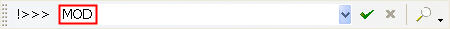
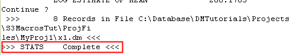
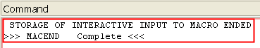
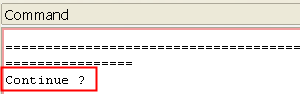
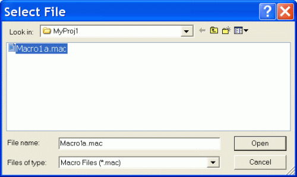

 |  Recording and Replaying a Macro Recording and Replaying macros  
---|---  
  
# Overview

In this portion of the tutorial you are going to be introduced to the tools and techniques used in recording and replaying a basic macro within your application. Please complete the exercises in the order shown below, as the second exercise on this page uses the results from the first exercise.

## Prerequisites

  * Created a new project and added all the required tutorial files - exercises on the [Creating a New Macros Project](<Creating_a_New_Project.md>) page

  * [Files](<../General/Tutorial_Files_List.md>) required for the exercises on this page:

  *     * samples (this file was generated in the exercise on the [Creating a New Macros Project](<Creating_a_New_Project.md>) page)

## Links to exercises

The following exercises are available on this page:

  * Recording Macros

  * Replaying a Macro

## Exercise: Recording Macros

In this exercise, you are going to record three sets of processes into three separate macros. This exercise consists of the following tasks:

  * First macro (Macro1a.mac)
  *     * Starting the first macro recording
    * Running the required Processes 
      * Determine sampling summary statistics (STATS)
      * Create a block model prototype (PROTOM)
    * Stopping the first macro recording
  * Second macro (Macro1b.mac)
  *     * Starting the second macro recording
    * Running the required Processes 
      * Estimate AU grade into block model (GRADE)
      * Determine grade model summary statistics(STATS)
      * List summary statistics (LIST) for both the samples and the grade model
    * Stopping the second macro recording
  * Third macro (Macro1c.mac)
  *     * Starting the third macro recording
    * Running the required Processes 
      * Delete temporary working files (DELETE)
    * Stopping the third macro recording
  * Replaying the first recorded macro

The exercise procedures are as follows:

**Starting the First Macro recording**

  1. Activate the Home ribbon and select Process | Macro | Start Recording.  
| Processes can be run and recorded in a macro while any of the windows (e.g. 3DDesign window, Logs window, Files window) are selected.  
---|---  
  2. In the Command toolbar (bottom of the screen), Command line, enter the Macro Name 'MOD' and then press <Enter>.  
  
  

  3. In the Select File dialog, define Lookin: ,the location for the new macro, as C:\Macros\
  4. Define the new macro File _n_ ame: as 'Macro1a' and then click _O_ pen.  
| The default extension for a macro file name is '.mac'.  
---|---  
  5. Your application is now ready to record your sequence of processes.

Running the Processes (Statistics and block modeling)

  1. Activate the Sample Analysis ribbon and select the top-level Statistics Processes button.

  2. In the STATS dialog, define the settings in the Files , Fields and Parameter tabs, as shown in the table below, and then click OK:  

**STATS dialog Settings**  
---  
**Files tab** |   
_**Input Files**_ |   
IN |  samples  
_**Output Files**_ |   
**OUT** |  x1  
**Field s tab** |   
|  none (by not selecting fields, all fields in the input file are selected)  
**Retrieval tab** |   
Retrieval Criteria |  none  
  3. Press <Enter> after each set of summary statistics is displayed in the Command control bar for each of the 8 sample fields (x8).

  4. In the Command control bar, check that the statistics process is complete:  
  
  

  5. Activate the Model ribbon and select Create | Prototype.

  6. In the PROTOM dialog, define the settings in the Files and Parameter tabs, as shown in the table below, and then click OK:

**PROTOM dialog Settings**  
---  
**Files tab** |   
_**Output Files**_ |   
**OUT** |  x2  
**Parameters tab** |   
**ROTMOD** |  0  
  7. In the Command control bar, Command line, define the parameters shown below:

 |  Press <Enter> after typing each parameter. Upper or Lower case letters can be used when defining the parameters below.  
---|---  
  
**Command line parameters** |   
---|---  
**Is a Mined out field required?** |  N  
**Are Subcells to be used?** |  N  
**X (Model Origin)** |  5610  
**Y (Model Origin)** |  4580  
**Z (Model Origin)** |  275  
**X (Cell Dimension)** |  40  
**Y (Cell Dimension)** |  40  
**Z (Cell Dimension)** |  10  
**X (No of Cells)** |  30  
**Y (No of Cells)** |  26  
**Z (No of Cells)** |  1  
  
 |  The command is complete when the message " >>> PROTOM Complete <<<" is displayed in the Command control bar. This process is also available as part of an interactive UI, allowing you to preview model prototype dimensions and even construct a prototype (regular or rotated) based on an input model specification. You can access this using the Auto Prototype command, also available on the Model ribbon.  
---|---  

|  Temporary File NamesThe following points should be noted when defining temporary file names to be used within macros:

  * Don't use the <TAB> key to indent or space out characters
  * Filenames should be a maximum of 20 characters long
  * Processes do not distinguish between upper and lower case letters in a filename e.g. x1 and X1 are seen as the same filename.
  * The filename prefix '_' is reserved for use in help and tutorial data sets
  * The filename prefix '_sp' is reserved for use by processes
  * Select a meaningful file naming convention which facilitates the reading, checking and editing of macros
  * A suggested convention, as used within this tutorial, uses:
  *     * A filename prefix 'x'
    * The remainder of the filename consists of an integer from the sequence 1,2,3...
    * Examples: X1, X2, X3

  
---|---  
  
**Stopping the Macro recording**

  1. Activate the Home ribbon and select Process | Macro | End Recording.
  2. Check the message in the Command control bar to make sure that the recording has been stopped.  
  
  
  
  
| 
     * Files, fields and parameters are recorded in a macro when:
     *        * They are compulsory
       * Contain default values (obtained from the process's help file)
       * Contain user defined inputs or values  
---|---  

**Recording the Second Macro (Grade estimation, statistics and listing)**

  1. Activate the Home ribbon and select Process | Macro | Start Recording.
  2. In the Command toolbar, Command line, enter the Macro Name 'EST' and then press <Enter>. 
  3. In the Select File dialog, define Lookin: as C:\Macros
  4. Define the new macro File _n_ ame: as 'Macro1b' and then click _O_ pen.
  5. Activate the Estimate ribbon and select the Estimate | Basic.

  6. In the GRADE dialog, define the settings in the Files , Fields and Parameter tabs, as shown in the table below, and then click OK:

**GRADE dialog Settings**  
---  
**Files tab**|   
 _**Input Files**_|   
PROTO| x2  
IN| samples  
 _**Output Files**_|   
MODEL| x3  
**Field s tab**|   
X| XPT  
Y| YPT  
Z| ZPT  
VALUE| AU  
**Parameters tab**|   
SDIST1| 100  
SDIST2| 100  
SDIST3| 100  
IMETHOD| 2  
POWER| 2  
  7. In the Command toolbar (bottom of the screen) type "STATS" and press enter to execute the STATS process.

  8. In the STATS dialog, define the settings in the Files , Fields and Parameter tabs, as shown in the table below, and then click OK:  

**STATS dialog Settings**  
---  
**Files tab**|   
 _**Input Files**_|   
IN| x3  
 _**Output Files**_|   
**OUT**|  x4  
**Field s tab**|   
F1| AU  
**Retrieval tab**|   
**Retrieval Criteria**| none  
  9. Press <Enter> to complete the statistics process.

  10. In the Command tool bar, type "LIST" and press <ENTER>

  11. In the LIST dialog, define the settings in the Files , Fields and Parameter tabs, as shown in the table below, and then click OK:  

**LIST dialog Settings**  
---  
**Files tab**|   
 _**Input Files**_|   
IN| x1  
**Field s tab**|   
F1| FIELD  
F2| MINIMUM  
F3| MAXIMUM  
F4| RANGE  
F5| MEAN  
**Parameters tab**|   
| none  
**Retrieval tab**|   
**Retrieval Criteria**| none  
  12. Press <Enter> to complete the listing process.

  13. In the Command tool bar, type "LIST" and press <ENTER>

  14. In the LIST dialog, define the settings in the Files , Fields and Parameter tabs, as shown in the table below, and then click OK:  

**LIST dialog Settings**  
---  
**Files tab**|   
 _**Input Files**_|   
IN| x4  
**Field s tab**|   
F1| FIELD  
F2| MINIMUM  
F3| MAXIMUM  
F4| RANGE  
F5| MEAN  
**Parameters tab**|   
| none  
**Retrieval tab**|   
**Retrieval Criteria**| none  
  15. Press <Enter> to complete the listing process.

  16. Activate the Home ribbon and select Process | Macro | End Recording.

  17. Check the messages in the Command control bar to make sure that the above steps have run correctly.

|  

  * The commands STATS and LIST display results in the Command control bar and require <Enter> to be pressed to complete the process.
  * This is indicated by the above message which is displayed in the Command control bar.

  
---|---  
  
**Recording the Third Macro (Deleting temporary files)**

  1. Activate the Home ribbon and select Process | Macro | Start Recording.
  2. In the Command toolbar, Command line, enter the Macro Name 'DEL' and then press <Enter>. 
  3. In the Select File dialog, define Lookin: as C:\Macros
  4. Define the new macro File _n_ ame: as 'Macro1c' and then click _O_ pen.
  5. Activate the Data ribbon and select Data Tools | Tables | Delete.

  6. In the DELETE dialog, define the settings in the Files and Parameter tabs, as shown in the table below, and then click OK:  

**DELETE dialog Settings**  
---  
**Files tab**|   
 _**Input Files**_|   
IN| x1  
**Parameters tab**|   
CONFIRM| 0  
  7. Repeat steps 5. and 6. for the remaining temporary files X2, X3 and X4.

  8. Activate the Home ribbon and select Process | Macro | End Recording.

  9. Check the messages in the Command control bar to make sure that the above steps have run correctly.

| 

  * Datamine files (*.dm) that are deleted using either the Project Files control bar or the process DELETE are permanently deleted.
  * These files cannot be retrieved i.e. they do not end up in a 'Recycle Bin' as is the case when files are deleted using Windows Explorer .

  
---|---  
  
****Top of page

## Exercise: Replaying a Macro

In this exercise, you are going to replay the first macro that was recorded in the above exercise i.e. Macro1a.mac. The exercise procedures are as follows:

**Replaying the First Macro recording**

  1. Select the Command control bar and click inside the Message pane.
  2. In the Message pane, right-click and select Clea _r_.

  3. Activate the Home ribbon and select Process | Macro | Run Macro.
  4. In the Select File dialog, select the file name Macro 1a.mac and then click Open.  
  
  

  5. Follow the progress of the running macro in the Command control bar, Message pane.
  6. Check the Project Files control bar to make sure that the macro has created the two files X1 and X2.

| 

  * In the above two exercises, the three macros have been recorded in three separate macro files (*.mac).
  * Alternatively, these macros could have been recorded into the same macro file.
  * This is done by selecting the first macro file when being prompted for the macro file name when starting to record the second and third macros.

  
---|---  
  
****Top of page