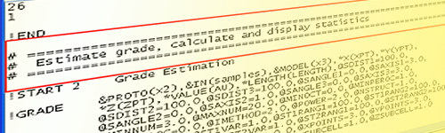

 |  Macros Tutorial Welcome to the Datamine Macros Tutorial  
---|---  
  
#  

# Introduction

This tutorial aims to introduce you to the basic tools and techniques used to write effective macros in your application. The following topics will be covered in this tutorial:

  * recording and replaying a macro

  * the basic and standard layout of macros

  * multiple macros and subroutines

  * comments and messages

  * controlling program flow

  * variables and prompts

  * validation and debugging

## What is a Macro?

A macro is a sequence of processes and macro commands, listed in text format and saved in a macro file (*.mac) which can be run as a single entity. Your application's "server" processes include all commands that are accessed through the Files, Fields & Parameters dialogs. 

In essence, a macro is a series of instructions written in your application's proprietary meta-language.

Macros are typically used to process data files within the project, in a sequential manner in order to achieve a specific result. The simplest form of a macro is a recording of processes which have been run from the various UI options or the command line. More advanced macros contain specific Macro Commands which allow you to enhance the functionality, structure and control of a macro.

A script provides all the functionality that is available in a macro and much more. However although scripting is more powerful, it comes at a cost; scripting languages such as JavaScript are full programming languages and are generally more complex in nature. The Datamine macro functionality and macro language have simple rules and syntax and have been designed to enable people without any programming experience to develop useful macros quickly and easily. As expected, it is a very popular facility.

## What are the Main Features of Macros?

The main features of macros can be summarized as follows:

  * all server processes can be used in macros

  * many macros can be contained in a single macro library file

  * macros can call macros

  * macros can be called by scripts

  * prompts and messages can be defined by the user

  * variable substitution is allowed and their values set by command, prompt or external variable text file

  * functions and arithmetic can be carried out on variables

  * testing and branching functions are provided to control the flow of processing

  * error trapping and control is possible

  * simple text format, editable in Notepad or similar - no costly editing application is required

## Application of Macros

Your recorded and customized macros can be used to:

  * record and replay all server processes

  * provide a means for less experienced users to process data using a simple custom interface

  * automate repetitive data processing tasks, thus saving time and ensuring repeatability

  * provide a means of keeping an audit trail or a record of the work done

  * process data when linked to a scripted menu system

## Processes, Macro Commands or Commands?

Both Processes and Macro Commands can be used to process data from within a macro.

 |  The design commands which are used to control the CAD functionality in the various windows e.g. 3D, Design and Plotswindows, cannot be used in macros but can be used in scripts.  
---|---  
  
Copyright Datamine Corporate Limited  
JMN_MF_016