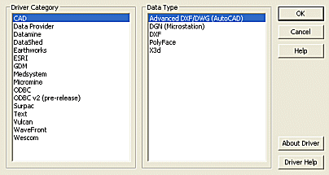

 |  Scripting Data Source Drivers Automating the import/export of dataw  
---|---  
  
# Data Source Driver Automation

This section of the tutorial will show you how file conversion can be automated using the scripting interface available with the Datamine Data Source Driver components. Your application already provides a variety of functions for accessing data formats across a wide range, however, these processes rely on user input, generally on a file-by-file basis:

Fig 1. The Data Import Dialog

Data Source Drivers control the translation of data between external files and your application, and are an integral part of your operating system. Your application makes use of both proprietary driver components to control the import and export of files into other industry-recognized formats (Vulcan, Surpac etc.), as well as accessing native windows components such as ODBC data sources for connecting to data help in Excel format, for example.

In addition to providing a rich interface for the flexible management of data transfer, your application also provides an automation interface for the DSDIE (Digital Simple Data Interface Enhanced) component, the API accessed in order to automate. This component, in conjunction with a Configuration file, can be used to automate the conversion of text-based files (e.g. comma-delimited files) into CSV format

The Configuration file

This file contains all the information needed to perform a data transfer. How this file is edited is up to you; it can either be edited manually in an ASCII text editor, or using the Configuration File editing facilities. This set of topics will show you how to edit the file manually. For more information on using your application's interface, refer to your online Help.

Scripting of the DSDIE component centers around a single core function - DataConvert(). This function accepts (and expects) four parameters, which are a list of file names:

  * The name of the Input file.

  * The name of the Output file.

  * The name of the Configuration file.

  * The name of the Log file, to record results.

At present, the DSDIE component can be used to automate the text driver, meaning text-based files can be included in the process. This functionality is likely to be expanded upon in future releases. The end result of the DataConvert() process is a Datamine format file.

## Why Automate Importing\Exporting of Data?

It is possible, for example, when changing your internal processes or implementing new technology, that you will need to batch-process the import of several files into another format (for example, the Native Datamine format), so that data transfer methodologies can be effected with the minimum required resource drain. One method of doing this is to write a script, processed either via your application's customization interface, or standalone, in a COM-aware scripting language.

The automation of data transfer tasks will also allow you to provide consistent results, and will allow you to further automate your work flow more easily, if required, based on a standardized input. The logical conclusion of this functionality is to make your entire data transfer process transparent, however, in reality, the extent to which you automate is flexible, and dictated by your particular requirements.

## Tutorial Summary

It is the intention of this tutorial to introduce you to the basic concept of automated data conversion.

In its most basic terms, the automation interface of the DSDIE component supports a simple function call, one of the parameters for which is a pointer to a configuration file containing all parameters required to ensure the information required by the data transfer is present. In this sense, the tutorial (i.e. what you actually do from a scripting perspective) is limited to the setting up of a script framework (which you will have already covered in previous exercises) and the calling of this function.

The remaining information is devoted to explaining how the Configuration file is structured, and how you can edit it to affect your results.

This tutorial does not rely on the creation of an interface, although if you wish to extend the features available by attaching them to interactive elements, the process for doing so will have already been covered in previous exercises.

The following tasks will be performed in this section:

  * Standard script environment setup in HTML and JavaScript, and creating the DSDIE component.

  * Editing the Configuration file to control import and export. In the example, you will be shown how to set up the automated import of comma-delimited (CSV) data into your application.

  * Finally, a Configuration file reference topic is provided.