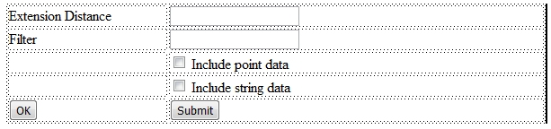

# Creating the Polygon Interface  
  
The interface you are going to create is shown below.

It consists of a table, some buttons, check boxes, text and text boxes.

## Prerequisites

  * The file `_vb_scr_points`.dm will be used to test the script.  
  
This file is located (with a standard installation) at `C:\Database\DMTutorials\Data\VBOP\Datamine` and should be loaded into the Project and displayed in the 3D window.

## Exercise: Drawing a table to contain the interface objects

It's up to you how you design your basic table. If you're familiar with HTML, you need to insert the relevant code to create a basic framework page plus a simple table in the <BODY>...</BODY> section, or you can use a web page design tool to create the new table interactively.

  1. Create a new, empty text file called 'Polygon.htm' in `C:\Database\DMTutorials\Projects\S3ScriptTut\Scripts` directory.
  2. Create a basic HTML skeleton page by adding the relevant <HTML>,<TITLE>,<HEAD> and <BODY> tags (and closing tags).
  3. Manually or interactively, insert a 5-row, 2 column basic table into the <BODY> section.  
  
If you're feeling really lazy, you can paste the following into your empty document:
         
         <!DOCTYPE html PUBLIC "-//W3C//DTD XHTML   
  
---  
           
              1.0 Transitional//EN" "http://www.w3.org/TR/xhtml1/DTD/xhtml1-transitional.dtd">  
           
         <html xmlns="http://www.w3.org/1999/xhtml">  
           
         <head>  
           
         <meta http-equiv="Content-Type" content="text/html;   
           
              charset=iso-8859-1" />  
           
         <title>Untitled Document</title>  
           
         </head>  
           
         <BODY>  
           
         <table width="600" border="0">  
           
           <tr>  
           
             <td>&nbsp;</td>  
           
             <td>&nbsp;</td>  
           
           </tr>  
           
           <tr>  
           
             <td>&nbsp;</td>  
           
             <td>&nbsp;</td>  
           
           </tr>  
           
           <tr>  
           
             <td>&nbsp;</td>  
           
             <td>&nbsp;</td>  
           
           </tr>  
           
           <tr>  
           
             <td>&nbsp;</td>  
           
             <td>&nbsp;</td>  
           
           </tr>  
           
           <tr>  
           
             <td>&nbsp;</td>  
           
             <td>&nbsp;</td>  
           
           </tr>  
           
         </table>  
           
         </BODY>  
           
         </html>  
           
            
  

## Exercise: Adding some text and text boxes

Next we will add some text and text boxes to the table. The easiest way to do this is via an interactive editor, but you can manually amend the HTML source if you're confident in your HTML skills.

  1. Position the cursor within the top left hand cell of the table and type 'Extension Distance'.
  2. In the next row down, type 'Filter'.
  3. Position the cursor in the top right hand cell and insert a textbox form element called "txtExtDist". This will place a text box within the cell.  
  
The first <TR> element of your table should now look like this:
         
          <tr>  
  
---  
           
             <td>Extension Distance</td>  
           
             <td>  
           
               <input   
           
              type="text" name="txtExtDist" />  
           
             </label></td>  
           
           </tr>  
           
         Now repeat step three for the next <TR> element, but   
           
                  this time introduce a text description on the left of "Filter".   
           
                  Insert a text field called 'txtFilter' on the right:  
           
            
           
           <tr>  
           
             <td>Filter</td>  
           
             <td>  
           
               <input   
           
              type="text" name="txtFilter" />  
           
             </label></td>  
           
           </tr>  
  

Top of page

## Exercise: Adding Check boxes for data selection

Next we will add two check boxes to the table. The text describing these will be associated with the check box itself.

  1. Position the cursor in row three column two, directly below the text box entered for the 'Filter' value. 
  2. Insert an HTML check box form element into this <TD> cell. Apply a label 'Include point data' to its right. This form control should have an internal name of 'chkIncPoint'.
  3. Repeat step two by selecting the next cell down and typing in the text 'Include string data' to it right. This form control should have an internal name of 'chkIncString'.

Top of page

## Exercise: Adding OK and Cancel buttons

Next we will add some buttons for activating the form.

  1. In the bottom left cell, insert a push button form element with a label of "OK" and an internal name of "btnOK"
  2. In the bottom right cell, insert a push button form element with a label of "Cancel" and an internal name of "btnCancel"
  3. Save your HTM file and view it in a web browser.
  4. Your interface should now look very similar to the one shown below:  
  

  5. The HTML Code that supports this view should be very similar to this:
         
         <!DOCTYPE html PUBLIC "-//W3C//DTD XHTML   
  
---  
           
              1.0 Transitional//EN" "http://www.w3.org/TR/xhtml1/DTD/xhtml1-transitional.dtd">  
           
         <html xmlns="http://www.w3.org/1999/xhtml">  
           
         <head>  
           
         <meta http-equiv="Content-Type" content="text/html;   
           
              charset=iso-8859-1" />  
           
         <title>Untitled Document</title>  
           
         </head>  
           
         <BODY>  
           
         <table width="600" border="0">  
           
           <tr>  
           
             <td width="175">Extension   
           
              Distance </td>  
           
             <td width="415">  
           
               <input   
           
              type="text" name="txtExtDist" />  
           
             </label></td>  
           
           </tr>  
           
           <tr>  
           
             <td>Filter</td>  
           
             <td><input type="text"   
           
              name="txtFilter" /></td>  
           
           </tr>  
           
           <tr>  
           
             <td>&nbsp;</td>  
           
             <td><label>  
           
               <input   
           
              type="checkbox" name="chkIncPoint" value="checkbox"   
           
              />  
           
             Include point data</label></td>  
           
           </tr>  
           
           <tr>  
           
             <td>&nbsp;</td>  
           
             <td><input type="checkbox"   
           
              name="chkIncString" value="checkbox" />  
           
         Include string data</td>  
           
           </tr>  
           
           <tr>  
           
             <td><label>  
           
               <input   
           
              type="submit" name="btnOK" value="OK"   
           
              />  
           
             </label></td>  
           
             <td><input type="submit"   
           
              name="btnCancel" value="Submit" /></td>  
           
           </tr>  
           
         </table>  
           
         </BODY>  
           
         </html>   
  

Top of page