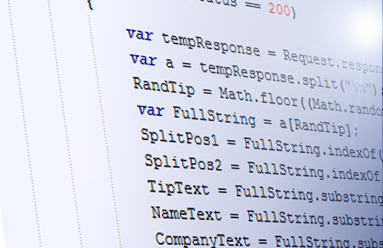
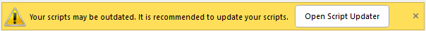
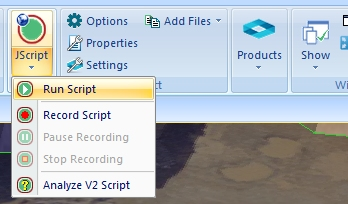

# Introduction to Scripting  
  
Your application provides a new, industry standard interface that allows you to write scripts using any COM-aware scripting language such as JavaScript. 

These scripts are embedded into an HTML document, which can then be loaded into your application's customization interface to execute commands. As well as running individual commands from scripts you can also run your existing macros which have for a long time been a feature of Datamine products

Due to the complexity of the subject matter, a guide explaining how to script needs to be pitched somewhere between providing background information to scripting, and attempting to explain every macro or script command available. This document intends to provide you with a balanced introduction to the benefits of scripting, and also the opportunity to learn about fundamental elements of scripting both in a general context, and from within the confines of your application. This document also gives you a chance to go through some practical exercises to give you a taster of what can be achieved.

;>)

Scripting can make light work of repetitive tasks and enforce consistent results

This guide will raise your awareness of the potential of automating some of your business processes using the wide variety of tools and components on offer, and provide a solid basis for learning more about this powerful aspect of your application.

### Safer Scripting

To maintain the highest level of local data security, we've rigorized our scripting interface in Studio products to provide a way to securely instantiate approved ActiveX objects through automation scripts. This provides a safer and more marshalled automation environment. 

In brief, we've introduced a new Studio application method (CreateObject) that can be used in place of the deprecated `new ActiveXObject("Prog.ID");` instruction. A call to something like `window.external.System.CreateObject("Prog.ID");` allows approved ActiveX objects to be instantiated to support your scripts. Most importantly, the ones that provide the highest risk are blocked. 

The **Datamine Studio Script Updater** , accessible via your **Home** ribbon, can update your scripts either individually or as a batch, automatically making them safer to use. 

If you load a script that looks like it could benefit from additional protection, a banner appears atop your display area. This also provides access to the conversion utility:

## Scripting and HTML

Although any scripting language can be used to access the rich library of functions exposed to COM by the Datamine product architecture, a simple HTML page can be used as a basis for creating simple or comprehensive graphical interfaces for scripts. This can be thought of as a replacement for the !SCREEN macro command, but is many times more powerful. 

Similarly, you could consider constructing your UI, if one is needed, in HTML.  

   

The easiest way to start to script is to record a script with your Datamine application. You can do this by activating the Home ribbon and (if your product supports it) selecting Scripts >> Record Script. 

This creates a simple HTML document with Execute and Help buttons which allow you to replay the sequence of commands you have recorded. 

However you will most likely want to do more than that; you may want to change the interface so that, for example, you can specify input and output file names; you may also want to specify field and parameter values; and then you can add extra buttons, radio buttons, text boxes, check boxes, and so on, in order to make your interface more flexible.

Changing the interface is done by editing the HTML script. As well as adding a text box or push button you also need to define the action or event that occurs when you enter data into the text box or click the button. This is done using any COM-aware scripting language such as JavaScript. You can run both server processes and design commands from these scripts as well as carrying out the usual programming functions. You can also interface with other systems through scripting.

This tutorial provides some useful JavaScript functions to simplify tasks such as running macros and setting up pick lists. 

This tutorial takes you through all the steps from recording and replaying scripts to designing your own interface. The aim of the tutorial is not to teach you how to script using HTML or JavaScript. These are both third party languages and there are plenty of books and other resources that do this job very well indeed. This tutorial concentrates on the tools that are needed to create and manage HTML pages, macro and other files that are used by your application. It will assist your understanding of the tutorial significantly if you are already familiar with the concepts of scripting using COM.

Experienced users will recognize that the availability of an industry-standard COM interface to all the available commands opens up enormous possibilities for integrating your Datamine product with their company's overall IT system. Commands can now be accessed and executed remotely from just about any programming language or system, and chained into processes that can automate just about any repetitive daily task, with consistent reulsts.

# Tutorial Data

There are three types of supporting file installed with your application:

  * Demo script files: these HTM files contain examples of scripts that are created using the tutorials outlined in this file.

  * Macro files: macro (menu) files created using the tutorials.

  * Datamine files: supporting .dm files that are used within the tutorials.

In all cases, if a particular tutorial relies on data either prepared by previous tutorials, or essential to go through a list of instructions, an indication will be made of the file(s) required and where they can be found. However, the following file types can be found in the directories listed below, with a standard installation of your product:

  * Demo script files can be found at
        
        C:\Database\DMTutorials\Projects\S3ScriptTut\Scripts.

  * Demo Macro files can be found at
        
        C:\Database\DMTutorials\Projects\S3ScriptTut\Macros.

  * Demo Datamine files for this tutorial can be found at
        
        C:\Database\DMTutorials\Data\VBOP\Datamine.

## Prerequisites

This guide serves as a useful document if you are new to scripting with Datamine products, or want to learn more about how this particular aspect of Datamine software has evolved. However, it is highly recommended that you approach this document with the following skills to hand:

It is recommended that you have some knowledge of established scripting methodologies.

  * You should have an appreciation of the object-oriented approach to programming, and understand the concept of objects, methods, properties and events.

  * You should have an understanding of common commands and processes, and the application interface.

  * You have access to the Demo Data Set, as installed with each release of your application.

  * You have a suitable application installed to facilitate the creation or debugging of scripts.

Related topics and activities

  * Scripting References