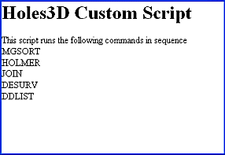

# Viewing the Script

In order to view the source, with the Holes3D script (created in the previous exercise) loaded in the Customization window, right click on the background of the script and select View Source from the menu (see figure below), the script Holes3D will be loaded into Notepad.

Note: If you wish to load a prepared script, you can find a copy of the Holes3D script at `C:\Database\DMTutorials\Projects\S3ScriptTut\Scripts`.

The first five lines of HTML code contain header information. The next three lines declare some variables that are going to be used within the script.

Following the variable declaration are three main functions that do most of the work, these are

  * AutoConnect: this function creates instances of objects called oDmApp and oScript which allows the connection to the application and script helper respectively.

  * btnExecute_onClick: this runs the sequence of commands that were recorded when the Execute button is clicked.

  * btnHelp_onClick: this runs the help file script when the Help button is clicked.

  * Finally, at the end, is the HTML code describing the interface. This includes the logo and the position and size of the Help and Execute buttons on the HTML page.

## Saving the Reference Copy of the Script

Hopefully you were successful in creating your own copy of Holes3D.htm. However if you want to view the reference copy and/or save a copy, you can do so in the following way.

  1. Select the Project Files window and open the All Files section.

  2. Double click on the entry Holes3D or `_scr_Holes3D` to open a copy into a window in the main graphical area with the title Command Automatically recorded html script.

  3. Right click and use View Source from the menu.

  4. Save the file from the Notepad application using File >> Save As form the menu. You should use the Save As dialog to browse to the location of the project and provide a new name for the file (make sure you add the '.htm' extension to the file name and don't use the default of '.txt').

This method of saving the reference copy of a file is used frequently in this tutorial, so it is important to understand it.

## Saving the Logo Image

The script displays the logo next to the name of the script. However, it is assumed that the logo image (dmlogo.gif) is present in the relevant images directory. The HTML code that displays the image is near the end of the file and is shown below.
    
    
    <td></td>

**Note** : The fully-qualified path to the image dmlogo.gif is shown in the above example. However, other company logos can be displayed by changing the script to reflect the location of the new logo.

## Creating and Viewing a Help file

A useful feature of all default scripts is the provision of a Help button. This calls a generic help function in the underlying Javascript. The problem, however, is that this file doesn't exist yet - you will need to create it;

  1. In the folder that you loaded the custom Holes3D script from, create a sub-folder called "Holes3D_Help".

  2. In the Holes3D_Help sub-folder, create an HTM file containing the information you wish to display (for now, just create a simple HTM file - you can edit it later if you wish). Call this file `_scr_Holes3D.htm` (it is wise to name your Help files with the same name as your script, or similar).

  3. Right-click the Customization window and select View Source. The underlying script for your Holes3D function is now displayed.

  4. Help display is controlled by the btnHelp_onclick() function. Look for the following block of code in the displayed script:
         
         function btnHelp_onclick() {

...and make the following lines read as:
         
         var features  = "centre:yes;help:no;status:no;resizable:yes;dialogWidth:850px;dialogHeight:600px";  
           
         var common = "Holes3D_Help";  
           
         window.showModalDialog(common + "/_scr_Holes3D.htm", common,  
           
         features);  
           
         }

  5. Save the file and refresh the Customization window; press <F5> or right-click the window and select Refresh. Now click Help, you should see your HTM file displayed, e.g.:

The Help function above calls the in-built Javascript function showModalDialog(). This is a useful way of adding multi-screen functionality to your scripts. In the Help call, an HTM file is displayed to show help, but it could easily be adapted to provide another HTM interface, with buttons to open other windows, and so on. The expected syntax for this method is:

showModelDialog(filepath,dialog title,features)

Where:

  * filepath is the path (relative or absolute) to an HTM file.

  * dialog titleis a string.

  * features is a string representing the properties of the new window